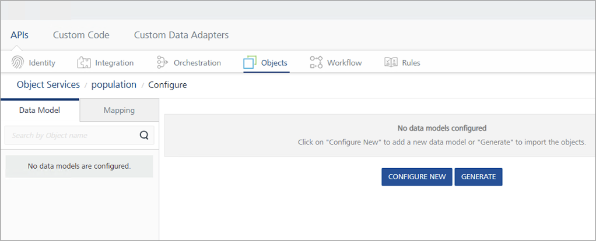
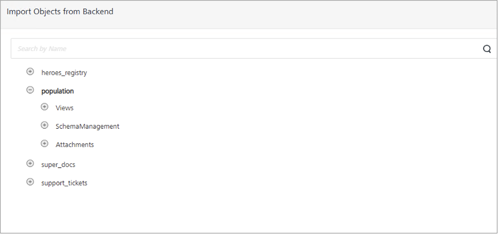
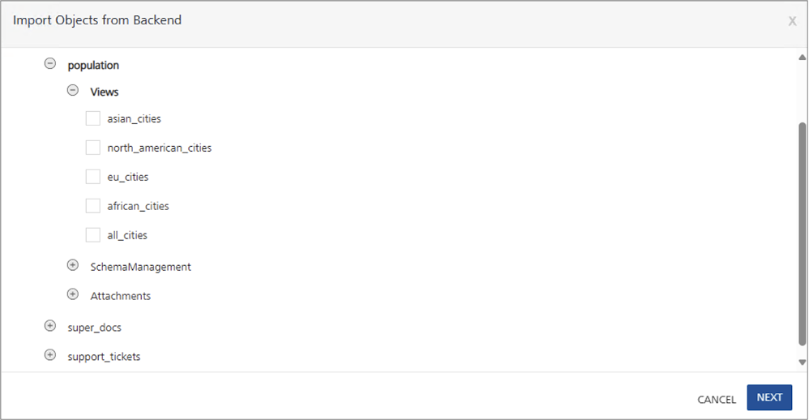
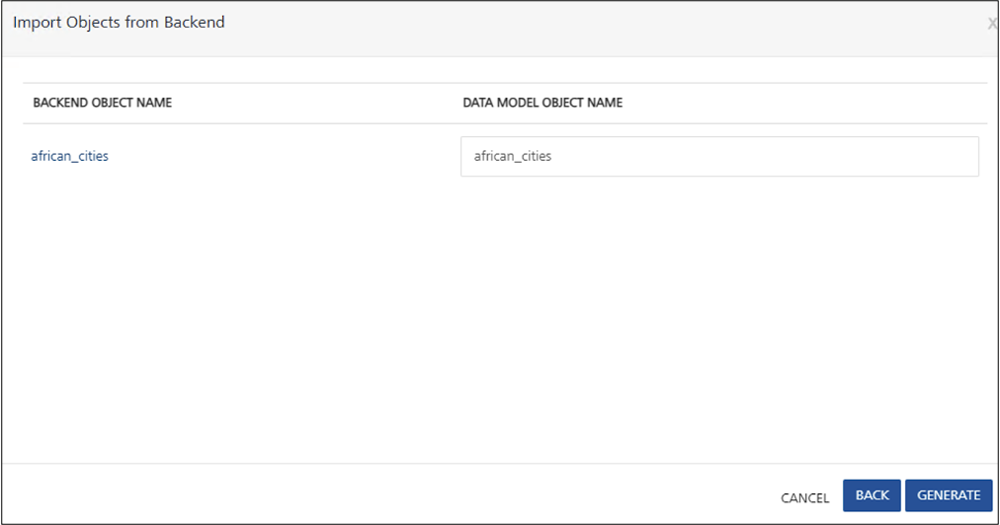
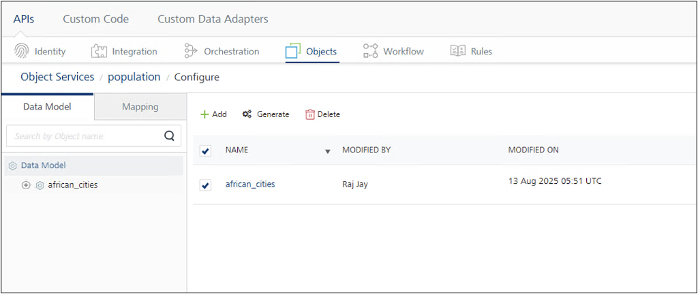
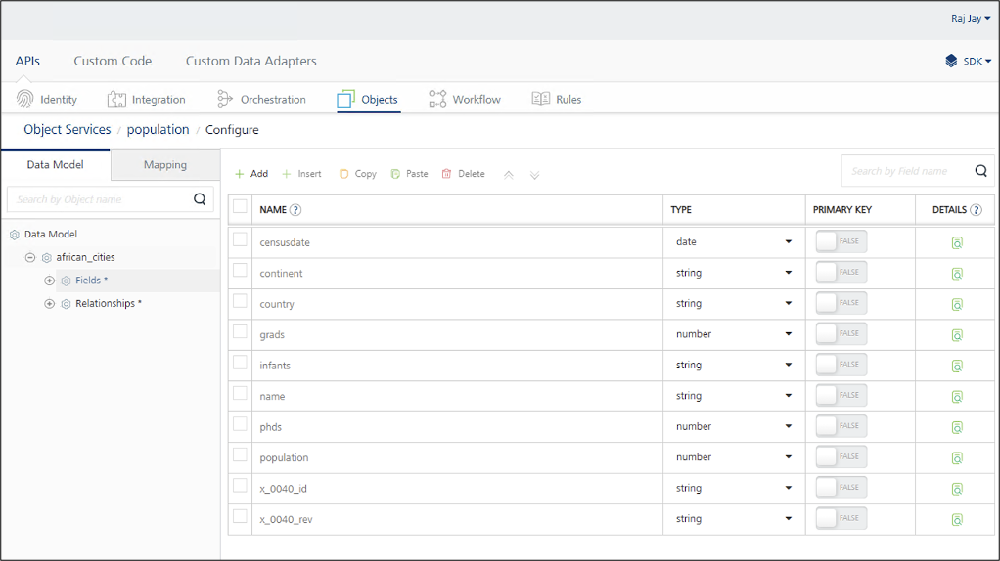
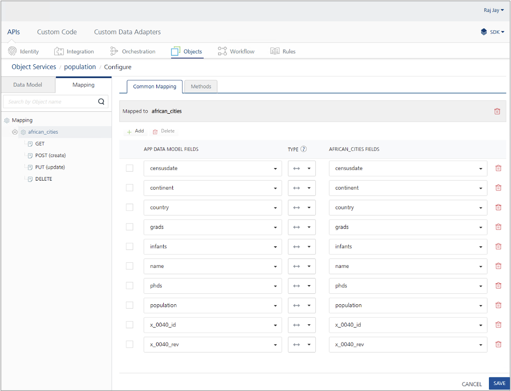
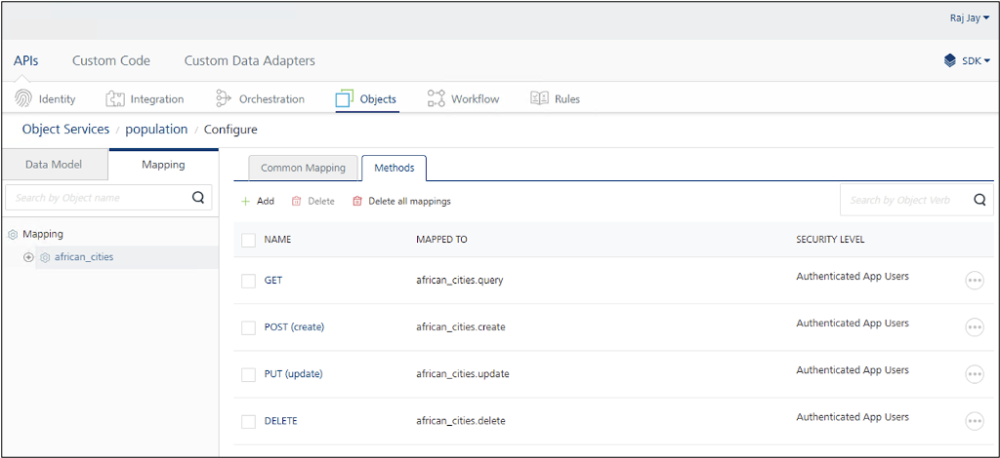
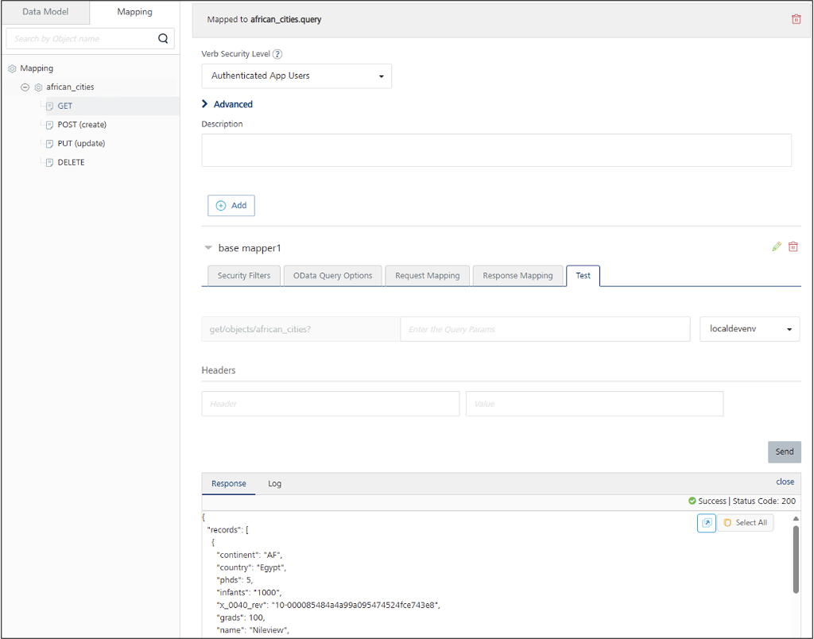
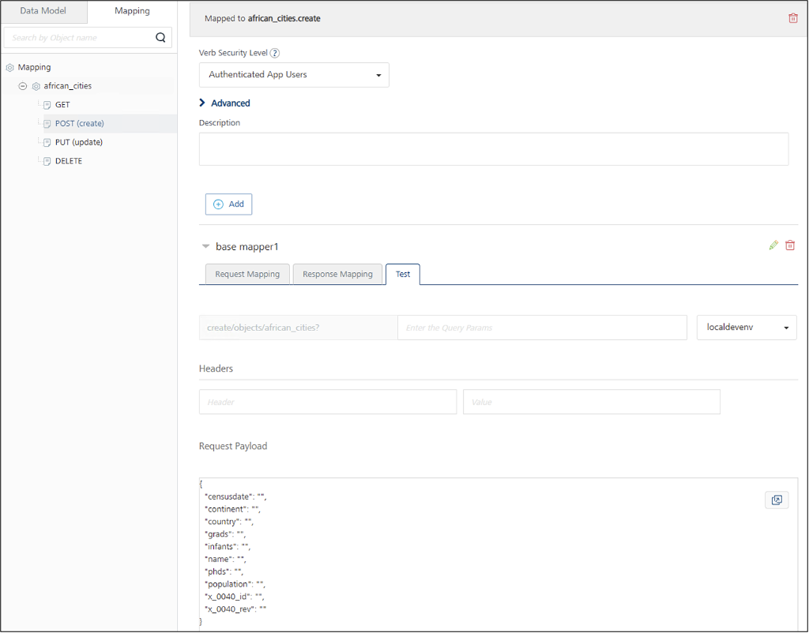

# Apache CouchDB Adapter tutorial

## About this task

This tutorial guides you through the process of using the Apache CouchDB[^1] Adapter in Volt MX Go. You will learn how to configure an object service for Apache CouchDB, generate a data model, review and adjust field mappings and HTTP methods, and test these methods for interacting with the data model.

By the end of this tutorial, you will be able to configure an Apache CouchDB object service, including generating the data model, modifying field mappings as needed, and testing the supported methods to effectively interact with the data model.

[^1]:Apache CouchDB and CouchDB are trademarks of The Apache Software Foundation.

## Before you begin

- You have an active CouchDB instance, and your Volt Foundry server is able to connect to the CouchDB host via HTTP/HTTPS.
- Within your Volt Foundry server, a test environment is already defined. It will be used for API testing, as will be described in the latter part of this tutorial.

    For more information on creating a test environment, see [Add an environment](adaptertutorial.md#add-an-environment).

## Assumptions

Before starting this tutorial, review the following assumptions to make sure you can follow the procedures.

For the purpose of this tutorial, it's assumed that:

- You already have a test environment set up. The name of the test environment in the following procedures is going to be referred to as *localdevenv*.

- You have a CouchDB database hosted on a machine.

    In the following procedures, the CouchDB database is named *population* and it's hosted on a machine with the hostname *couchdb*.

    The *population* database contains data on the populations of cities across multiple continents, including Asia, Africa, and North America. A sample document in this database looks like the following:

    ```json
    {
    "_id": "11381c61-b182-4fed-bd1b-6453a24c6b8b",
    "_rev": "6-5bdb9d619b82cb45db1d656c849c5c6c",
    "continent": "AS",
    "country": "China",
    "name": "Beijing",
    "population": 513,
    "censusdate": "2023-10-15T00:00:00Z",
    "grads": 100,
    "phds": 50
    }
    ```

- The *population* database includes fives views named:

    - **african_cities**
    - **all_cities**
    - **asian_cities**
    - **eu_cities**
    - **north_american_cities**

    For example, the **african_cities** view uses the following map function to filter what documents should show up.

    ```javascript
    function (doc) { 
        if (doc.continent === 'AF') 
            emit(doc.country, doc.name, doc.population);
    }
    ```

    The **asian_cities** view has the following map function:

    ```javascript
    function (doc) { 
        if (doc.continent === 'AS') 
            emit(doc.country, doc.name, doc.population); 
    }    
    ```

## Log in to Volt Foundry

1. Open your browser and navigate to the Volt Foundry hostname followed by `/mfconsole/`.

    !!! tip

        Use the **Console URL** provided in the **Install Complete** window or from the *Installation Complete* details displayed in the command line to access Volt Foundry.

2. On the **Sign in to your account** page, enter your username and password.
3. Click **Sign In**.  

   The **Volt MX Foundry Console** opens, displaying the **Apps** page by default.

## Configure an object service for Apache CouchDB 

1. In the left pane of the **Volt MX Foundry Console**, click **API Management**.
2. On the **APIs** page, navigate to **Objects**, then click **Configure New**.
3. Enter the object service name in the **Name** text field.
4. From the **Business Adapters** options under **Endpoint Type**, select **Apache CouchDB**.
5. Set the **Metadata Security Level** to **Authenticated App Users**.
6. Under **Connection Parameters**:

    1. Enter the host name and port where the CouchDB instance is hosted in the **CouchDB host URI** and **Port** text fields.

        !!! note

            Cluster is not yet supported.

    2. Enter your CouchDB credentials in the **User name** and **Password** text fields.
    3. Click **Test Connection** to verify the connection.

    !!! tip

        - Ensure you select the environment you added before clicking **Test Connection**. 
        - If the test fails, double-check and update the connection parameters as needed.

7. Click **Save and Configure**.

!!! note

    The Apache CouchDB adapter communicates with the CouchDB instance using CouchDB’s RESTful HTTP/HTTPS API. For proper functionality, the HTTP or HTTPS traffic must be allowed between the Volt Foundry server and the CouchDB instance.

## Generate a data model

1. On the **Data Model** tab, click **Generate**.

    {: style="height:80%;width:80%"}

    The **Import Objects from Backend** dialog appears, displaying the CouchDB databases. In the example image, *heroes_registry*, *population*, *super_docs*, and *support_tickets* are CouchDB databases. Expanding a database reveals a subset of objects available for imported.

    {: style="height:80%;width:80%"}


2. Expand **Views** and select the checkbox next to the view you want to import. You can import one or multiple views from the same or different databases.

    {: style="height:80%;width:80%"}

3. Click **Next**. The **BACKEND OBJECT NAME** and **DATA MODEL OBJECT NAME** of the selected view or views are shown.

    {: style="height:80%;width:80%"}

    !!! tip

        You can modify the data model object names for the selected views.

4. Click **Generate**. The selected view or views are added to the **Data Model**.

    {: style="height:80%;width:80%"}

    !!! tip

        If you need to add more views, click **Generate** and repeat the steps.

5. Expand a view and then click **Fields** to see the inferred schema for documents in that view.

    The schema is infered from the first document in the view. Ensure that at least one document exists in the view with a complete set of fields and proper data integrity to guarantee an accurate inferred schema.

    {: style="height:80%;width:80%"}

6. Modify fields or field types as needed, then click **Save**.

    !!! warning

        Don't change the field names ending with `_id` and `_rev`, as these are reserved system fields maintained by CouchDB.

## Check the mapping and methods

1. Click the **Mapping** tab, then select the view, named **african_cities** as shown in the example image. The **Common Mapping** tab appears, allowing you to map fields between Volt Foundry and CouchDB. The default mapping suits most cases.

    {: style="height:80%;width:80%"}

2. Click the **Methods** tab to view a list of HTTP methods available for the object model. In the example image, the **GET**, **POST**, **PUT**, and **DELETE** methods can be executed.

    {: style="height:80%;width:80%"}

    To disable a method, select its checkbox and click **Delete**.

    ??? info "Method description"

        - **GET**: Retrieves all documents in the view. 
        - **POST**: Creates a new document in the view. CouchDB views have selection criteria, so the new document must meet those to appear. For example, in **african_cities** view, the new document must represent an African city to be included.
        - **PUT**: Updates an existing document. 
        - **DELETE**: Deletes an existing document. 

## Test the methods

### Test the GET method

1. On the **Mapping** tab, expand the view and click **GET**.
2. Expand the **base mapper1**, then select the **Test** tab.
3. Click **Send**.

    All documents from the view are retrieved and displayed in the **Response** console. Using the **african_cities** view as an example, a sample response looks like this:

    {: style="height:80%;width:80%"}

### Test the POST method

1. On the **Mapping** tab, expand the view and click **POST**.
2. Expand the **base mapper1**, then select the **Test** tab.

    The **Request Payload** with the appropriate schema is displayed.

    {: style="height:80%;width:80%"}

3. Fill in all fields with appropriate values, except for `x_0040_id` and `x_0040_rev` fields. CouchDB automatically generates values for these system fields when creating the new document.  

    Example request payload:

    ```json
    {
    "censusdate": "2023-12-31T00:00:00Z",
    "continent": "AF",
    "country": "Egypt",
    "grads": 150000,
    "infants": 80000,
    "name": "Cairo",
    "phds": 5000,
    "population": 9900000,
    "x_0040_id": "",
    "x_0040_rev": ""
    }
    ```

4. Click **Send** to create the new document.

### Test the PUT method

1. On the **Mapping** tab, expand the view and click **PUT**.
2. Expand the **base mapper1**, then select the **Test** tab.

    The **Request Payload** with the appropriate schema is displayed.

3. Enter the updated values for the fields you want to update.
4. Click **Send** to update the documents.

### Test the DELETE method

1. On the **Mapping** tab, expand the view and click **DELETE**.
2. Expand the **base mapper1**, then select the **Test** tab.
3. In the **Request Payload**, enter the `x_0040_id` and `x_0040_rev` fields with their appropriate values corresponding to the document you want to delete.

    Example request payload:

    ```json
    {
    “x_0040_id”: “<appropriate id>”,
    “x_0040_rev”: “<appropriate rev>”
    }
    ```

4. Click **Send** to delete the document.
