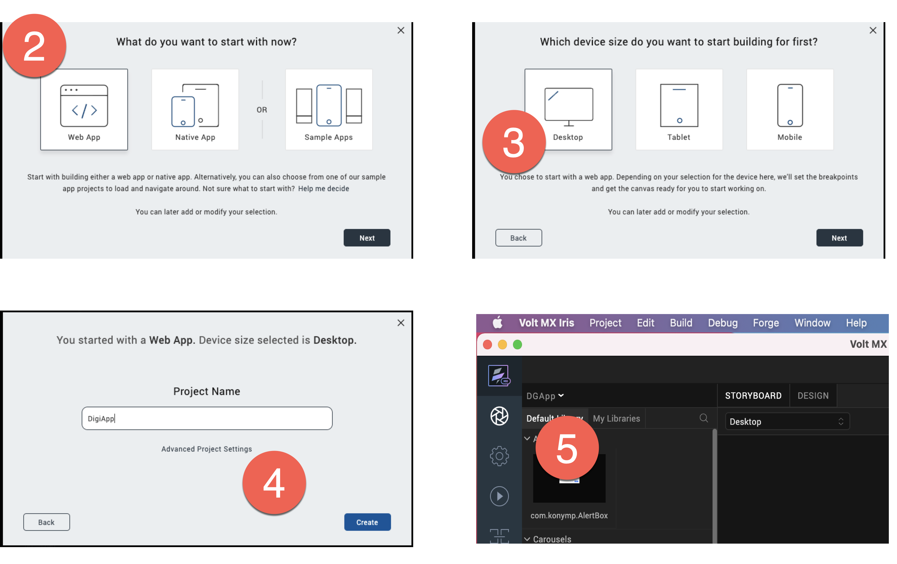

# Design Import tutorial
 
 This  tutorial guides you in accesing the Design Import in VoltMX Go through the use of VoltMX Iris to view the .NSF file.

## Before you start

- Must have a **VoltMX Iris** app and completed the installation procedure in [Volt MX Iris](https://opensource.hcltechsw.com/volt-mx-docs/95/docs/documentation/Iris/installing_iris.html).
- Must have a **VoltMX Foundry** app and completed the installation procedure in [Volt MX Foundry](https://opensource.hcltechsw.com/volt-mx-docs/docs/documentation/Foundry/installing_foundry.html).
- Must have a configured **.NSF** file, schema and scopes in [KEEP](https://opensource.hcltechsw.com/Domino-rest-api/tutorial/adminui.html).
- Must have a **username** and **password** for VoltMX Go Iris, Foundry and Domino REST API.

## Launch VoltMX Go Iris

1. Open the **VoltMX Go Iris**. This opens the log-in screen of Iris.

	!!! notes "Notes"
	You can also start Iris by going to the folder where it's stored and double-clicking it.

   	On launching Iris, the VoltMX Go cloud login screen appears for license validation.

2.  Enter your **credentials** in VoltMx Go Iris and click **Sign-In.**
   The VoltMX Go Iris app canvass opens.

	

## Open a new project

1. Click **Project** on the VoltMX Go Iris navigation tab and click the **New Project.** 
2. Select **Web App** and click **Next.**

	!!! notes "Notes"
		For this release, select only the Web App.

3. Select the **device** you want to build for the new Project and click **Next**.

	!!! notes "Notes"
		For this release, select only the Desktop.

4. Enter your **Project Name** and  click **Create**. 

		
5. You can see your Project name on the upper-right corner of the Iris canvass.

	

## Introduction to the Design Import

This feature in VoltMX Go Iris is a way to extract the domino **.NSF** file where you can design the **.NSF** structure in **VoltMX GO Iris** simultaneously to  the **Notes Designer.**

## Import a Domino Application

1. Click on **Project** navigation bar, go to &rarr; **Import** &rarr; **Domino Application** on **VoltMX Go Iris** app.
1. Go to the first step "**Getting Started**" and click **Next**.
2.  Click **Create New** on the *Associate Foundry  App*.

	!!! notes "Notes"
		Once you click **Create New** , new foundry app associated in VoltMX Go Iris. The default name of this is App1 and this goes to the next step.

3. Select the “**Create New**” for  the connection of Domino REST API Services and click **Next**.

	1. Fill-in the **New Identity Service** and click **Next**
	
	|  **Fields**     | **Description** |
	| -----------     | -----------		|
	| Domino REST API URL   | This refers to the Domino REST API URL you are working with.     |
	| Scope       | This is the name of your configured scope describe in your App of Domino REST API app management. |
	|Client ID    | This is the App ID of your Application in Domino Rest API app management. Once you configured and added your App, you may see all along your App ID and your App Secret. |
	Client Secret| This is the App Secret in Domino Rest API app management. Once you configured and added your App, you may see all along your App ID and your App Secret. |
	|Service Name:| Any name that identify the VoltMX Go Foundry Identity Services. |

	

	2. Select your **Domino Rest API Identity Service** and  click **Next**

		!!! notes "Notes"
			This refers to the **service name** you added from the earlier page.

		

	3. Select your **Domino Rest API Identity Service** and click **Next.**

 4. Select your scope that you’ve configured in Domino Rest API. 
 
 	!!! notes "Notes"
		These scopes are associated with the .nsf file from Domino Software and IBM Lotus Notes.

 	1. You can **select** or **deselect** the configured forms, fields, views and agent and click **Next.**

		!!! notes "Notes"
			The lists you see are the ones you choose in the configured forms, views, and agents and save on your scope in KEEP configurations.

5. Click **Build Iris Application.**

	!!! notes "Notes"
		You can see the summary of the configured forms, views, agents and fields. You can Go Back if there are changes. 

6. Click **Done**.

	!!!notes "Notes"
		- You can view the final result of the .nsf file that you configured in KEEP.
		- You can click the link “*click here to view logs on a separate window”* to see the summarized forms, views and app forms in one page.

Once you click **Done**, each of the selected form, views and agents have imported in the  Iris through the use of Forms in VoltMX Go Iris. 