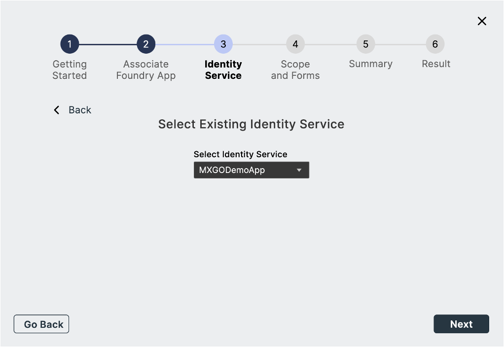
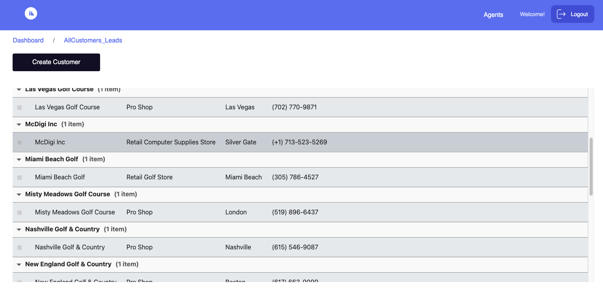

# Design Import tutorial

<!--add changes to designimport.md -->
 
 This  tutorial guides you in accesing the Design Import in Volt MX Go through the use of Volt MX Iris to view the .NSF file.

## Before you start

- You have completed the [Volt MX Go installation](installation.md).
- You have created your [Foundry admin account](../howto/foundryadminaccount.md).
- You have noted the following Domino REST API details:
    - Server URL: `http://drapi.mymxgo.com` 
    - username: `mxgo admin`
    - password: `password`

- You have a configured **`.NSF`** file, `schema` and `scopes` in [Domino Rest API](https://opensource.hcltechsw.com/Domino-rest-api/tutorial/adminui.html).
- You have a credentials for Volt MX Foundry and Domino REST API.

## Launch Volt MX Go Iris

1. Open the **Volt MX Go Iris**. This opens the log-in screen of Iris.

	!!!note
		You can also start Iris by going to the folder where it's stored and double-clicking it.
		
   	On launching Iris, the Volt MX Go cloud login screen appears for license validation.

2.  Enter your **credentials** in Volt MX Go Iris and click **Sign-In.**
   The Volt MX Go Iris app opens.

	{: style="height:60%;width:60%"}

## Validate Volt MX GO Foundry
	
1. Open the **Vlt MX Iris** menu bar for Mac and **Edit** menu bar for Windows and click **Preferences**.
2. This opens the **Volt MX Iris Preferences**. Click to **Volt MX Foundry**.
3. Fill-in the Foundry URL with `http://foundry.mymxgo.com` and click **Validate**. 
4. Click **Done**. 

{: style="height:80%;width:80%"}

## Open a new project
	
!!!note
		The default project for Iris is `Sample` which has the mobile app. For early release, you need only the WebApp and the Desktop as a platform. 

1. Click **Project** on the Volt MX Go Iris navigation tab and click the **New Project.**
2. Select **Web App** and click **Next.**

	!!!note
		For this release, select only the Web App.

3. Select the **device** you want to build for the new Project and click **Next**.

	!!!note
		For this release, select only the Desktop.

4. Enter your **Project Name** and  click **Create**. 

		
5. You can see your Project name on the upper-right corner of the Iris canvass.

	{: style="height:70%;width:70%"}

## Introduction to the Design Import

This feature in Volt MX Go Iris is a way to extract the domino **`.NSF`** file where you can design the **`.NSF`** structure in **Volt MX GO Iris** synchronous to  the **Notes Designer** server. 

## Import a Domino Application

1. Click on **Project** navigation bar, go to &rarr; **Import** &rarr; **Domino Application** on **Volt MX Go Iris** app.
1. Go to the first step "**Getting Started**" and click **Next**.
2. Click **Create New** on the *Associate Foundry  App* window.

	!!!note
		Once you click **Create New**, new foundry app associated in Volt MX Go Iris. The default name of the same your **Project Name**.

3. Select the “**Create New**” for  the connection of Domino REST API Services and click **Next**.

	1. Fill-in the **New Identity Service** and click **Next**

		|  **Fields**     | **Description** |
		| -----------     | -----------		|
		| Domino REST API URL   | This refers to the Domino REST API URL you are working with. You must enter your respective Domino REST API URL    |
		| Scope       | This is the name of your configured scope describe in your App of Domino REST API app management. |
		|Client ID    | This is the App ID of your Application in Domino Rest API app management. Once you configured and added your App, you may see all along your `App ID` and your `App Secret`. |
		|Client Secret| This is the App Secret in Domino Rest API app management. Once you configured and added your App, you may see all along your `App ID` and your `App Secret`. |
		|Service Name:| Any name that identify the Volt MX Go Foundry Identity Services. |

		{: style="height:80%;width:80%"}

	2. Select your **service name** you added from the earlier page and click **Next**.

		{: style="height:80%;width:80%"}

	3. Log-in your credential to Domino Rest API and click **allow**.

		{: style="height:80%;width:80%"}

	4. Select your **Foundry Identity Service** name  associated to Domino REST API and click **Next.**

		{: style="height:80%;width:80%"}

4. Select your scope that you’ve configured in Domino Rest API. 
 
 	!!!note
		These scopes are associated with the .nsf file from Domino and Notes.

	You can **select** or **deselect** the configured forms, fields, views and agent and click **Next.**

	!!!note
		The lists you see are the ones you choose in the configured forms, views, and agents and save on your scope in Domino Rest API configurations.

5. Click **Build Iris Application.**

	!!!note
		You can see the summary of the configured `forms`, `views`, `agents` and fields. You can **Go Back** if there are changes. 

6. Click **Done**.

	!!!note
		- You can view the final result of the .nsf file that you configured in Domino REST API.
		- You can click the link "**click here to view logs on a separate window**" to see the summarized forms, views and app forms in one page.

Once you click **Done**, each of the selected form, views and agents have imported in the  Iris through the use of Forms in Volt MX Go Iris.

## Create from existing Foundry and Domino Rest API.

1. On the **Volt MX Go Iris** top menu, select **Project** &rarr; **Import** &rarr; **Domino Application**.
2. Go to the first step "**Getting Started**" and click **Next**.
3. Click on **Use Existing** link on **Associate Foundry App**.
	- Select from the Volt MX Go Application the foundry app and click **Associate**. The existing foundry app is selected and click **Next**.

4. Click **Select Existing** on the Identity Service step. This connects the **Domino Rest API service**.
	- Select your **active app** from you Domino Rest API Identity Service.
	
5. Select your scope that you’ve configured in Domino Rest API. These scopes are associated with the .nsf file from Domino and Notes.

	- You can **select** or **deselect** the configured `forms`, `fields`, `views` and `agents` and click **Next**. The lists you see are the ones you choose in the configured forms, views, and agents and save on your scope in Domino Rest API configurations.

6. Click **Build Iris Application.**

7. Click **Done**.Once you click **Done**, each of the selected form, views and agents have imported in the  Iris through the use of Forms in Volt MX Go Iris.

!!!note
		- You can view the final result of the .nsf file that you configured in Domino REST API.
		- You can click the link **click here to view logs on a separate window** to see the summarized `forms`, `views`, and app forms in one page.

## CRUD operation upon importing the .NSF file

1. Log in your account in Domino REST API.

	!!!note
		Your configuration in Domino REST API decide what are the operations you can include in the **design import** form.
		All the views, forms, and agents of your .NSF file have imported, so you can design your **.NSF** synchronous to the **Notes Designer**.

2. On the **Dashboard**, click your Table (example: newCar) under **Forms**.  
	
	

3. Click **Add New**.
4. Fill in the fields and click **Add**. This add the data in the .NSF file.

	

5. Go back to the **Dashboard**, and then click your Table (example: carListView) under **Views**. 

	

6. In the **Views** window, you can see here the added values on your **Forms**.

	

The **Design Import** in Iris is synchronous with the data added, modified and deleted in the **Notes Designer**.

