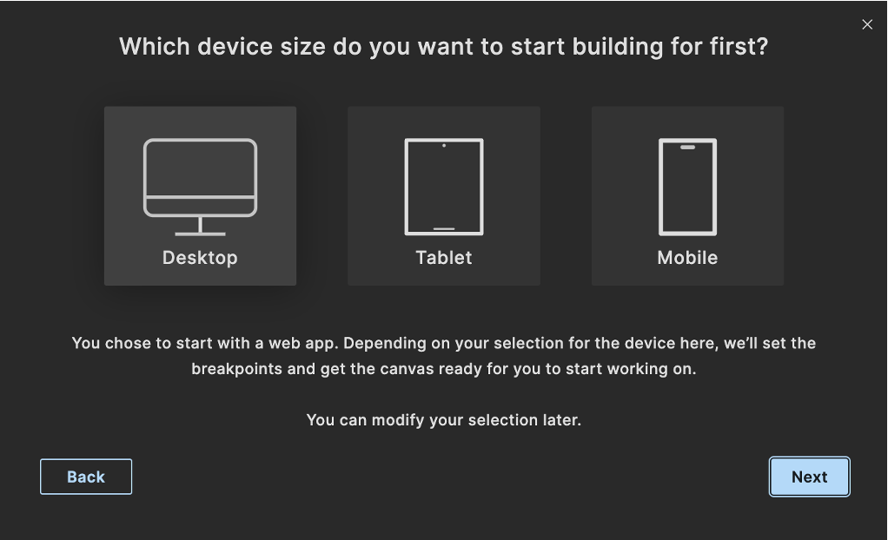
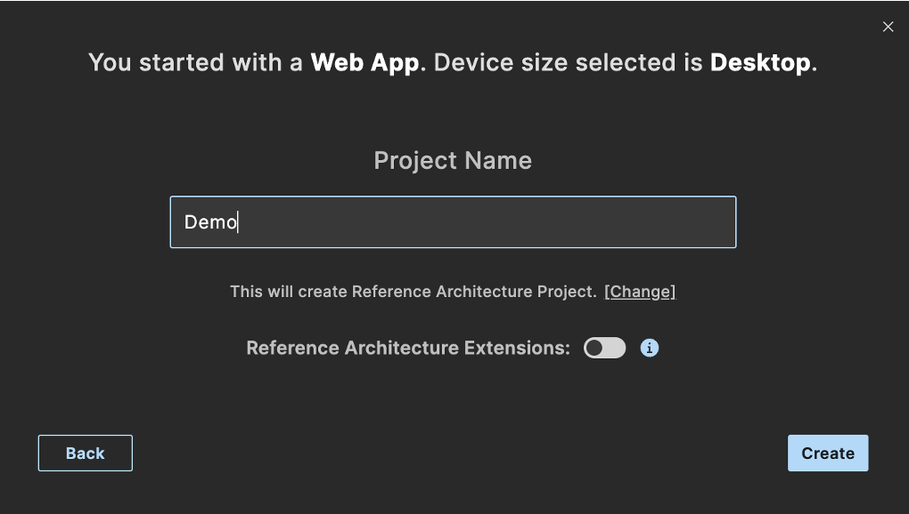
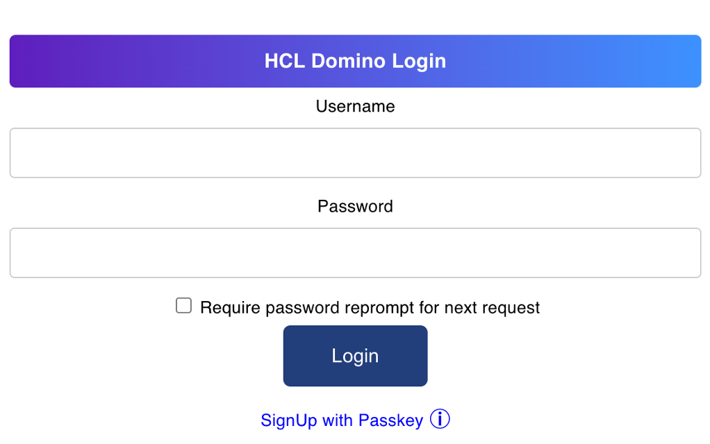
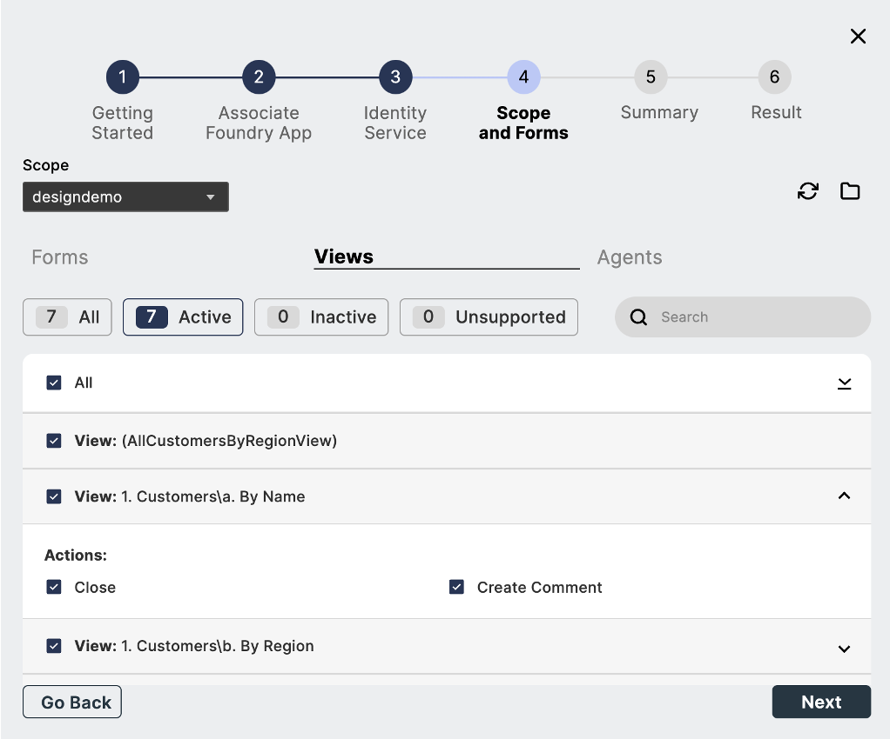
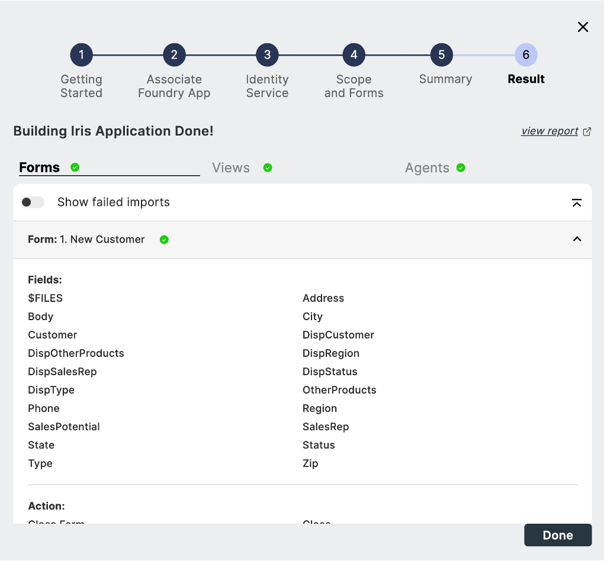
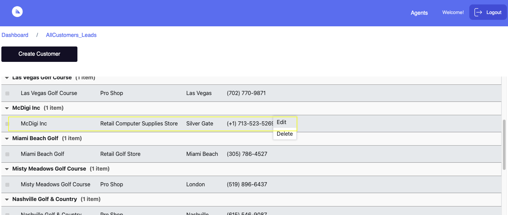

# Design Import tutorial

--8<-- "mxgoversion.md"

The tutorial guides you through the Design Import process in Volt MX Go. You will create a project in Volt Iris and then run the Design Import Wizard to enable you to import Domino application forms, views, and agents, then build those forms and views within Volt Iris. You will also perform CRUD operations on the imported Domino application published via Volt Iris.  

At the end of this tutorial, you will gain enough competence to use the Design Import Wizard to successfully import a Domino application.

## Before you begin

Before starting this tutorial, you must meet prerequisites based on the situational scenario that applies to you:

- **All access scenario** is for a user with all the necessary access rights to install and configure Volt MX Go and with the correct access to all required Domino databases and the Domino REST API.
- **Limited access scenario** is for a user who is most likely a Volt Iris developer and doesn't have all the necessary access. In this case, you must coordinate with a Volt Foundry administrator and a Domino/Domino REST API administrator to obtain the required access and fulfill other requirements.

Kindly follow and complete the prerequisites that apply to your situation.

=== "All access scenario"

    **Volt MX Go prerequisites**

    - You have completed the [Volt MX Go installation](installupgrade/index.md).
    - You have a [Volt Foundry admin account](../howto/install/foundryadminaccount.md). 
    - You have [created an Environment in Volt Foundry](adaptertutorial.md#add-an-environment). 

    **Domino/Domino REST API prerequisites**

    !!! tip

        Contact your Domino administrator/Domino REST API administrator for any needed assistance.

    - You have set up Domino REST API in the Domino server containing the Domino database you are importing.
    - You have at least Designer access to the Domino database where you are creating or updating a schema and to the *Domino Keep Configuration database* `keepconfig.nsf` to create a scope and OAuth application for the Domino application.

        For more information on access levels, see [Access Levels in the ACL](https://help.hcltechsw.com/domino/14.0.0/admin/conf_accesslevelsintheacl_c.html "Link opens a new tab"){: target="_blank" rel="noopener noreferrer"}&nbsp;{: style="height:13px;width:13px"} in the HCL Domino documentation 

    - You have accessed Domino REST API.
    - You have [configured a schema](https://opensource.hcltechsw.com/Domino-rest-api/references/usingwebui/schemaui.html#add-a-schema "Link opens a new tab"){: target="_blank" rel="noopener noreferrer"}&nbsp;{: style="height:13px;width:13px"} with:
        - All necessary forms:
            - having [active status](https://opensource.hcltechsw.com/Domino-rest-api/references/usingwebui/schemaui.html#activate-a-form "Link opens a new tab"){: target="_blank" rel="noopener noreferrer"}&nbsp;{: style="height:13px;width:13px"} 
            - including the `$FILES` field and having the **Formula for Delete Access** set to `@True`(see [Change form configuration](https://opensource.hcltechsw.com/Domino-rest-api/references/usingwebui/schemaui.html#change-form-configuration "Link opens a new tab"){: target="_blank" rel="noopener noreferrer"}&nbsp;{: style="height:13px;width:13px"} for more information)
            - having a default mode and a dql mode, and both modes having matching fields (see [Clone a mode](https://opensource.hcltechsw.com/Domino-rest-api/references/usingwebui/schemaui.html#clone-a-mode "Link opens a new tab"){: target="_blank" rel="noopener noreferrer"}&nbsp;{: style="height:13px;width:13px"} and [Compare modes](https://opensource.hcltechsw.com/Domino-rest-api/references/usingwebui/schemaui.html#compare-modes "Link opens a new tab"){: target="_blank" rel="noopener noreferrer"}&nbsp;{: style="height:13px;width:13px"} for more information) 
        - All necessary [views having active status](https://opensource.hcltechsw.com/Domino-rest-api/references/usingwebui/schemaui.html#activate-a-view "Link opens a new tab"){: target="_blank" rel="noopener noreferrer"}&nbsp;{: style="height:13px;width:13px"}
        - All necessary [agents having active status](https://opensource.hcltechsw.com/Domino-rest-api/references/usingwebui/schemaui.html#activate-an-agent "Link opens a new tab"){: target="_blank" rel="noopener noreferrer"}&nbsp;{: style="height:13px;width:13px"}
    - You have [configured a scope for your schema](https://opensource.hcltechsw.com/Domino-rest-api/references/usingwebui/scopeui.html#add-a-scope "Link opens a new tab"){: target="_blank" rel="noopener noreferrer"}&nbsp;{: style="height:13px;width:13px"}:
        - having a scope name **not exceeding 15 characters**, which can include alphanumeric characters and *underscore* "&#95;" and *hyphen* "&#45;" special characters
        - having a **Maximum Access Level** set to *Designer*, **Editor**, or *Manager*
    - You have [created an OAuth application](https://opensource.hcltechsw.com/Domino-rest-api/references/usingwebui/appui.html#add-an-application "Link opens a new tab"){: target="_blank" rel="noopener noreferrer"}&nbsp;{: style="height:13px;width:13px"}:
        
        - having your configured scope and `$SETUP` added to the *Scope* field.

            !!! tip
                
                If you want all the scopes in Domino REST API to be available to Design Import, just add `$DATA` and `$SETUP` to the **Scope** field.

        - having a placeholder callback URL that you will replace with the callback URL from the Identity Service you will create using the Design Import Wizard 
    - You have taken note of the Domino REST API URL, and the App ID and [App Secret](https://opensource.hcltechsw.com/Domino-rest-api/references/usingwebui/appui.html#generate-an-app-secret "Link opens a new tab"){: target="_blank" rel="noopener noreferrer"}&nbsp;{: style="height:13px;width:13px"} of the OAuth application.

    !!! tip

        Refer to the **Domino REST API prerequisites for Design Import** video in the [Video tutorials](video.md) section to learn more.

=== "Limited access scenario"

    **Volt MX Go prerequisites**
    
    - You have completed the [installation of Volt Iris](../tutorials/installupgrade/installiris/installiris.md).
    - You have contacted the Volt Foundry administrator to:
        - have access to Volt Foundry 
        - have a Volt Foundry admin account
        - have an Environment created in Volt Foundry in case there is none

    **Domino/Domino REST API prerequisites**

    - You have contacted the Domino/Domino REST API administrator to:

        - ensure you have at least Designer access to the Domino database you will be importing
        - configure a schema for the Domino database that you will be importing with:
            - All necessary forms:
                - having active status 
                - including the `$FILES` field
                - having the *Formula for Delete Access* set to `@True`
                - having a `default` mode and a `dql` mode, and both modes having matching fields 
            - All necessary views having active status
            - All necessary agents having active status
        - configure a scope or scopes for your schema:
            - having a scope name **not exceeding 15 characters**, which can include alphanumeric characters and *underscore* "&#95;" and *hyphen* "&#45;" special characters
            - having a **Maximum Access Level** set to *Designer*, **Editor**, or *Manager*.

        - create an OAuth application:

            - having your configured scope or scopes and `$SETUP` added to the **Scope** field.
            
                !!! tip
                    
                    If you want all the scopes in Domino REST API to be available to Design Import, just add `$DATA` and `$SETUP` to the **Scope** field. 
            
            - having a placeholder callback URL that will be replaced with the callback URL from the Identity Service you will create using the Design Import Wizard

        - provide you with Domino REST API URL, and the App ID and App Secret of the OAuth application.

    !!! tip

        Refer to the **Domino REST API prerequisites for Design Import** video in the [Video tutorial](video.md) section to learn more.
        
## Launch Volt Iris

1. Open Volt Iris. When the **Sign-in to your account** page appears, close it by clicking the Volt Iris home icon.

    

2. Configure the login settings.

    1. Go to **Preferences**.

        For Windows, select **Edit** &rarr; **Preferences**.

        For Mac, depending on your macOS, select **Volt Iris** &rarr; **Preferences** or **Settings**.

    2. In the **Volt Iris Preferences** dialog, click **Volt Foundry**.

    3. On the **Volt Foundry** tab, enter your Volt Foundry URL in the **Foundry URL** text box, and then click **Validate**.

        {: style="height:60%;width:60%"}

        You should see the **Validation Successful** message at the top of the dialog. If you entered an incorrect Volt Foundry URL, you will see an error message at the top of the dialog advising you to try the validation again.

    4. Click **Done**.

3. Log in to Volt Iris.

    1. Click **Login** on the upper right corner of the Volt Iris screen.
    2. Enter your email and password for **Volt Foundry** on the **Sign in to your account** page.
    3. Click **Sign In**. Your username appears next to the profile icon.

## Create a new project

In this tutorial, we will use a web app project. The following steps will enable you to create one. If you want to create a native app, see [create a native app project](../howto/designimport/dicreatenativeapp.md) for more information.  

1. In the top menu, select **Project** &rarr; **New Project**.
2. In the **What do you want to start with now?** dialog, select **Web App** and click **Next**.

    {: style="height:70%;width:70%"}

3. In the **Which device size do you want to start building for first?** dialog, select **Desktop** and click **Next**.

    {: style="height:70%;width:70%"}

4. Enter your **Project Name** and click **Create**.  
  
    {: style="height:70%;width:70%"}

You can now see your project name in the upper-left corner of the **Volt Iris** UI.

{: style="height:60%;width:60%"}

## Import a Domino application

1. In the top menu, select **Project** &rarr; **Import** &rarr; **Domino Application**. The **VoltMX Design Import Wizard** opens.

2. On **Getting Started** step, click **Next**.

    {: style="height:70%;width:70%"}

3. On **Associate Foundry App** step, click **Create New**.

    {: style="height:70%;width:70%"}

4. After creating the Foundry app having a default name similar to your **Project Name**, click **Next**.

    {: style="height:70%;width:70%"}

5. On **Identity Service**:

    1. Enter the required details in **Create New Identity Service** and click **Next**.

        |Fields|Description|
        |:----|:----|
        |DRAPI URL|This refers to the Domino REST API URL you are working with.|
        |Scope|This refers to the name of the scope that's set up in the OAuth app you are using in the Domino REST API.  If multiple scopes are configured in the OAuth app, and you wish to use specific scopes, ensure that you separate these scopes with commas when you enter them. For example: `scope1,scope2`  If you intend to use or access all the scopes available in Domino REST API, enter `$DATA`. Just make sure that you only configured `$DATA` and `$SETUP` in the OAuth app in Domino REST API.|
        |App ID | This is the App ID of the OAuth app you are using in Domino REST API.|
        |App Secret| This is the App Secret of the OAuth app you are using in Domino REST API.  You can click and hold on the eye icon to verify the entered value.|
        |Service Name:| Any name that identifies the Volt Foundry Identity Services.  The service name must have a maximum of 10 alphanumeric characters without spaces.|

        {: style="height:70%;width:70%"}

    2. Select the **Identity Service**.

        The name of the Identity Service is the service name you provided prefixed with *MXGO*. As shown in the image, the name of the Identity Service is *MXGODemoApp*

        {: style="height:70%;width:70%"}

        !!!warning "Important"

            You need to **pause** here and **do not** click **Next** until you **update the callback URL in the OAuth app** in Domino REST API with the callback URL from the Identity Service in your Volt Foundry app. If you click **Next** without updating the callback URL in the OAuth app, a validation error occurs and prevents you from proceeding. 

        ??? note "To update the callback URL of the OAuth app in Domino REST API"

            1. **Get the callback URL of your Identity Service**.

                1. Log in to Volt Foundry.
                1. On the **Apps** page, click your Volt Foundry app.
                1. On the **Identity** tab under **Configure Services**, click your Identity Service.
                1. Under **Provider Details**, click **Copy** corresponding to the **Callback URL** field to copy the callback URL.

                    

                1. Close Volt Foundry.

            1. **Update the callback URL of the OAuth app in Domino REST API**.

                === "All access scenario"

                    1. Log in to Domino REST API.
                    1. Select **Application Management – OAUTH** from the home page or **Applications** from the side navigation pane to access the **Application Management** page.
                    1. Click the **Edit Application** icon corresponding to your OAuth app.
                    1. Update the **Callback URLs** field with the callback URL you copied from your Identity Service.
                    1. Click **Update**.
                    1. Close Domino REST API.

                === "Limited access scenario"

                    1. Send the copied callback URL to the Domino REST API administrator and request to update the callback URL of the OAuth app.
                    2. Get confirmation that the callback URL of the OAuth app is already updated before proceeding.

                    **Note**: If you don't receive immediate confirmation that the callback URL in the OAuth app has been updated, you can close the Design Import Wizard and Volt Iris. Once you receive confirmation, follow these steps:

                    1. Open Volt Iris and sign in using your MX Go Volt Foundry account.
                    2. Make sure that the opened project is what you used in this tutorial.
                    3. In the top menu, select **Project** &rarr; **Import** &rarr; **Domino Application** to open the **VoltMX Design Import Wizard**.
                    4. On **Getting Started**, click **Next**.
                    5. On **Associate Foundry App**, you will see that the Volt Foundry app is still linked. Click **Next**.
                    6. On **Identity Service** page, click **Use Existing** and then select the identity service under **Select Existing Identity Service**.

                From here, you can continue with the next step in this tutorial.

    3. Click **Next**. The **HCL Domino Login** dialog opens.

        {: style="height:70%;width:70%"}

        !!! note

            In case of an error due to incorrect entry in the **Scope**, **App ID**, or **App Secret** fields in the **Create New Identity Service**, a dialog shows an error message and information on how to address the error. Clicking **OK** in the dialog will redirect you to the **Create New Identity Service**, where you can correct the entry in the relevant text field.

    4. Login with your *Domino credentials* in the **HCL Domino Login** dialog.

    5. In the **Permission Requested** dialog, click **Allow**.

        {: style="height:70%;width:70%"}

    6. Choose the identity service related to your app on Volt Foundry in **Foundry App Identity Service** and click **Next**.

        {: style="height:70%;width:70%"}

6. On **Scope and Forms**:

    !!!note
        - Selectable forms, views, and agents are only those set to the active status when configuring the schema in the Domino REST API. Those in inactive status can still be seen but won't be selectable. Unsupported agents are also shown but won't be selectable. 
        - Actions are often active within the Domino database and can only be modified using Domino Designer. Imported actions might not function as expected. If this happens, you modify or update the actions to function as expected. For more information, see [Modify or update imported actions using VoltFormula](../howto/voltformula/importvoltformula.md).
        - If a dialog opens indicating that your Domino REST API schema has misconfigured settings, kindly see [Troubleshooting](../references/troubleshoot.md#design-import) for more information on addressing the issue.
        - If you see a **warning** icon appear beside any form, form field, view, or agent, click the **Reports** folder icon and click a report to open a detailed report explaining the cause of the warning.
        - You can click the **Refresh** icon to update the scope in case there are changes in the Domino REST API schema without exiting the wizard.
        - You can use the **All**, **Active**, **Inactive**, and **Unsupported** buttons in each tab to filter what's displayed.
        - You can use the **Search** box to find forms, fields, actions, views, and agents. The search results will automatically update as you type the letters of your keyword in the **Search** box. If you want to clear the search, simply click the clear icon.

    1. Select the **Scope** you want to use from the drop-down list.

        The available scopes are based on the scopes defined when creating the identity service.  

        {: style="height:70%;width:70%"}

    1. Click the **Forms** tab and select the forms, fields and actions you want to include in the import.

        {: style="height:70%;width:70%"}

    1. Click the **Views** tab and select the views and actions you want to include in the import.

        {: style="height:70%;width:70%"}

    1. Click the **Agents** tab and select the agents you want to include in the import. 

        {: style="height:70%;width:70%"}

    1. Click **Next**.

7. On **Summary**, review the selected `forms`, `fields`, `views`, and `agents`. Once you confirm that you have selected everything that you want to import, click **Build Iris Application**.

    {: style="height:70%;width:70%"}

    !!! note

        - It may take a while to complete the publishing of the imported Domino app.
        - If a dialog indicating that existing Iris forms are detected appears, click **Yes** to overwrite the detected forms and proceed with the building of the application. The existing Iris forms were automatically generated when you created the project in Volt Iris.

            {: style="height:80%;width:80%"}

8. On **Result**, see the final `forms`, `views`, `actions`,`agents`, and then click **Done**.

    !!! tip

        - A **checkmark** icon indicates a successful import.  
        - A **warning** icon indicates a successful import, but the imported component might not work as expected due to, for example, its data type not being currently supported. 
        - An **error** icon indicates a failed import. 
        - Click the **Show failed imports** toggle in a specific tab to the on position to see all elements with the **error** icon in that specific tab. The **Show failed imports** toggle won't be visible in a specific tab when there are no failed imports in that particular tab. 
        <!-- When the scope you selected has active agents, the **Agents** tab is shown. Otherwise, the **AppForms** tab is shown.-->
        - You can click **view report** to see a results report of imported forms, views, and agents in a new window. 

    {: style="height:70%;width:70%"}

Once you click **Done**, you can see the imported forms and views in a storyboard view in Volt Iris.

{: style="height:80%;width:80%"}

To see the imported forms in a directory, click the **DESIGN** tab to show the **Project** tab. You then expand the **Responsive Web / Desktop** and the **Form** directory to show the imported forms, views, and actions.

{: style="height:50%;width:50%"}

## Perform CRUD operation in imported Domino app

Before you can do the CRUD operation in your imported Domino app, you must first build and publish the imported app in Volt Iris.

If your app is a **Web App**, follow the instructions in [Building a Web App](https://help.hcl-software.com/voltmx/v10/Iris/iris_microapps/Content/WebPublish.html#publish-a-web-app "Link opens a new tab"){: target="_blank" rel="noopener noreferrer"}&nbsp;{: style="height:13px;width:13px"} in the HCL Volt MX documentation.

If your app is a **Native App:**

1. [Configure your mobile app browser](../howto/designimport/configmobile.md).

2. After configuring your mobile app browser, follow the instructions in [Building a Native App](https://help.hcl-software.com/voltmx/v10/Iris/iris_user_guide/Content/LocalBuildStarter.html "Link opens a new tab"){: target="_blank" rel="noopener noreferrer"}&nbsp;{: style="height:13px;width:13px"} in the HCL Volt MX documentation to view the mobile app.

!!! note

    For the following topics, the steps are based on an example Domino application. The example images will be different from what you will see when you try the steps using your imported application.

### Create entry

1. On the **Dashboard**, go to **Forms** and click your preferred document. In the example image, we're selecting **NewCustomer**.

    

2. Fill in the fields.
3. Click **Select Files** to upload a file. The **File Upload** dialog appears.

    !!!note
        This step only applies to fields that need you to upload an attachment. The **File Upload** also appears only if the configured forms of your schema in Domino REST API include the `$FILES` field.

4. Select the file you want to upload. You can select more than one file to upload. 

    !!! note

        To see the details of the uploading size limit, see [HCL Notes and DOMINO file limits](https://help.hcltechsw.com/dom_designer/14.0.0/basic/H_NOTES_AND_DOMINO_KNOWN_LIMITS.html "Link opens a new tab"){: target="_blank" rel="noopener noreferrer"}&nbsp;{: style="height:13px;width:13px"} in the HCL Domino documentation. 

5. Click **Open**. If the file is pre-existing, a dialog prompt appears with the option to overwrite it.

6. Click **Add**.

    

    This adds the data to the Domino database.

### Viewing data

1. On the **Dashboard**, go to **Views** and click your preferred document. In the example image, we're selecting **AllCustomers Lead**.

    

2. On the **AllCustomers_Leads** page, go to your preferred AllCustomers_Lead and click **View** to open the **AllCustomers_Lead** detail.

    

3. Select the **Download All Attachments** link to download the attachment files.

    !!! note

        You can download the attachments only if the `$FILES` field is configured in the form in your schema in the Domino REST API.
        

### Update data

1. On the **Dashboard**, go to **Views** and click your preferred document. In the example image, we're selecting **AllCustomers Leads**.

    

2. On the **AllCustomers_Leads** page, select a customer, and then select **Edit** from the context menu.

    !!! note

        If the detail view **DOESN'T show**, check the [Database Views in Domino Rest API](https://opensource.hcltechsw.com/Domino-rest-api/references/usingwebui/schemaui.html#list-available-database-views "Link opens a new tab"){: target="_blank" rel="noopener noreferrer"}&nbsp;{: style="height:13px;width:13px"} under schema to confirm that the selected database view is **active**. Also, confirm whether the columns in the view were added during the import.

    

3. Edit the fields that you want to modify.

    

4. Click **Select Files** to upload a file. The **File Upload** dialog appears.

5. Select the file you want to upload. You can select more than one file to upload.  

6. Click **Open**.

7. Click **Save** to save your updates.

### Delete entry

!!! note

    To delete data, make sure that the **Formula for Delete Access** is set to `@True` in both the `default` and `dql` modes of your forms during schema configuration in the Domino REST API.

1. On the **Dashboard**, go to **Views** and click your preferred document. In the example image, we're selecting **AllCustomers Leads**.

    

2. On the **AllCustomers_Leads** page, select the customer you want to delete, and then choose **Delete** from the context menu.

    

3. When the confirmation dialog appears, click **OK**.

    

4. When the notification dialog indicating that the record has been deleted appears, click **OK**.

    

!!! note

    Since the changes to the form are reflected in the Domino Server, they're also visible in the Notes Client.
