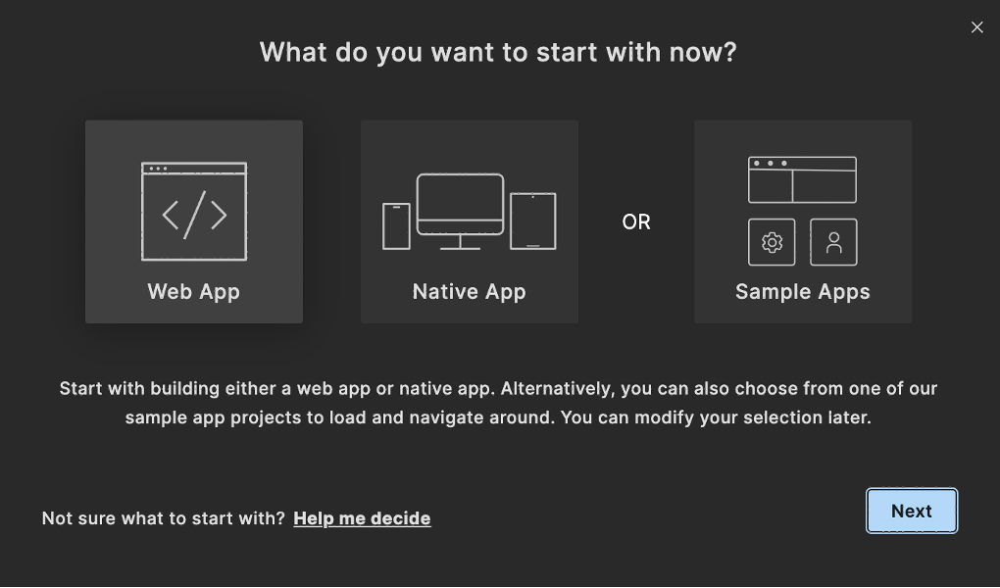
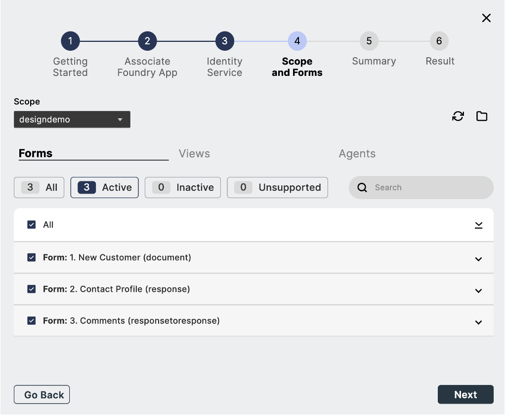
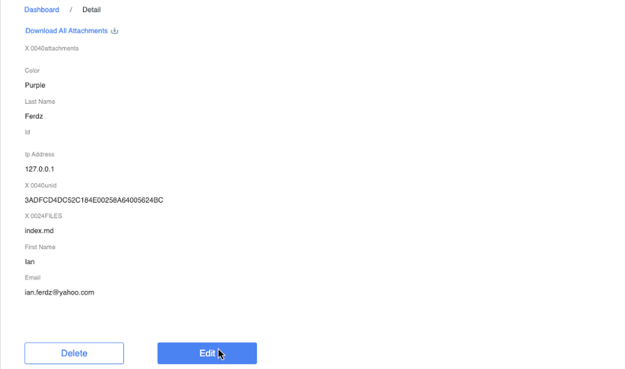

# Design Import tutorial
 
 This tutorial guides you in accessing Design Import in Volt MX Go through the use of Volt MX Iris to view the `.nsf` file. This feature in Volt MX Go Iris is a way to extract the domino`.nsf` file where you can design the `.nsf` structure in **Volt MX GO Iris** synchronously to the **Domino Designer** server. 

## Before you start

<!--!!!note
    Make sure you have downloaded the latest version of Volt MX Go Iris before performing the installation.-->

- You have completed the [Volt MX Go installation](installation.md).
- You have created your [Foundry admin account](../howto/foundryadminaccount.md).
<!-- You have noted the following Domino REST API details:
    
    - Domino REST API server URL 
    - username: `mxgo admin`
    - password: `password`

    !!!note
        - If you updated the administrator's first name, last name, and password in the `values.yaml` file in the [Download the Domino REST API Helm chart](http://localhost:8000/HCL-TECH-SOFTWARE/voltmxgo-documentation/tutorials/downloadhelmchart.html#1-download-the-domino-rest-api-helm-chart) procedure as part of the containerized deployment, use the updated values for the username and password.
        - If you used the installer to install Domino REST API, use your Domino server administrator username and password.-->

- You have a configured `.nsf` file, `schema` and `scopes` in [Domino Rest API](https://opensource.hcltechsw.com/Domino-rest-api/tutorial/adminui.html){: target="_blank"}.
    -  When you configure the `schema`, you must set **Formula for Delete Access** to `@True` in default `Mode` in all `Forms`.
    -  When you configure the `schema` in dql `mode`, you must include all the fields of the `Form` (example: Customer)

- You have credentials for Volt MX Foundry and Domino REST API.

## Launch Volt MX Go Iris

1. Open the **Volt MX Go Iris**. This opens the Iris log-in screen.
        
2. On launching Iris, the Volt MX Go cloud login screen appears for license validation. Click **Close.**

3. Go to [Validate Volt MX GO Foundry](#validate-volt-mx-go-foundry) procedure.

4. Enter your **Foundry app credentials** in Volt MX Go Iris and click **Sign-in**.

    

## Validate Volt MX GO Foundry
    
1. Open the **Volt MX Iris** menu bar for Mac and **Edit** menu bar for Windows and click **Preferences**.
2. This opens the **Volt MX Iris Preferences**. Click on **Volt MX Foundry**.
3. Fill in the **Foundry URL** with <!--`http://foundry.mymxgo.com` or--> your Foundry hostname, and click **Validate**.
    
    

4. Click **Done**. 
    
## Create a new project
    
!!!note
    Design Import currently only supports projects for desktop web apps. Before importing a Domino Application, select or create a project set for the Responsive Web desktop.
        

1. On the top menu, **Project** &rarr; **New Project**.
2. On the **What do you want to start with now?** dialog, select **Web App** and click **Next**.

    {: style="height:80%;width:80%"}

3. On the **Which device size do you want to start building for first?** dialog, select Desktop and click **Next**.

    {: style="height:80%;width:80%"}

4. Enter your **Project Name** and click **Create**.    
    {: style="height:80%;width:80%"}

5. You can see your project name in the upper-left corner of the Iris canvass.

    {: style="height:80%;width:80%"}

## Import a Domino Application using the new Foundry app

1. Select **Project** &rarr; **Import** &rarr; **Domino Application** on **Volt MX Go Iris** app. The VoltMX Design Import Wizard appears.

2. The VoltMX Design Import wizard appears. Go to the first step **Getting Started** and click **Next**.

    
    
3. On the second step **Associate Foundry App**, click **Create New** and click **Next**.

    !!!note
        Once you click **Create New**, the new Foundry app is associated with Volt MX Go Iris. The default name is the same as your **Project Name**.

    
            

4. The third step **Identity Service**, fill in the **Create New Identity Service** and click **Next**,

    |  **Fields**     | **Description** |
    | -----------     | -----------     |
    | Domino REST API URL   | This refers to the Domino REST API URL you are working with. You must enter your respective Domino REST API URL    |
    | Scope       | This is the name of your configured scope described in your App of Domino REST API app management. |
    |Client ID    | This is the App ID of your Application in Domino Rest API app management. Once you configured and added your App, you may see your `App ID` and your `App Secret`. |
    |Client Secret| This is the App Secret in Domino Rest API app management. Once you configured and added your App, you may see your `App ID` and your `App Secret`. |
    |Service Name:| Any name that identifies the Volt MX Go Foundry Identity Services. |

    

    1. Select your **service name**, that you added from the earlier page and click **Next**. Once your Foundry Application has been published, your service name should be named as MXGO(service name). Example: MXGOmyProjectGA

        

    2. Login with your **Domino credentials** within this wizard modal dialog and click **allow**.

        !!!note
            This document assumes you are using the Domino IdP which uses your Domino directory credentials. If you aren't, enter the credentials for the IdP you've configured for Domino REST API. 

        

    3. Select your **Foundry Identity Service** name  associated to Domino REST API and click **Next.**

        

5. On the fourth step **Scope and Forms**, select the scope that you’ve configured in Domino Rest API. These scopes are associated with the `.nsf` file from Domino and Notes.

    
    - You can **select** or **deselect** the configured `forms`, `fields`, and `views` and click **Next**. The lists you see here are the configured and unconfigured forms you set in the Domino Rest API. Only the configured forms will be able to select.
        

6. On the fifth step **Summary**, you can review here the final `Form` and `views` fields you want to import. Once reviewed, click **Build Iris Application.**. 

    !!!tip
        It may take a while of publishing the imported Iris app.

    

7. On the final step **Result**, you can see the final `forms` and `views`. 
 
    !!!tip
        - The **check mark icon** beside each of the `forms`, `fields`, and `views` means that it was successfully created.
        - The **warning icon** beside each of the `forms`, `fields`, and `views` means that the supported datatype doesn't match with the Iris app datatype.
        - Turn on the `show only error` toggle to see all the fields with the warning icon.

     

    Once you click **Done**, each of the selected forms, views, and agents have imported into the  Iris through the use of Forms in Volt MX Go Iris.
    **The App Events [desktop]** appears.

    

    !!!note
        - You can view the final result of the `.nsf` file that you configured in Domino REST API.
        - You can click the link **click here to view logs on a separate window** to see the summarized `forms`, `views`, and app forms on one page.

## Import a Domino Application from the existing Foundry app

1. Click on **Project** &rarr; **Import** &rarr; **Domino Application** on **Volt MX Go Iris** app.
2. A wizard modal dialog appears. Go to the first step "**Getting Started**" and click **Next**.
3. On the second step **Associate Foundry App"**, click **Use Existing** and click **Next**.
    - Select from the Volt MX Go Application the foundry app and click **Associate**. The existing Foundry app is selected and click **Next**.

4. The third step **Identity Service**, click **Select Existing** on the Identity Service step. This connects the **Domino Rest API service**.
    - Select your **active app** from your Domino Rest API Identity Service.
    
5. On the fourth step **Scope and Forms**, select the scope that you’ve configured in Domino Rest API. These scopes are associated with the `.nsf` file from Domino and Notes.

    - You can **select** or **deselect** the configured `forms`, `fields`, and `views` and click **Next**. The lists you see here are the configured and unconfigured forms you set in the Domino Rest API. Only the configured forms will be able to select.

6. On the fifth step **Summary**, you can review here the final `Form` and `views` fields you want to import. Once reviewed, click **Build Iris Application.**. 

    !!!tip
        It may take a while of publishing the imported Iris app.

7. On the final step **Result**, you can see the final `forms` and `views`. 
 
    !!!tip
        - The **check mark icon** beside each of the `forms`, `fields`, and `views` means that it was successfully created.
        - The **warning icon** beside each of the `forms`, `fields`, and `views` means that the supported datatype doesn't match with the Iris app datatype.
        - Turn on the `show only error` toggle to see all the fields with the warning icon.
   

    Once you click **Done**, each of the selected forms, views, and agents have imported into the  Iris through the use of Forms in Volt MX Go Iris.
    **The App Events [desktop]** appears.

## CRUD operation upon importing the `.nsf` file

!!!note
    - Before you can do the CRUD operation in your imported Domino application, you must first build and published the web in Iris.
    To do this, go to [Building a Web App](https://opensource.hcltechsw.com/volt-mx-docs/95/docs/documentation/Iris/iris_microapps/Content/WebPublish.html#publish-a-web-app){: target="_blank"}.

    - Log in to your account in Domino REST API using the newly published imported Domino application.
      Your configuration in Domino REST API decides what operations you can include in the **design import** form.
      All the `views` and `forms` of your `.nsf` file have been imported, so you can design your **`.nsf`** file with CRUD operation.

### Create entry

1. On the **Dashboard**, click your desired forms or table (example: Customer) under **Forms** label.  
    

2. Click **Add New**.
3. Fill in the fields and click **Add**. This adds the data to the `.nsf` file.

    

4. Go back to the **Dashboard**, and under the **Views** label, click the views or table (example: Customer).

    

5. In the **Dashboard/Views** (example: CustomerView) page, you can see here the added entry.

    

    Since changes to the form are reflected in the Domino Server, they're also visible in the Notes Client.

    

### Update data

1. On the **Dashboard**, and under the **Views** label, click the views or table (example: Customer).

    

2. In the **Dashboard/Views** (example: Costumer) page, search the data you want to update.

4. Click the **View** button on the right-side.
    

5. Click **Edit**.
    

6. Edit the field(s) that you want to update and click **Save**.
    

    Since changes to the form are reflected in the Domino Server, they're also visible in the Notes Client.

    !!!note
        You can also delete here the entry that you have chosen.

### Delete entry

!!!Warning
    - Before you delete any of the the data, you must set **Formula for Delete Access** to `@True` in Default `mode` during your schema configuration.

1. On the **Dashboard**, and under the **Views** label, click the views or table (example: Customer).

    

2. In the **Dashboard/Views** (example: Costumer - view ) page, search the data you want to delete.
  

4. Click the **Delete** button on the right-side. 
    

    There is a modal pop-up message box to confirm the deletion of data, click OK.

     

    Another pop-up message box appears.

    
 
    Since changes to the form are reflected in the Domino Server, they're also visible in the Notes Client.

