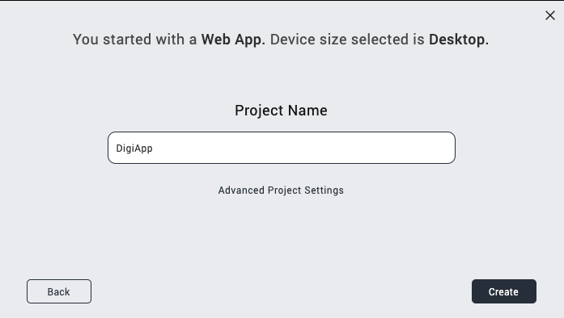
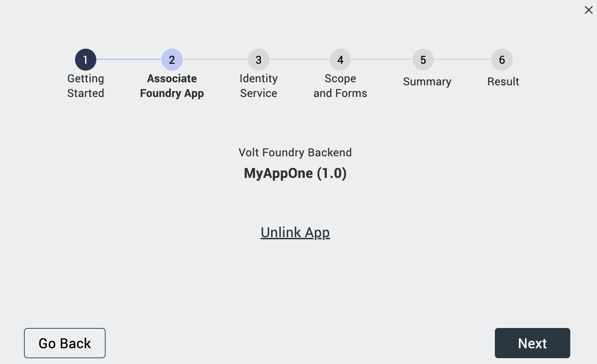
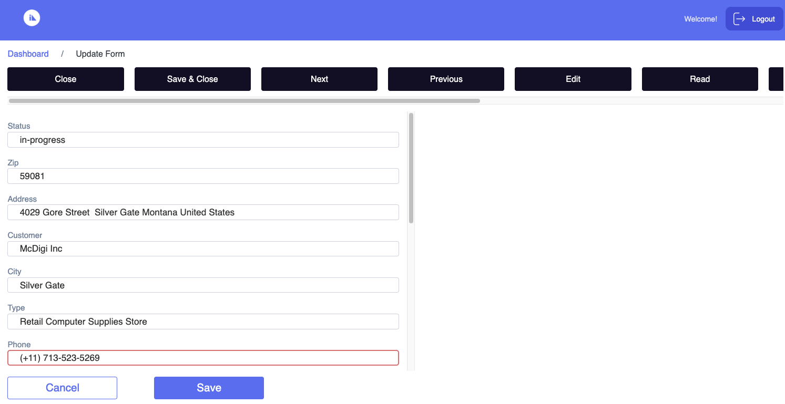

# Design Import tutorial

--8<-- "mxgoversion.md"

This tutorial guides you in accessing Design Import in Volt MX Go through the use of Volt Iris to view the `.nsf` file. This feature in Volt MX Go Iris is a way to extract the domino`.nsf` file where you can design the `.nsf` structure in **Volt MX GO Iris** synchronously to the **Domino Designer** server. 

## Before you begin

- You have completed the [Volt MX Go installation](installation.md).
- You have created your [Foundry admin account](../howto/foundryadminaccount.md).
- You have created Domino REST API.
- Your user account must be [added to the LocalKeepAdmins](https://help.hcltechsw.com/notes/12.0.2/client/sec_acl_useradd_t.html){: target="_blank" rel="noopener noreferrer"} group in the **Domino Keep Configuration (`KeepConfig.nsf`) Access Control List** to access administrative APIs used by Design Import. 

- You have a configured `.nsf` file, schema, scopes, and application in [Domino REST API](https://opensource.hcltechsw.com/Domino-rest-api/references/usingwebui/index.html){: target="_blank" rel="noopener noreferrer"}.

    - When you configure the schema, set the **Formula for Delete Access** to `@True` in `default` mode in all the forms in the schema. For more information, see [Change form configuration](https://opensource.hcltechsw.com/Domino-rest-api/references/usingwebui/schemaui.html#change-form-configuration){: target="_blank" rel="noopener noreferrer"}.

    - When you configure the `schema`, add a `dql` mode to each configured form. The `dql` mode must include all the fields of the form. Both the `default` and `dql` modes must have matching fields.

    - When you configure the `schema`, include the `$Files` field in the configured form to capture the uploading and downloading of files in the Design Import.

    - When you configure the `schema`, [set the views to Active status](https://opensource.hcltechsw.com/Domino-rest-api/references/usingwebui/schemaui.html#activate-a-view){: target="_blank" rel="noopener noreferrer"}.

    - When you configure the `scopes`, set the *Maximum Access Level* set to Designer or Manager. For more information, see [Scope Management in Domino Rest API](https://opensource.hcltechsw.com/Domino-rest-api/references/usingwebui/scopeui.html){: target="_blank" rel="noopener noreferrer"}.

    - When you configure `scope`, the scope name must be limited to 30 characters.

    - When you configure your Domino REST API application, it's mandatory to add `$SETUP` to return proper values.
    
## Launch Volt MX Go Iris

1. Open Volt MX Go Iris. When the **Sign-in** dialog opens, close it.

    !!!note
        If you have already configured the login settings while performing the other tutorials, enter your email and password for Foundry on the **Sign in to your account** page and click **Sign In**. You don't need to execute the steps below for configuring the login settings and logging in. 

2. Configure the login settings.

    1. Go to **Preferences**.
        
        For Windows, select **Edit** &rarr; **Preferences**. 
        
        For Mac, depending on your macOS, select **Volt Iris** &rarr; **Preferences** or **Settings**.

    2. On the **Volt MX Go Iris Preferences** dialog, click **Volt MX Go Foundry**.

    3. On the **Volt MX Go Foundry** tab, enter your Foundry URL in the **Foundry URL** text box, and then click **Validate**.
        
        <!-- You should see the “Validation Successful” message at the top of the dialog.-->
    
    4. Click **Done**.
    
    

    If the **Foundry URL** is incorrect, a prompt error will appear.

3. Log in to Volt MX Go Iris.
    1. Click **Login** on the upper right corner of the Volt MX Go Iris screen.
    2. Enter your email and password for **Volt MX Foundry** on the **Sign in to your account** page.
    3. Click **Sign In**. Your username appears next to the profile icon.

## Create a new project
    
1. On the top menu, select **Project** &rarr; **New Project**.
2. On the **What do you want to start with now?** dialog, select **Web App** and click **Next**.
    For other platforms, please see [Native App]( ../howto/dicreatenativeapp.md).

    {: style="height:80%;width:80%"}

3. On the **Which device size do you want to start building for first?** dialog, select **Desktop** for Web App and click **Next**.

    {: style="height:80%;width:80%"}

4. Enter your **Project Name** and click **Create**.  
  
    {: style="height:80%;width:80%"}

You can now see your project name in the upper-left corner of the **Volt MX Go Iris** canvass.

{: style="height:80%;width:80%"}

## Import a Domino Application using the new Foundry app

1. On the top menu, select **Project** &rarr; **Import** &rarr; **Domino Application**. The **VoltMX Design Import Wizard** opens.

2. On **Getting Started**, click **Next**.

    
    
3. On **Associate Foundry App**, click **Create New**.

    

    Once you click **Create New**, the new Foundry app is associated with Volt MX Go Iris. The default name is the same as your **Project Name**.

     

            
4. On **Identity Service**:
    
    1. Enter the required details in the **Create New Identity Service** and click **Next**. 

        |  **Fields**     | **Description** |
        | -----------     | -----------     |
        | Domino REST API URL   | This refers to the Domino REST API URL you are working with. You must enter your respective Domino REST API URL.    |
        | Scope       | This is the name of your configured scope described in your App of Domino REST API app management. $DATA scope show all the scopes in your App in Domino REST API.  |
        |Client ID    | This is the App ID of your Application in Domino Rest API app management. Once you configured and added your App, you may see your `App ID` and your `App Secret`. |
        |Client Secret| This is the App Secret in Domino Rest API app management. Once you configured and added your App, you may see your `App ID` and your `App Secret`. |
        |Service Name:| Any name that identifies the Volt MX Go Foundry Identity Services. |

        

    2. Select the **service name**, that you added from the previous page and click **Next**. Once your **Foundry Application** has been published, your service name should be named as MXGO(service name). Example: MXGOISMyApp

        

    3. Login with your **Domino credentials** within this wizard dialog and click **Allow**.

        !!!note
            This document assumes you are using the Domino IdP which uses your Domino directory credentials. If you are not, enter the credentials for the IdP you've configured for Domino REST API. 

        

    4. Select your **Foundry Identity Service** name associated to Domino REST API and click **Next**.

        

5. On **Scope and Forms**

    !!!Important
        In this Volt MX Go 2.0.3 version, **actions** will be imported as inactive buttons.

    1. Select the **scope** that you’ve configured in Domino Rest API. These scopes are associated with the `.nsf` file from **Domino** and **Notes**.

        !!!note
            The scope name should be no more than 30 characters. If it exceeds this limit, a prompt will appear. In this case, contact your Domino Rest API admin to configure your scope. Please take note of the prerequisites required for [importing Domino Application](../tutorials/designimport.md#before-you-start).

        

        When a **Domino Rest API Issues Report** prompt appears, check [Domino Rest API schema issues](../references/troubleshoot.md#domino-rest-api-schema-issues).

    2. **Select** or **deselect** the configured `forms`, `fields` in each form, `views`, `agents`, `actions` and click **Next**. 
    
        !!!note
            - The following lists show the forms, views and action you have **configured** and **unconfigured** in the **Domino Rest API**. When selecting items, you can only choose those that are configured, such as forms, views, agents, and actions. Unconfigured items, on the other hand, only display their disabled form, action and agent names.
            - These **actions**, which are basically *buttons* that can be added to your imported app. These **actions** are often configured within the Domino `.nsf` file and can only be modified in the **Domino Designer**. 
      
        a. On the **Forms** tab, you may select or deselect **form**, **field within forms** and **actions**. 
        
        

        b. On the **Views** tab, you may select or deselect **views** and **actions**.

        

        c. On the **Agents** tab, you may select or deselect **agents**. 

        
        
    Follow this link to learn more on [importing Domino Agents.](../howto/diagents.md)

6. On **Summary**, review the final `forms`, `fields` in each form, `views` and `agent`, and then click **Build Iris Application**.

    !!!note
        - It may take a while to complete the publishing of the imported Domino app.

    

7. On **Result**, see the final `forms`, `views`, `actions`,`agent` and then click **Done**.
 
    !!!tip
        - The **check mark icon** beside each of the `forms`, `fields` from the forms, `views` and `agents` means that it was successfully created.
        - The **warning icon** beside each of the `forms`, `fields from the forms`, `views` and `agents` means that the supported property values doesn't match with the Volt MX Go Iris app property values.
        
        - Turn on the **Show only error** toggle to see all the fields with the error icon.
        - When selecting a scope with ***active Agents***, the **Agents** tab appears. Otherwise, the **AppForms** tab is displayed.

     

Once you click **Done**, each of the selected forms, views, and agents are imported into Iris through the use of Forms in Volt MX Go Iris. **The App Events [desktop]** appears.

!!!note
    - You can view the final result of the `.nsf` file that you configured in Domino REST API.
    - You can click the link **click here to view logs on a separate window** to see the summarized `forms`, `views`, `agents` and app forms.

## Import a Domino Application from the existing Foundry app

1. On the top menu, select **Project** &rarr; **Import** &rarr; **Domino Application**. The **VoltMX Design Import Wizard** opens.
2. On **Getting Started**, click **Next**.

    

3. On **Associate Foundry App**:
    
    1. Click **Use Existing**.

        

    2. Select the **Foundry App** generated from the wizard, click **Associate** and close the form. 

        

    3. Click **Next**.

        

        !!!info
            - If you have an existing Domino Application Project on your canvass and you want to import and associate it with another Foundry app, click the **Unlink App**.
            - There is a prompt to delete the Foundry App, click **delete**.
            - This unlinks the Foundry App and returns to selecting *Create New* or *Use Existing* 

4. On **Identity Service**, click **Select Existing** on the Identity Service step. This connects the **Domino Rest API service**.

    
    
5. On **Scope and Forms**
    
    !!!Important
        In this Volt MX Go 2.0.3 version, **actions** will be imported as inactive buttons.

    1. Select the **scope** that you’ve configured in Domino Rest API. These scopes are associated with the `.nsf` file from **Domino** and **Notes**.

        !!!note
            The scope name should be no more than 30 characters. If it exceeds this limit, a prompt will appear. In this case, contact your Domino Rest API admin to configure your scope. Please take note of the prerequisites required for [importing Domino Application](../tutorials/designimport.md#before-you-start).

        

        When a **Domino Rest API Issues Report** prompt appears, check [Domino Rest API schema issues](../references/troubleshoot.md#domino-rest-api-schema-issues).

    2. **Select** or **deselect** the configured `forms`, `views`, `agents` and `actions` and click **Next**. 
        
        !!!note
            - The following lists show the forms, views and action  you have **configured** and **unconfigured** in the **Domino Rest API**. When selecting items, you can only choose those that are configured, such as forms, views, agents, and actions. Unconfigured items, on the other hand, only display their disabled form, action and agent names.
            - These **actions**, which are basically *buttons* that can be added to your imported app. These **actions** are often configured within the Domino `.nsf` file and can only be modified in the **Domino Designer**. 
      
        a. On the **Forms** tab, you may select or deselect **form**, **field within forms** and **actions**. 
        
        

        b. On the **Views** tab, you may select or deselect **views** and **actions**. 

        

        c. On the **Agents** tab, you may select or deselect **agents**. 

        

        Follow this link to learn more on [importing Domino Agents.](../howto/diagents.md)

6. On **Summary**, review the final `forms`, `views` and `agents` you want to import, and then click **Build Iris Application**. 

    !!!note
        - It may take a while to complete the publishing of the imported Domino app.

    

7. On **Result**, see the final `forms`, `views`, `actions` and `agents`, and then click **Done**.

    !!!note
        When selecting a scope with active Agents, the **Agents** tab appears. Otherwise, the **AppForms** tab is displayed.
 
     

Once you click **Done**, each of the selected forms, views, and agents have imported into the Volt MX Go Iris through the use of Forms in Volt MX Go Iris. **The App Events [desktop]** appears.

## CRUD operation upon importing the `.nsf` file

!!!note "Published the web app and native app in Iris"
    - Before you can do the CRUD operation in your imported Domino application, you must first build and publish the web and native app in Volt MX Go Iris.
    
        - If your app is a **Web App**, see [Building a Web App](https://opensource.hcltechsw.com/volt-mx-docs/95/docs/documentation/Iris/iris_microapps/Content/WebPublish.html#publish-a-web-app){: target="_blank" rel="noopener noreferrer"}.

        - If your app is a **Native App:**
            1. [Configure your mobile app browser](../howto/configmobile.md).
            2. After configuring your mobile app browser, see [Building a Native App](https://opensource.hcltechsw.com/volt-mx-docs/95/docs/documentation/Iris/iris_user_guide/Content/LocalBuildStarter.html){: target="_blank" rel="noopener noreferrer"} to view the mobile app.

    - Log in to your account in Domino REST API using the newly published imported Domino application.
      Your configuration in Domino REST API decides what operations you can include in the **design import** form.
      All the `views`, `agents`,`forms` of your `.nsf` file have been imported, so you can design your **`.nsf`** file with CRUD operation.

    - The **Native App (mobile and tablet)** and the **Web App (Responsive Desktop)** have the same capability of doing the CRUD operation.

### Create entry

1. In the **Dashboard**, go to the **Forms** section and click your preferred document. (example: NewCustomers).

    

2. Fill in the fields.
3. Click **Select Files** to upload a file. Keep in mind that this step only applies to fields that need you to upload an attachment. The **File Upload** appears only if the schema included the `$Files` field in the configuration of Domino REST API.

    1. Select the file you want to upload. You can select more than one file to upload. 
    
        !!!notes
            To see the details of uploading size limit, see [HCL Notes and DOMINO file limits](https://help.hcltechsw.com/dom_designer/11.0.1/basic/H_NOTES_AND_DOMINO_KNOWN_LIMITS.html)

    2. Click **Open**. If the file is pre-existing, a dialog prompt appears with the option to overwrite it.
    
4. Click **Add**. This adds the data to the `.nsf` file.

    

### Viewing data

1. In the Dashboard, go to the **Views** section and click your preferred document.(example: AllCustomers_Lead).

    

2. This will open the AllCustomers_Lead's document page. Go to your preferred AllCustomers_Lead and click **View**.

    
   
3. This will open the AllCustomers_Lead's detail. Select the **Download All Attachments** link. Files will be downloaded. 

    !!!note
        - You can download the attachments in your document (e.g AllCustomers_Lead's detail). You can download the attachment if the `$File` is configured in your DRAPI Database Views.
        - You can also see here the **Delete** and **Edit** button.

### Update data

1. On the **Dashboard**, go to the **Views** section, click your preferred document (example: AllCustomers_Lead).

    

2. In the **Dashboard/AllCustomers_Leads** page, search the customer, click the name and select **Edit**. 

    !!!note
        If the detail view **DOESN'T show**, check the [Database Views in DRAPI](https://opensource.hcltechsw.com/Domino-rest-api/references/usingwebui/schemaui.html#list-available-database-views) under schema, to confirm that the **Database View** is **active** and the columns in the view are added during the import.

    

    !!!note
        You may also see the delete button here, which allows you to erase or remove the data you've selected.

3. **Edit** the fields that you want to modify.

4. Click **Select Files** to add a new file. The uploaded file will show below the **Select Files** button. Keep in mind that this step only applies to fields that need you to upload an attachment.

    1. Select the file you want to upload. You can select more than one file to upload. 
    
        !!!notes
            To see the details of uploading size limit, see [HCL Notes and DOMINO file limits](https://help.hcltechsw.com/dom_designer/11.0.1/basic/H_NOTES_AND_DOMINO_KNOWN_LIMITS.html)

    2. Click **Open**. If the file is pre-existing, a dialog prompt will appear with the option to overwrite it.

    

6. Click **Save**.

### Delete entry

!!!note
    - Before you delete any of the data, you must set **Formula for Delete Access** to `@True` in **default** and **dql** `mode` during your schema configuration.

1. On the **Dashboard**, go to the **Views** section, click your preferred document (example: AllCustomers_Leads).

    

2. In the **Dashboard/AllCustomers_Leads** page, find the row corresponding to the customer and select the **Delete** option.

    

    There is a confirmation message box to confirm the deletion of data, click **OK**.

    

    Another pop-up message box appears.

    
 
!!!note
    Since changes to the form are reflected in the Domino Server, they're also visible in the Notes Client.

