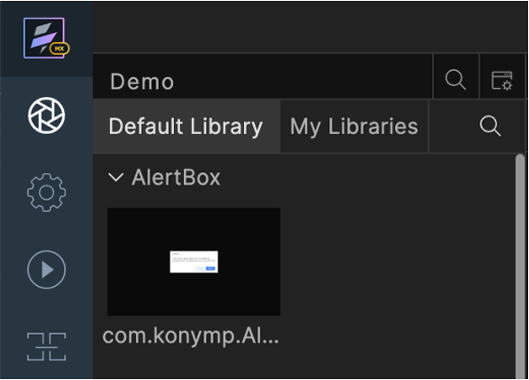
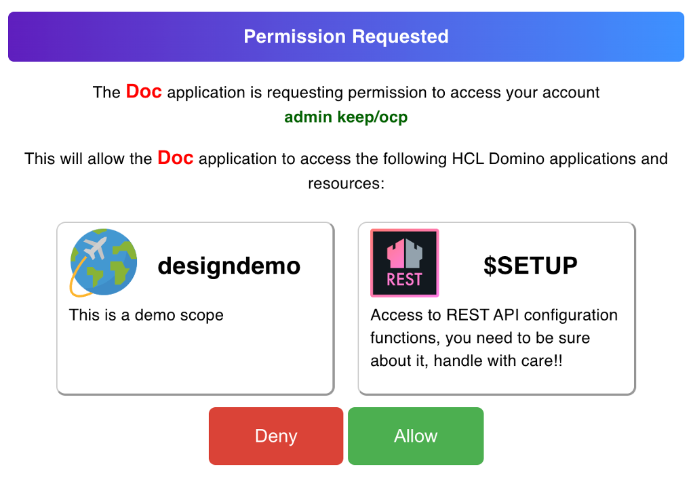
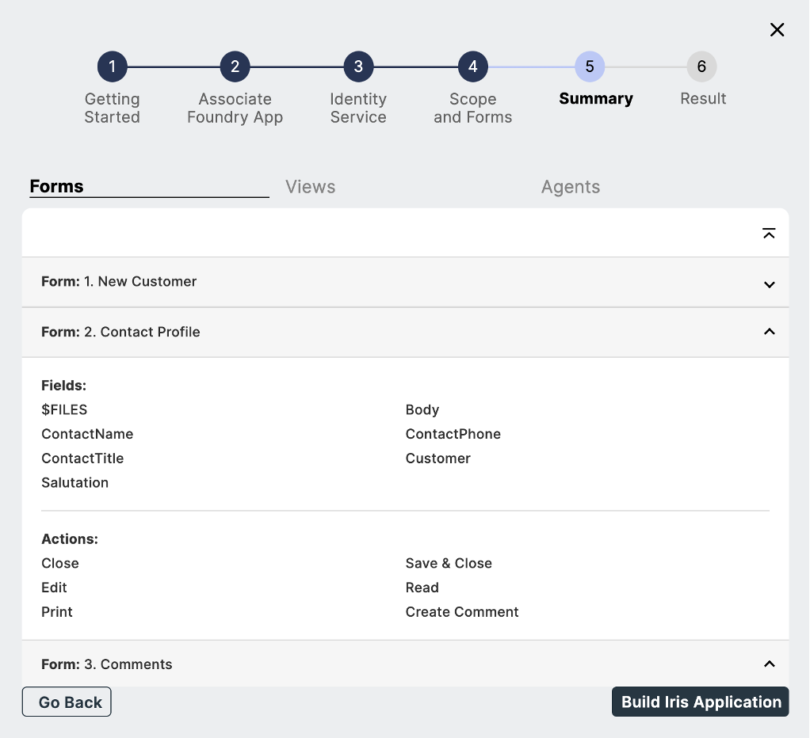

# Design Import tutorial
 
 This tutorial guides you in accessing Design Import in Volt MX Go through the use of Volt MX Iris to view the `.nsf` file. This feature in Volt MX Go Iris is a way to extract the domino`.nsf` file where you can design the `.nsf` structure in **Volt MX GO Iris** synchronous to the **Domino Designer** server. 

## Before you start

!!!note
	Make sure you have downloaded the latest version of Volt MX Go Iris before performing the installation.

- You have completed the [Volt MX Go installation](installation.md).
- You have created your [Foundry admin account](../howto/foundryadminaccount.md).
- You have noted the following Domino REST API details:
    - Server URL: `http://drapi.mymxgo.com` 
    - username: `mxgo admin`
    - password: `password`

- You have a configured `.nsf` file, `schema` and `scopes` in [Domino Rest API](https://opensource.hcltechsw.com/Domino-rest-api/tutorial/adminui.html).
- You have a credentials for Volt MX Foundry and Domino REST API.

## Launch Volt MX Go Iris

1. Open the **Volt MX Go Iris**. This opens the log-in screen of Iris.
		
2. On launching Iris, the Volt MX Go cloud login screen appears for license validation. Click **Close.**

3. Go to [Validate Volt MX GO Foundry](#validate-volt-mx-go-foundry) procedure.

4.  Enter your **credentials** in Volt MX Go Iris and click **Sign-In.**

	{: style="height:60%;width:60%"}

## Validate Volt MX GO Foundry
	
1. Open the **Volt MX Iris** menu bar for Mac and **Edit** menu bar for Windows and click **Preferences**.
2. This opens the **Volt MX Iris Preferences**. Click to **Volt MX Foundry**.
3. Fill-in the Foundry URL with `http://foundry.mymxgo.com` and click **Validate**. 
4. Click **Done**. 

{: style="height:80%;width:80%"}

## Create a new project
	
!!!note
	Design Import currently only supports projects for desktop web apps. Before importing a Domino Application, select or create a project set for Responsive Web desktop.
		

1. On the top menu, **Project** &rarr; **New Project**.
2. On the **What do you want to start with now?** dialog, select **Web App** and click **Next**.

	{: style="height:70%;width:70%"}

3. On the **Which device size do you want to start building for first?** dialog, select Desktop and click **Next**.

	{: style="height:70%;width:70%"}

4. Enter your **Project Name** and click **Create**. 	
	{: style="height:70%;width:70%"}	

5. You can see your project name on the upper-right corner of the Iris canvass.

	{: style="height:70%;width:70%"}

## Import a Domino Application using new Foundry

1. Select **Project** &rarr; **Import** &rarr; **Domino Application** on **Volt MX Go Iris** app. The VoltMX Design Import Wizard appears.

2. The VoltMX Design Import wizard appears. Go to the first step **Getting Started** and click **Next**.

	{: style="height:80%;width:80%"}
	
3. On the second step **Associate Foundry App**, click **Create New** and click **Next**.

	!!!note
		Once you click **Create New**, new foundry app associated in Volt MX Go Iris. The default name is the same with your **Project Name**.

4. The third step **Identity Service**, fill in the **Create New Identity Service** and click **Next**,

	|  **Fields**     | **Description** |
	| -----------     | -----------		|
	| Domino REST API URL   | This refers to the Domino REST API URL you are working with. You must enter your respective Domino REST API URL    |
	| Scope       | This is the name of your configured scope describe in your App of Domino REST API app management. |
	|Client ID    | This is the App ID of your Application in Domino Rest API app management. Once you configured and added your App, you may see all along your `App ID` and your `App Secret`. |
	|Client Secret| This is the App Secret in Domino Rest API app management. Once you configured and added your App, you may see all along your `App ID` and your `App Secret`. |
	|Service Name:| Any name that identify the Volt MX Go Foundry Identity Services. |

	{: style="height:80%;width:80%"}

	1. Select your **service name**, that you added from the earlier page and click **Next**. Once your Foundry Application has pubished, your service name should be named as MXGO(service name). Example: MXGODigiApp1

		{: style="height:80%;width:80%"}

	2. Log-in your credential to Domino Rest API within this wizard modal dialog and click **allow**.

		{: style="height:80%;width:80%"}

	3. Select your **Foundry Identity Service** name  associated to Domino REST API and click **Next.**

		{: style="height:80%;width:80%"}

5. On the fourth step **Scope and Forms**, select your scope that you’ve configured in Domino Rest API. These scopes are associated with the `.nsf` file from Domino and Notes.

	- You can **select** or **deselect** the configured `forms`, `fields` and `views` and click **Next**. The lists you see are the ones you choose in the configured `forms` and  `views`, then save on your scope in Domino Rest API configurations.
		{: style="height:80%;width:80%"}

6. On the fifth step **Summary**, you can review here the final `Form` and `views` fields you want to import. Once reviewed, click **Build Iris Application.**. 

	!!!tip
		It may take a while of publishing the imported Irish app.

	
	{: style="height:80%;width:80%"}	

7. On the final step **Result** , you can see the final `forms` and `views`. 
 
	!!!tip
		- The **check mark icon** besides each of the `forms`, `fields` and `views` means that it was successfully created.
		- The **warning icon** besides each of the `forms`, `fields` and `views` means that the supported datatype doesn't match with the Iris app datatype.
		- Turn on `show only error` toggle to see all the fields with warning icon.

	{: style="height:80%;width:80%"}	

	Once you click **Done**, each of the selected form, views and agents have imported in the  Iris through the use of Forms in Volt MX Go Iris.
	**The App Events [desktop]** appears.

	

	!!!note
		- You can view the final result of the `.nsf` file that you configured in Domino REST API.
		- You can click the link **click here to view logs on a separate window** to see the summarized `forms`, `views`, and app forms in one page.

## Import a Domino Application from existing Foundry

1. Click on **Project** &rarr; **Import** &rarr; **Domino Application** on **Volt MX Go Iris** app.
2. A wizard modal dialog appears. Go to the first step "**Getting Started**" and click **Next**.
3. On the second step **Associate Foundry App"**, click **Create New** and click **Next**.
	- Select from the Volt MX Go Application the foundry app and click **Associate**. The existing foundry app is selected and click **Next**.

4. The third step **Identity Service**, click **Select Existing** on the Identity Service step. This connects the **Domino Rest API service**.
	- Select your **active app** from you Domino Rest API Identity Service.
	
5. On the fourth step **Scope and Forms**, select your scope that you’ve configured in Domino Rest API. These scopes are associated with the `.nsf` file from Domino and Notes.

	- You can **select** or **deselect** the configured `forms`, `fields` and `views` and click **Next**. The lists you see are the ones you choose in the configured `forms` and  `views`, then save on your scope in Domino Rest API configurations.

6. On the fifth step **Summary**, you can review here the final `Form` and `views` fields you want to import. Once reviewed, click **Build Iris Application.**. 

	!!!tip
		It may take a while of publishing the imported Irish app.

7. On the final step **Result** , you can see the final `forms` and `views`. 
 
	!!!tip
		- The **check mark icon** besides each of the `forms`, `fields` and `views` means that it was successfully created.
		- The **warning icon** besides each of the `forms`, `fields` and `views` means that the supported datatype doesn't match with the Iris app datatype.
		- Turn on `show only error` toggle to see all the fields with warning icon.

	Once you click **Done**, each of the selected form, views and agents have imported in the  Iris through the use of Forms in Volt MX Go Iris.
	**The App Events [desktop]** appears.

## CRUD operation upon importing the `.nsf` file

!!!note
	Before you can do the CRUD operation in your imported domino application, you must first build and published web in Iris.
	To do this, go this link: [Building a Web App](https://opensource.hcltechsw.com/volt-mx-docs/95/docs/documentation/Iris/iris_microapps/Content/WebPublish.html#publish-a-web-app)

1. Log in your account in Domino REST API using the newly published imported domino application.

	!!!note
		Your configuration in Domino REST API decide what are the operations you can include in the **design import** form.
		All the `views` and `forms` of your `.nsf` file have imported, so you can design your **`.nsf`** file with CRUD operation.

2. On the **Dashboard**, click your Table (example: newCar) under **Forms**.  
	
	

3. Click **Add New**.
4. Fill in the fields and click **Add**. This add the data in the `.nsf` file.

	

5. Go back to the **Dashboard**, and then click your Table (example: carListView) under **Views**. 

	

6. In the **Views** window, you can see here the added values on your **Forms**.

	

