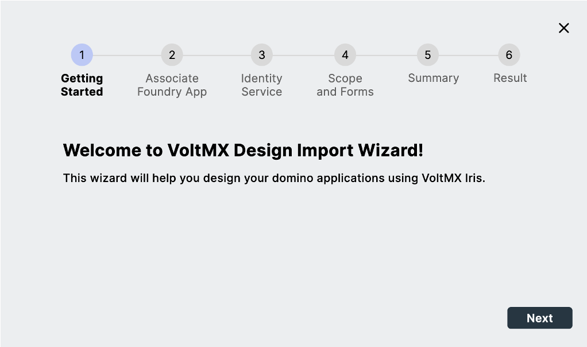
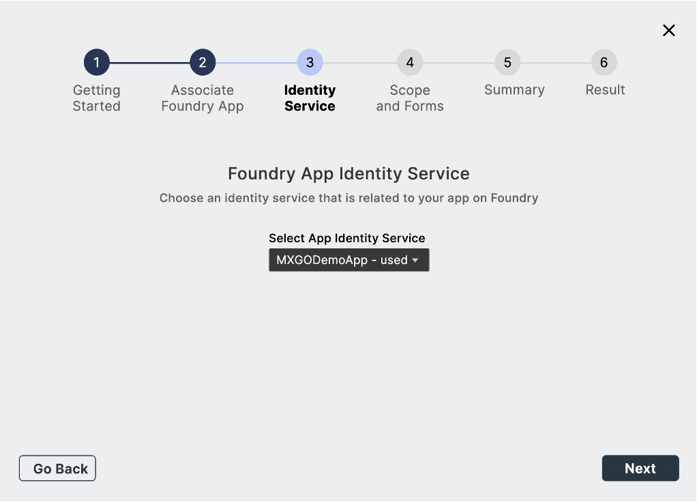
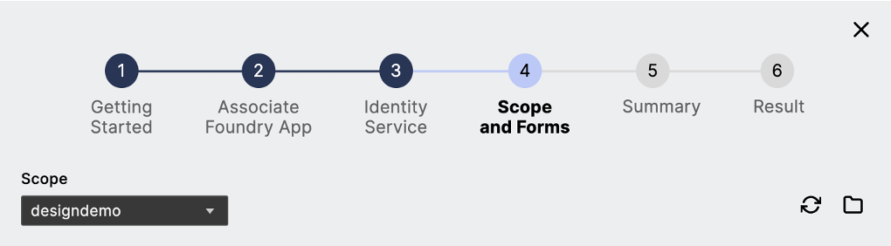
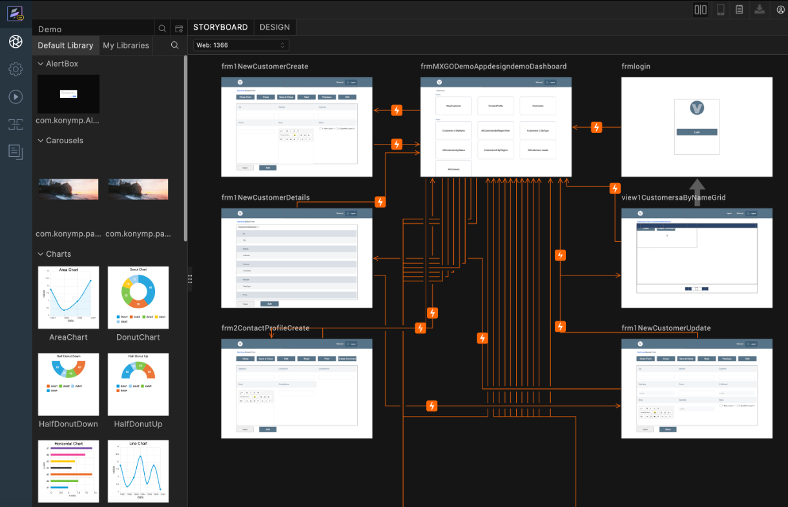
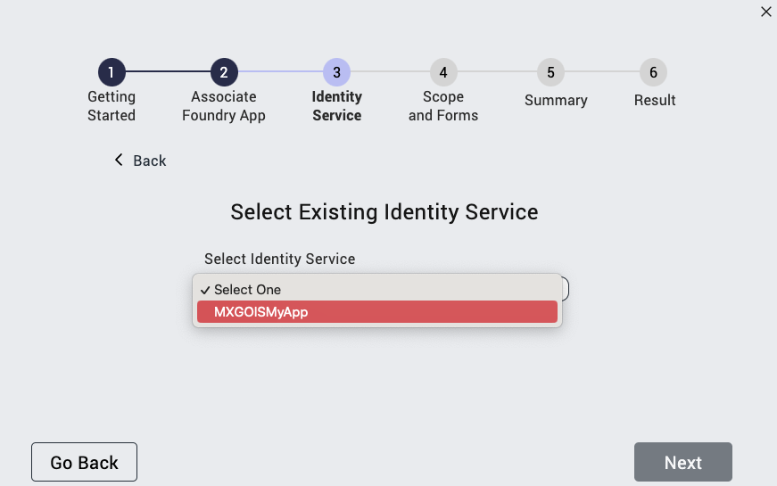
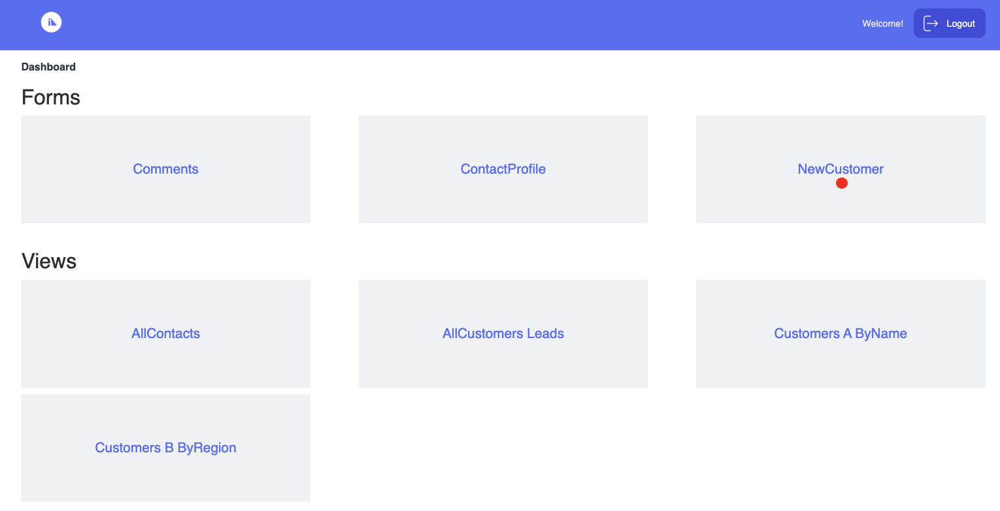
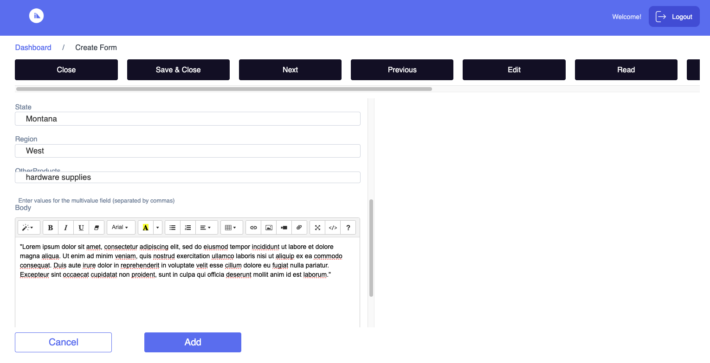
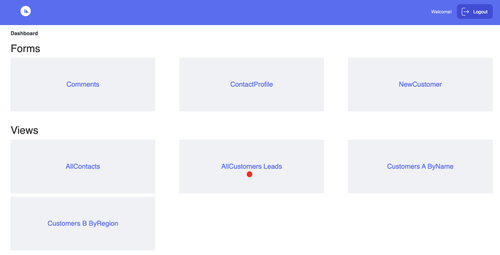
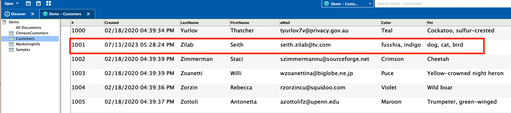

# Design Import tutorial
 
 This tutorial guides you in accessing Design Import in Volt MX Go through the use of Volt MX Iris to view the `.nsf` file. This feature in Volt MX Go Iris is a way to extract the domino`.nsf` file where you can design the `.nsf` structure in **Volt MX GO Iris** synchronously to the **Domino Designer** server. 

!!!note
    This tutorial is for Mobile app and Responsive Desktop

## Before you start

- You have completed the [Volt MX Go installation](installation.md).
- You have created your [Foundry admin account](../howto/foundryadminaccount.md).
- You have created Domino REST API.
- Your user account must be [added to the LocalKeepAdmins](https://help.hcltechsw.com/notes/12.0.2/client/sec_acl_useradd_t.html){: target="_blank"} group in the Domino Keep Configuration (KeepConfig.nsf) Access Control List to access administrative APIs used by Design Import. 

<!-- All users in Volt MX Go that are performing a Design Import need to be [added to the LocalKeepAdmins](https://help.hcltechsw.com/notes/12.0.2/client/sec_acl_useradd_t.html) group in the Domino Keep Configuration (KeepConfig.nsf) Access Control List for access to administrative API used by Design Import.--> 

- You have a configured `.nsf` file, `schema`,`scopes` and application in [Domino Rest API](https://opensource.hcltechsw.com/Domino-rest-api/references/usingdominorestapi/administrationui.html){: target="_blank"}.

    -  When you configure the `schema`, open Configured Database Form and set the **Formula for Delete Access** to `@True` in default `Mode` in all `Forms`.See [Changes in Configuration Forms of Domino Rest API](https://opensource.hcltechsw.com/Domino-rest-api/references/usingdominorestapi/administrationui.html#configure-a-form){: target="_blank"}.

    -  When you configure the `schema`, open Database Form (configured) and set in `dql mode`, you must include all the fields of the `Form`. Both the `default` and `dql modes` fields must match for the form and fields to be seen as configured in the design import. 

    - When you configure the `schema`, open the Database Form (configured) and include the `$Files` field to capture the uploading and downloading of files in the Design Import.

    -  When you configure the `schema`, open Database Views and set the Status to active.

    -  When you configure the `scopes`, you need a *Maximum Access Level* set to Designer or Manager. See [Scope in Domino Rest API](https://opensource.hcltechsw.com/Domino-rest-api/references/usingdominorestapi/administrationui.html#add-a-scope){: target="_blank"}.

    -  When you configure your Domino REST API application, it's mandatory to add `$SETUP` to return proper values.

## Launch Volt MX Go Iris

1. Open Volt MX Go Iris. When the **Sign-in** dialog opens, close it.

    !!!note
        If you have already configured the login settings while performing the other tutorials, enter your email and password for Foundry on the **Sign in to your account** page and click **Sign In**. You don't need to execute the steps below for configuring the login settings and logging in. 

2. Configure the login settings.

    1. Go to **Preferences**.
        
        For Windows, select **Edit** &rarr; **Preferences**. 
        
        For Mac, depending on your macOS, select **Volt MX Iris** &rarr; **Preferences** or **Settings**.

    2. On the **Volt MX Go Iris Preferences** dialog, click **Volt MX Go Foundry**.

        

    3. On the **Volt MX Go Foundry** tab, enter your Foundry URL in the **Foundry URL** text box, and then click **Validate**.
        
        You should see the “Validation Successful” message at the top of the dialog.
    
    4. Click **Done**.

3. Log in to Volt MX Go Iris.
    1. Click **Login** on the upper right corner of the Volt MX Go Iris screen.
    2. Enter your email and password for Foundry on the **Sign in to your account** page.
    3. Click **Sign In**. Your username appears next to the profile icon.

<!--1. Open the **Volt MX Go Iris**. This opens the Iris log-in screen. Click the close button.

    !!!note
        If the Iris newly installed, the close button is accessible. However, once the preference is modified, the close button is no longer appear during login.

    Wait until the MX Go Foundry preference has been verified before logging in.

    **Validation of MX Go preference:**
        
    1. Click  the home {: style="height:3%;width:3%"} icon.
    2. Open the **Volt MX Iris** menu bar for Mac and **Edit** menu bar for Windows and click **Preferences**.
    3. This opens the **Volt MX Iris Preferences**. Click on **Volt MX Foundry**.
    4. Fill in the **Foundry URL** with <!--`http://foundry.mymxgo.com` or your Foundry hostname, and click **Validate**.
        

    5. Click **Done**. 

4. Enter your **Foundry app credentials** in Volt MX Go Iris and click **Sign-in**.

    -->

## Create a new project
    
1. On the top menu, select **Project** &rarr; **New Project**.
2. On the **What do you want to start with now?** dialog, select **Web App** or **Native App** and click **Next**.

    {: style="height:80%;width:80%"}

3. On the **Which device size do you want to start building for first?** dialog, select **Desktop** for Web App or **Mobile** for Native App and click **Next**.

    {: style="height:80%;width:80%"}

4. Enter your **Project Name** and click **Create**.  
  
    {: style="height:80%;width:80%"}

You can now see your project name in the upper-left corner of the Iris canvass.

{: style="height:80%;width:80%"}

## Import a Domino Application using the new Foundry app

1. On the top menu, select **Project** &rarr; **Import** &rarr; **Domino Application**. The **VoltMX Design Import Wizard** opens.

2. On **Getting Started**, click **Next**.

    
    
3. On **Associate Foundry App**, click **Create New**.

    !!!note
        Once you click **Create New**, the new Foundry app is associated with Volt MX Go Iris. The default name is the same as your **Project Name**.
            

4. On **Identity Service**:
    
    1. Enter the required details in the **Create New Identity Service** and click **Next**. 

        |  **Fields**     | **Description** |
        | -----------     | -----------     |
        | Domino REST API URL   | This refers to the Domino REST API URL you are working with. You must enter your respective Domino REST API URL.    |
        | Scope       | This is the name of your configured scope described in your App of Domino REST API app management. $DATA scope show all the scopes in your App in Domino REST API.  |
        |Client ID    | This is the App ID of your Application in Domino Rest API app management. Once you configured and added your App, you may see your `App ID` and your `App Secret`. |
        |Client Secret| This is the App Secret in Domino Rest API app management. Once you configured and added your App, you may see your `App ID` and your `App Secret`. |
        |Service Name:| Any name that identifies the Volt MX Go Foundry Identity Services. |

        

    2. Select your **service name**, that you added from the earlier page and click **Next**. Once your Foundry Application has been published, your service name should be named as MXGO(service name). Example: MXGOkeepRecipe201

        

    2. Login with your **Domino credentials** within this wizard modal dialog and click **Allow**.

        !!!note
            This document assumes you are using the Domino IdP which uses your Domino directory credentials. If you aren't, enter the credentials for the IdP you've configured for Domino REST API. 

        

    3. Select your **Foundry Identity Service** name associated to Domino REST API and click **Next**.

        

5. On **Scope and Forms**:

    1. Select the scope that you’ve configured in Domino Rest API. These scopes are associated with the `.nsf` file from Domino and Notes.

        

    2. **Select** or **deselect** the configured `forms`, `fields`, and `views` and click **Next**. The lists you see here are the configured and unconfigured forms you set in the Domino Rest API. You can only select the configured forms.

        

6. On **Summary**, review the final `forms` and `views` fields you want to import, and then click **Build Iris Application.**. 

    !!!note
        It may take a while to complete the publishing of the imported Iris app.

    

7. On **Result**, see the final `forms` and `views`, and then click **Done**.
 
    !!!tip
        - The **check mark icon** beside each of the `forms`, `fields`, and `views` means that it was successfully created.
        - The **warning icon** beside each of the `forms`, `fields`, and `views` means that the supported datatype doesn't match with the Iris app datatype.
        - Turn on the **Show only error** toggle to see all the fields with the warning icon.

     

Once you click **Done**, each of the selected forms, views, and agents are imported into Iris through the use of Forms in Volt MX Go Iris. **The App Events [desktop]** appears.

!!!note
    - You can view the final result of the `.nsf` file that you configured in Domino REST API.
    - You can click the link **click here to view logs on a separate window** to see the summarized `forms`, `views`, and app forms on one page.

## Import a Domino Application from the existing Foundry app

1. On the top menu, select **Project** &rarr; **Import** &rarr; **Domino Application**. The **VoltMX Design Import Wizard** opens.
2. On **Getting Started**, click **Next**.

    

3. On **Associate Foundry App**:
    
    1. Click **Use Existing**.

        

    2. Select the **Foundry App** generated from the wizard, click **Associate** and close the form. 

        

    3. Click **Next**.

        

        !!!info
            If you have an existing Domino Application Project on your canvass and you want to import and associate it with another Foundry app, use the **Unlink App**. This unlinks the Foundry App and returns to selecting *Create New* or *Use Existing* 

4. On **Identity Service**, click **Select Existing** on the Identity Service step. This connects the **Domino Rest API service**.

    
    
5. On **Scope and Forms**: 

    1. Select the scope that you’ve configured in Domino Rest API. These scopes are associated with the `.nsf` file from Domino and Notes.

        

    2. **Select** or **deselect** the configured `forms`, `fields`, and `views` and click **Next**. The lists you see here are the configured and unconfigured forms you set in the Domino Rest API. You can only select the configured forms.

        

6. On **Summary**, review the final `forms` and `views` fields you want to import, and then click **Build Iris Application.**. 

    !!!note
        It may take a while to complete the publishing of the imported Iris app.
    
    

7. On **Result**, see the final `forms` and `views`, and then click **Done**.
 
     

Once you click **Done**, each of the selected forms, views, and agents have imported into the  Iris through the use of Forms in Volt MX Go Iris. **The App Events [desktop]** appears.

## CRUD operation upon importing the `.nsf` file

!!!note "Published the web app and native app in Iris"
    - Before you can do the CRUD operation in your imported Domino application, you must first build and publish the web and native app in Iris.
    
        - If your app is a **Web App**, see [Building a Web App](https://opensource.hcltechsw.com/volt-mx-docs/95/docs/documentation/Iris/iris_microapps/Content/WebPublish.html#publish-a-web-app){: target="_blank"}.

        - If your app is a **Native App:**
            1. [Configure your mobile app browser](../howto/configmobile.md).
            2. After configuring your mobile app browser, see [Building a Native App](https://opensource.hcltechsw.com/volt-mx-docs/95/docs/documentation/Iris/iris_user_guide/Content/LocalBuildStarter.html){: target="_blank"} to view the mobile app.

    - Log in to your account in Domino REST API using the newly published imported Domino application.
      Your configuration in Domino REST API decides what operations you can include in the **design import** form.
      All the `views` and `forms` of your `.nsf` file have been imported, so you can design your **`.nsf`** file with CRUD operation.

    - The Native App (mobile) and the Web App (Responsive Desktop) have the same capability of doing the CRUD operation.

### Create entry

1. In the **Dashboard**, go to the **Forms** section and click your preferred document. (example: Customer).

    

2. Fill in the fields.
3. Click **Select Files** to upload a file. The **File Upload** appears only if the schema included the `$Files` field in the configuration of Domino REST API.

    1. Select the file you want to upload. You can select more than one file to upload. 
    
        !!!notes
            To see the details of uploading size limit, see [HCL Notes and DOMINO file limits](https://help.hcltechsw.com/dom_designer/11.0.1/basic/H_NOTES_AND_DOMINO_KNOWN_LIMITS.html)

    2. Click **Open**. If the file is pre-existing, a dialog prompt appears with the option to overwrite it.
    
4. Click **Add**. This adds the data to the `.nsf` file.

    

### Viewing data

1. In the Dashboard, go to the **Views** section and click your preferred document.(example: Customer).

    

2. This will open the Customer's document page. Go to your preferred Customer and click **View**.

    

    
3. This will open the Customer's detail. Select the **Download All Attachments** link. Files will be downloaded. 

    !!!note
        - You can download the attachments in your document (e.g Customer's detail). You can download the attachment if the `$File` is configured in your DRAPI Database Views.
        - You can also see here the **Delete** and **Edit** button.

   <!--  -->

### Update data

1. On the **Dashboard**, go to the **Views** section, click your preferred document (example: Customer).

    

2. In the **Dashboard/Customer** page, search the customer and click **View**. 

    !!!note
        If the detail view **DOESN'T show**, check the [Database Views in DRAPI](https://opensource.hcltechsw.com/Domino-rest-api/references/usingdominorestapi/administrationui.html#list-available-views) under schema, to confirm that the Database View is active and the columns in the view are added during the import.

    

3. Click **Edit**.

    !!!note
        You may also see the delete button here, which allows you to erase or remove the data you've selected.

4. Edit the fields that you want to modify.

5. Click **Select Files** to add a new file. The uploaded file will show below the **Select Files** button.

    1. Select the file you want to upload. You can select more than one file to upload. 
    
        !!!notes
            To see the details of uploading size limit, see [HCL Notes and DOMINO file limits](https://help.hcltechsw.com/dom_designer/11.0.1/basic/H_NOTES_AND_DOMINO_KNOWN_LIMITS.html)

    2. Click **Open**. If the file is pre-existing, a dialog prompt will appear with the option to overwrite it.

6. Click **Save**.

      

### Delete entry

!!!note
    - Before you delete any of the data, you must set **Formula for Delete Access** to `@True` in Default `mode` during your schema configuration.

1. On the **Dashboard**, go to the **Views** section, click your preferred document (example: Customer).

    

2. In the **Dashboard/Customer** page, search customer and click the **Delete** button.

    

    There is a confirmation message box to confirm the deletion of data, click **OK**.

    

    Another pop-up message box appears.

    
 

!!!note
    Since changes to the form are reflected in the Domino Server, they're also visible in the Notes Client.

