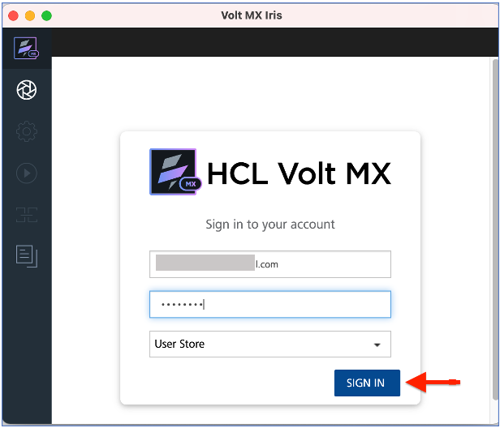

# Design Import tutorial

<!--add changes to designimport.md -->
 
 This  tutorial guides you in accesing the Design Import in VoltMX Go through the use of VoltMX Iris to view the .NSF file.

## Before you start

- Must have a **VoltMX Iris** app and completed the installation procedure in [Volt MX Iris](https://opensource.hcltechsw.com/volt-mx-docs/95/docs/documentation/Iris/installing_iris.html).
- Must have a **VoltMX Foundry** app and completed the installation procedure in [Volt MX Foundry](installation.md).
- Must have a configured **`.NSF`** file, `schema` and `scopes` in [KEEP](https://opensource.hcltechsw.com/Domino-rest-api/tutorial/adminui.html).
- Must have a **username** and **password** for VoltMX Go Iris, Foundry and Domino REST API.

## Launch VoltMX Go Iris

1. Open the **VoltMX Go Iris**. This opens the log-in screen of Iris.

	!!!note
		You can also start Iris by going to the folder where it's stored and double-clicking it.
		
   	On launching Iris, the VoltMX Go cloud login screen appears for license validation.

2.  Enter your **credentials** in VoltMx Go Iris and click **Sign-In.**
   The VoltMX Go Iris app canvass opens.

## Validating VoltMX GO Foundry
	
1. Open the **Vlt MX Iris** menu bar for Mac and **Edit** menu bar for Windows and click **Preferences**.
2. This opens the **VoltMX Iris Preferences**. Click to **Volt MX Foundry**.
3. Fill-in the Foundry URL with `http://foundry.mymxgo.com` and click **Validate**. 
4. Click **Done**. 

		

## Open a new project
	!!!note
		The default project for Iris is `Sample` which has the mobile app. For early release, you need only the WebApp and the Desktop as a platform. 

1. Click **Project** on the VoltMX Go Iris navigation tab and click the **New Project.**
2. Select **Web App** and click **Next.**

	!!!note ""
		For this release, select only the Web App.

3. Select the **device** you want to build for the new Project and click **Next**.

	!!!note ""
		For this release, select only the Desktop.

4. Enter your **Project Name** and  click **Create**. 

		
5. You can see your Project name on the upper-right corner of the Iris canvass.

	 

## Introduction to the Design Import

This feature in VoltMX Go Iris is a way to extract the domino **`.NSF`** file where you can design the **`.NSF`** structure in **VoltMX GO Iris** synchronous to  the **Notes Designer** server. 

## Import a Domino Application

1. Click on **Project** navigation bar, go to &rarr; **Import** &rarr; **Domino Application** on **VoltMX Go Iris** app.
1. Go to the first step "**Getting Started**" and click **Next**.
2. Click **Create New** on the *Associate Foundry  App*.

	!!!note ""
		Once you click **Create New** , new foundry app associated in VoltMX Go Iris. The default name of the same your **Project Name*.

3. Select the “**Create New**” for  the connection of Domino REST API Services and click **Next**.

	1. Fill-in the **New Identity Service** and click **Next**

		|  **Fields**     | **Description** |
		| -----------     | -----------		|
		| Domino REST API URL   | This refers to the Domino REST API URL you are working with. You must enter your respective Domino REST API URL    |
		| Scope       | This is the name of your configured scope describe in your App of Domino REST API app management. |
		|Client ID    | This is the App ID of your Application in Domino Rest API app management. Once you configured and added your App, you may see all along your `App ID` and your `App Secret`. |
		|Client Secret| This is the App Secret in Domino Rest API app management. Once you configured and added your App, you may see all along your `App ID` and your `App Secret`. |
		|Service Name:| Any name that identify the VoltMX Go Foundry Identity Services. |

		

	2. Select your **service name** you added from the earlier page and click **Next**.

		

	3. Log-in your credential to Domino Rest API and click **allow**.

		

	4. Select your **Foundry Identity Service** name  associated to Domino REST API and click **Next.**

		
 4. Select your scope that you’ve configured in Domino Rest API. 
 
 	!!!note ""
		These scopes are associated with the .nsf file from Domino Software and IBM Lotus Notes.

	1. You can **select** or **deselect** the configured forms, fields, views and agent and click **Next.**

		!!!note ""
			The lists you see are the ones you choose in the configured forms, views, and agents and save on your scope in Domino Rest API configurations.

5. Click **Build Iris Application.**

	!!!note ""
		You can see the summary of the configured `forms`, `views`, `agents` and fields. You can **Go Back** if there are changes. 

6. Click **Done**.

	!!!note ""
		- You can view the final result of the .nsf file that you configured in Domino REST API.
		- You can click the link "**click here to view logs on a separate window**" to see the summarized forms, views and app forms in one page.

Once you click **Done**, each of the selected form, views and agents have imported in the  Iris through the use of Forms in VoltMX Go Iris.

## Creating from existing Foundry and Domino Rest API.

1. Click on **Project** navigation bar, go to &rarr; **Import** &rarr; **Domino Application** on **VoltMX Go Iris** app.
2. Go to the first step "**Getting Started**" and click **Next**.
3.  Click on **Use Existing** link on **Associate Foundry App**.
	1. Select from the VoltMX Go Application the foundry app and click **Associate**. The existing foundry app is selected and click **Next**.
4. Click **Select Existing** on the Identy Service step. This connects the Domino Rest API service.
	1. Select your **active app** from you Domino Rest API identity Service.
5. Select your scope that you’ve configured in Domino Rest API. 
 
 	!!!note ""
		These scopes are associated with the .nsf file from Domino Software and IBM Lotus Notes.

	1. You can **select** or **deselect** the configured forms, fields, views and agent and click **Next.**

		!!!note ""
			The lists you see are the ones you choose in the configured forms, views, and agents and save on your scope in Domino Rest API configurations.

6. Click **Build Iris Application.**

	!!!note ""
		You can see the summary of the configured `forms`, `views`, `agents` and `fields`. You can **Go Back** if there are changes. 

7. Click **Done**.

	!!!note ""
		- You can view the final result of the .nsf file that you configured in Domino REST API.
		- You can click the link "**click here to view logs on a separate window**" to see the summarized forms, views and app forms in one page.

Once you click **Done**, each of the selected form, views and agents have imported in the  Iris through the use of Forms in VoltMX Go Iris.

