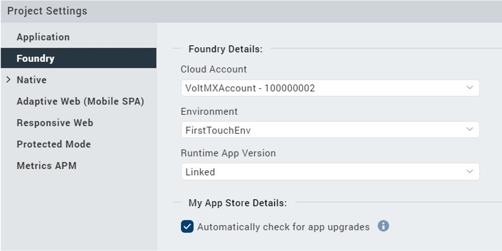
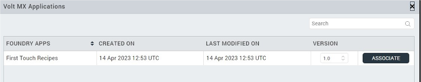
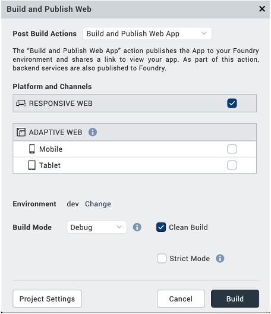
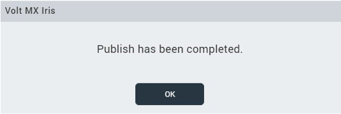

# First Touch tutorial

This tutorial guides you in accessing and running the First Touch Recipe Catalog app from Volt Foundry to view and explore the app.

## Before you start

- You have completed the [Volt MX Go installation](installation.md).
- You have created your [Foundry admin account](../howto/foundryadminaccount.md).

### Additional prerequisites

If you used the Volt MX Go native installers, you need to perform the following in addition to the steps listed above:

- You have [set up an oauth.nsf](https://opensource.hcltechsw.com/Domino-rest-api/howto/VoltMX/setupoauthnsf.html){: target="_blank"}.
- You have [set up Domino REST API](https://opensource.hcltechsw.com/Domino-rest-api/howto/VoltMX/configuring-keep-idplite-with-identity-service.html?h=oauth.json#set-up-domino-rest-api){: target="_blank"}.

    !!!note
        You don't need to perform The *Create Foundry Identity Service* and the *Set up Domino REST API application and database* procedures included in the same webpage that contain the *Set up Domino REST API* procedure as they aren't applicable to First Touch.

- You have [downloaded the FirstTouchRecipes_NSF_EA3.zip](portaldownload.md) file, extracted the NSF file from the zip file, and copied the NSF file to the root of the data directory of your Domino server.

## Log in to Volt MX Go Foundry

1. Open `http://foundry.mymxgo.com/mfconsole/` or your provided Foundry hostname concatenated with `/mfconsole/`in your browser.

    !!!tip
        If you used the native installer to install Volt MX Go Foundry, use the **Console URL** in the **Install Complete** window or from the *Installation Complete* details that appear in the command line to log in to Volt MX Go Foundry.  
 

2. Enter your username and password on the **Sign in to your account** page. 
3. Click **Sign In**.  

   The **Volt MX Foundry Console** opens with the **Apps** page shown by default. The **VOLT MX GO | First Touch** banner is shown on the **Apps** page.

   

## Run First Touch

1. On the **Apps** page, click **GET STARTED**.

    OR

    Select **VOLT MX GO First Touch** from the side panel. 

    

2. On the **Welcome to Volt MX Go** dialog, enter the following information:

    - Domino REST API server URL
    - username: `mxgo admin`
    - password: `password`

    !!!note
        - If you updated the administrator's first name, last name, and password in the `values.yaml` file in the [Download the Domino REST API Helm chart](http://localhost:8000/HCL-TECH-SOFTWARE/voltmxgo-documentation/tutorials/downloadhelmchart.html#1-download-the-domino-rest-api-helm-chart) procedure as part of the containerized deployment, use the updated values for the username and password.  
        - If you used the native installer to install Domino REST API, use your Domino server administrator username and password. 

3. Click **Next**. An installation progress dialog appears.

    {: style="height:60%;width:60%"}

4. Wait for the completion of the installation. Once completed, a **Congratulations!** dialog appears confirming the successful installation of the First Touch app and the verification of the connection to the Domino database via Domino REST API.

    {: style="height:60%;width:60%"}
 

5. On the **Congratulations!** dialog, click **Launch** to launch the First Touch Recipe Catalog app. The First Touch Recipe Catalog app opens in another tab. 
6. Click **Sign In**.
7. On the **HCL Domino Login** page, enter your Domino REST API username and password, and click **Login**.

    {: style="height:60%;width:60%"}

8. On the **Permission Requested** page, click **Allow**.

    {: style="height:60%;width:60%"}
 
You can now view and explore the First Touch Recipe Catalog app. 

<!--For more information, see [First Touch Recipe Catalog app](../topicguides/firsttouchapp.md).-->

!!!tip
    - You can click **Cancel** in the **Congratulations!** dialog to return to the **Apps** view in Foundry to view the app’s Foundry configuration.
    - To launch the app again from Foundry, click **GET STARTED**, select **View First Touch Recipes**, and then click **Next**.    

<!--
## Import the First Touch sample recipe application

1. Open **Volt MX GO Iris**.
2. Enter your username and password in the **Sign in to your account** page, and then
click **Sign In**.
3. On the main menu, select **Projects &rarr; Import &rarr; Local Project &rarr; Open as New Project &rarr; From an Archive**. A file selector dialog opens.
4. Select the `FirstTouchRecipes.zip` file and click **Open**. The First Touch Application project is imported into your workspace.

## Connect to Foundry

1. Check Foundry settings.

    1. (For Windows) On the top menu, select **Edit** &rarr; **Preferences**.

        or

        (For Mac) On the main menu, select **Volt MX Iris** &rarr; **Preferences**.

    2. On the **Volt MX Iris Preferences** dialog, click **Volt MX Foundry**.
    3. On the **Volt MX Foundry** tab, enter `http://foundry.mymxgo.com` in the **Foundry URL** text box, and then click **Validate**.

        

        You should see the “Validation Successful” message at the top of the screen if the Foundry is available.

    4. Click **Done**.

2. Check environment settings.

    1. On the top menu, select **Project &rarr; Settings**.
    2. On **Project Settings** dialog, click **Foundry**.
    3. Select `FirstTouchEnv` under **Environment** (if not yet selected).

        

    4. Click **Done**.

3. Connect to Foundry.

    1. Click the **Profile** icon on the upper right corner of the Volt Iris screen.
    2. Enter your username and password for Foundry. Your username appears next to the **Profile** icon.
    3. Click the **Data & Services** tab under your username.
    4. Click the menu icon, and then select **Link to an Existing App**. The Volt MX Applications dialog opens.

        

    5. Click **Associate** to link your application to the First Touch Recipes data stored on Foundry.
    6. Click **Project Services** and see the connections to the Foundry data.

        

## Publish the application

Now that the Recipe App has been imported and linked to the First Touch Foundry you are ready to build and publish the application.

1. On top menu, select **Build** &rarr; **Build and Publish Web**.
2. Select **Responsive Web** checkbox and **Clean Build** checkbox, and then click **Build**.

    

Once the build is completed, you will see the following dialog indicating publishing completion.

**You will now find the published application here: `<foundry url>/admin/console/apps/appservices.html#!/details`**.
-->