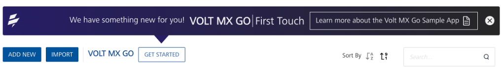
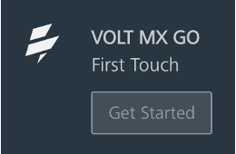
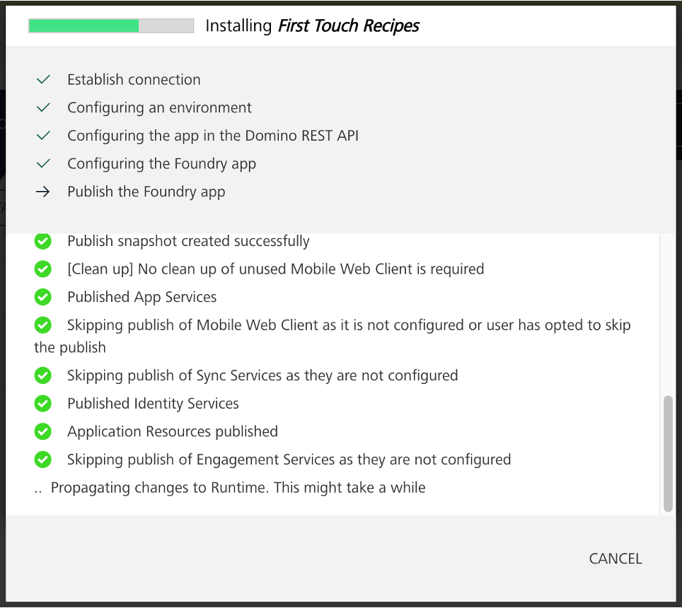
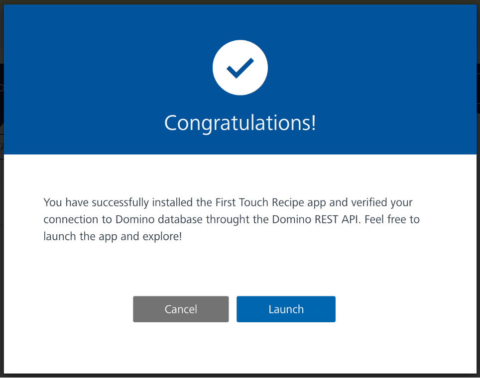
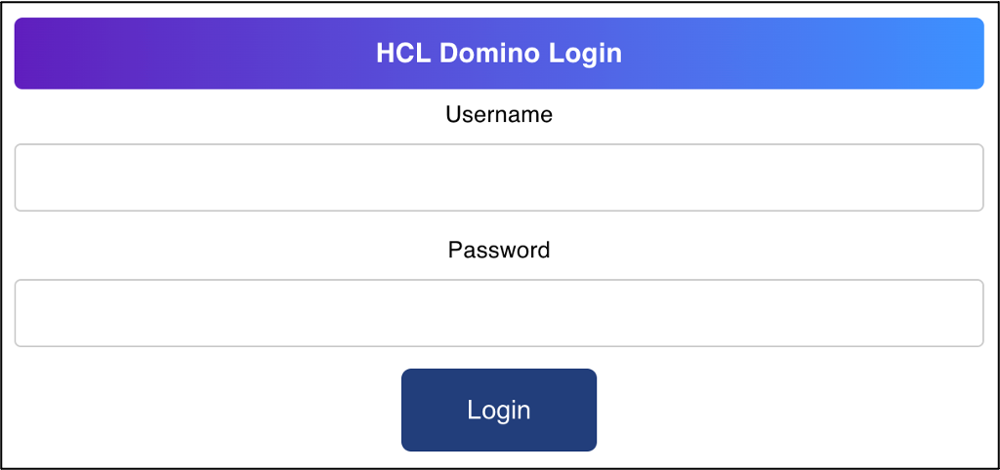
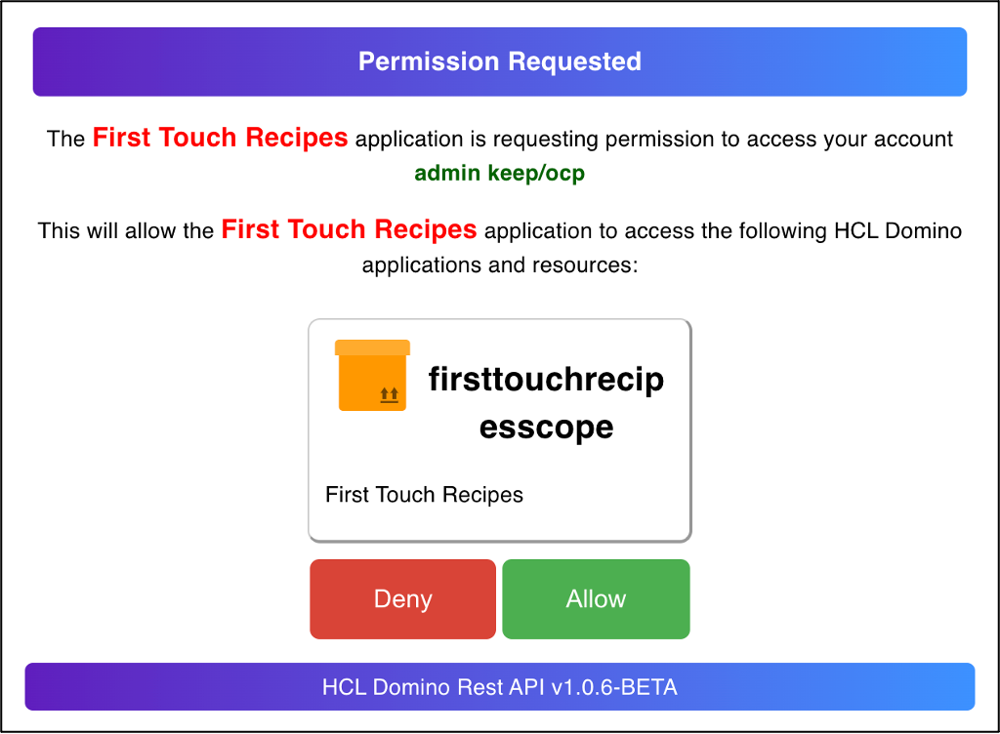

# First Touch tutorial

This tutorial guides you in accessing and running the First Touch Recipe Catalog app from Volt MX Go Foundry to view and explore the app.

## Before you begin

=== "For production environment"

    **For Volt MX Go install to a production environment**

    - You have completed the [Volt MX Go installation in a production environment](prerequisite.md).
    - You have created your [Volt MX Go Foundry admin account](../howto/foundryadminaccount.md).
    - If using MySQL, make sure that the maximum allowed packet size is at least 16 MB. For more information, see **First Touch or Custom Application Fails to Install on Volt MX Go Foundry** issue in [Troubleshooting](../references/troubleshoot.md). <!--This isn't applicable when setting up First Touch in Volt MX Go installed in a development or test-only environment.-->

    <!--!!!note 
        You can skip the setup of `oauth.nsf`, Domino REST API, and download of the First Touch recipe ZIP file if you are performing the Volt MX Go install to a development or test only environment.--> 

    !!!tip
        The following actions might require certain Domino access rights. Contact your Domino Administrator/Domino REST API Administrator for assistance.  

    - You have [set up an oauth.nsf](https://opensource.hcltechsw.com/Domino-rest-api/howto/VoltMX/setupoauthnsf.html){: target="_blank" rel="noopener noreferrer"}.
    - You have [set up Domino REST API](https://opensource.hcltechsw.com/Domino-rest-api/howto/IdP/configuredrapiIdP.html){: target="_blank" rel="noopener noreferrer"}.
    - You have [downloaded the FirstTouchRecipes.nsf.zip](portaldownload.md) file, extracted the NSF file from the zip file, and copied the NSF file to the root of the data directory of your Domino server.

=== "For development or test-only environment"

    **For Volt MX Go install to a development or test-only environment**

    - You have completed the [Volt MX Go installation in a development or test-only environment](containerdeployment.md).
    - You have created your [Volt MX Go Foundry admin account](../howto/foundryadminaccount.md).
   

## Log in to Volt MX Go Foundry

1. Open the Volt MX Go Foundry hostname concatenated with `/mfconsole/`in your browser.

    !!!tip
        Use the **Console URL** in the **Install Complete** window or from the *Installation Complete* details that appear in the command line to log in to Volt MX Go Foundry.  
 
2. Enter your username and password on the **Sign in to your account** page. 
3. Click **Sign In**.  

   The **Volt MX Foundry Console** opens with the **Apps** page shown by default. The **VOLT MX GO | First Touch** banner is shown on the **Apps** page.

   

## Run First Touch

1. On the **Apps** page, click **GET STARTED**.

    OR

    Select **VOLT MX GO First Touch** from the side panel. 

    

2. On the **Welcome to Volt MX Go** dialog, enter the following information:

    - Domino REST API server URL
    - username
    - password

    !!!note
        This document assumes you are using the Domino IdP, which uses your Domino directory credentials. If you aren't, enter the credentials for the IdP you've configured for Domino REST API. 

3. Click **Next**. An installation progress dialog appears.

    {: style="height:60%;width:60%"}

    !!!note
        If an *Uploading web binary for First Touch Recipes app* error occurs in the installation progress dialog, see **First Touch or Custom Application Fails to Install on Volt MX Go Foundry** issue in [Troubleshooting](../references/troubleshoot.md).

4. Wait for the completion of the installation. Once completed, a **Congratulations!** dialog appears confirming the successful installation of the First Touch app and the verification of the connection to the Domino database via Domino REST API.

    {: style="height:60%;width:60%"}
 

5. On the **Congratulations!** dialog, click **Launch** to launch the First Touch Recipe Catalog app. The First Touch Recipe Catalog app opens in another tab. 
6. Click **Sign In**.
7. On the **HCL Domino Login** page, enter your Domino REST API username and password, and click **Login**.

    !!!note
        This document assumes you are using the Domino IdP, which uses your Domino directory credentials. If you aren't, enter the credentials for the IdP you've configured for Domino REST API.

    {: style="height:60%;width:60%"}

8. On the **Permission Requested** page, click **Allow**.

    {: style="height:60%;width:60%"}
 
You can now view and explore the First Touch Recipe Catalog app. 

!!!tip
    - You can click **Cancel** in the **Congratulations!** dialog to return to the **Apps** view in Volt MX Go Foundry to view the app’s Foundry configuration.
    - To launch the app again from Volt MX Go Foundry, click **GET STARTED**, select **View First Touch Recipes**, and then click **Next**.    

## Additional information

- To learn more about the app, see [First Touch Recipe Catalog app](../topicguides/firsttouchapp.md).
- To know how to import the First Touch Recipe app project to Volt MX Go Iris, see [Import First Touch into Volt MX Go Iris](../howto/importft.md).
- To know how to manually update your Domino container if you obtain a new version of *FirstTouchRecipes.nsf*, see [Update FirstTouchRecipes.nsf](../howto/FTnsfupdate.md).