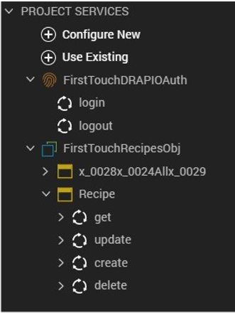

# First Touch tutorial

This tutorial guides you on accessing and running the First Touch app in Volt Foundry to view and explore a sample app, and then set up and run the sample app in Volt Iris.

## Before you start

- You have completed the [Volt MX Go installation](installation.md).
- You have created your [Foundry admin account](../howto/foundryadminaccount.md).

- You have [downloaded the HCL Volt MX GO Early Access Release package](portaldownload.md).

## Log in to Volt MX Foundry

1. Open `http://foundry.mymxgo.com/mfconsole/` in your browser. 
2. Enter your username and password on the **Sign in to your account** page. 
3. Click **Sign In**.  

   The **Volt MX Foundry Console** opens with the **Apps** page shown by default. The **VOLT MX GO | First Touch** banner is shown on the **Apps** page.

   

## Run First Touch

1. On the **Apps** page, click **GET STARTED**.

    OR

    Select **VOLT MX GO First Touch** from the side panel. 

    

2. On the **Welcome to Volt MX Go** dialog, enter the following information:

    - Server URL: `http://drapi.mymxgo.com`
    - username: `mxgo admin`
    - password: `password`

3. Click **Next**. An installation progress dialog appears. 

4. Wait for the completion of the installation. Once completed, a **Congratulations!** dialog appears confirming the successful installation of the First Touch app and the verification of the connection to the Domino database via Domino REST API. 
 
5. On the **Congratulations!** dialog, click **Launch**. 

   You can now view and explore the First Touch sample recipe app Foundry configuration.
 

The First Touch sample recipe app is a Domino app written using Volt MX Go. It is automatically configured to use Domino REST API for both the Identity Service and the Object Service. For more information, see [Identity Service](https://opensource.hcltechsw.com/volt-mx-docs/95/docs/documentation/Foundry/voltmx_foundry_user_guide/Content/Identity.html) and [Object Service](https://opensource.hcltechsw.com/volt-mx-docs/95/docs/documentation/Foundry/voltmx_foundry_user_guide/Content/Objectservices.html) in the [HCL Volt MX Documentation](https://opensource.hcltechsw.com/volt-mx-docs/95/docs/documentation/index.html). 

## Import the First Touch sample recipe application

1. Open **Volt MX GO Iris**.
2. Enter your username and password in the **Sign in to your account** page, and then
click **Sign In**.
3. On the main menu, select **Projects &rarr; Import &rarr; Local Project &rarr; Open as New Project &rarr; From an Archive**. A file selector dialog opens.
4. Select the `FirstTouchRecipes.zip` file and click **Open**. The First Touch Application project is imported into your workspace.

## Connect to Foundry

1. Check Foundry settings.

    1. (For Windows) On the top menu, select **Edit** &rarr; **Preferences**.

        or

        (For Mac) On the main menu, select **Volt MX Iris** &rarr; **Preferences**.

    2. On the **Volt MX Iris Preferences** dialog, click **Volt MX Foundry**.
    3. On the **Volt MX Foundry** tab, enter `http://foundry.mymxgo.com` in the **Foundry URL** text box, and then click **Validate**.

        

        You should see the “Validation Successful” message at the top of the screen if the Foundry is available.

    4. Click **Done**.

2. Check environment settings.

    1. On the top menu, select **Project &rarr; Settings**.
    2. On **Project Settings** dialog, click **Foundry**.
    3. Select `FirstTouchEnv` under **Environment** (if not yet selected).

        

    4. Click **Done**.

3. Connect to Foundry.

    1. Click the **Profile** icon on the upper right corner of the Volt Iris screen.
    2. Enter your username and password for Foundry. Your username appears next to the **Profile** icon.
    3. Click the **Data & Services** tab under your username.
    4. Click the menu icon, and then select **Link to an Existing App**. The Volt MX Applications dialog opens.

        

    5. Click **Associate** to link your application to the First Touch Recipes data stored on Foundry.
    6. Click **Project Services** and see the connections to the Foundry data.

        

## Publish the application

Now that the Recipe App has been imported and linked to the First Touch Foundry you are ready to build and publish the application.

1. On top menu, select **Build** &rarr; **Build and Publish Web**.
2. Select **Responsive Web** checkbox and **Clean Build** checkbox, and then click **Build**.

    

Once the build is completed, you will see the following dialog indicating publishing completion.

**You will now find the published application here: `<foundry url>/admin/console/apps/appservices.html#!/details`**.