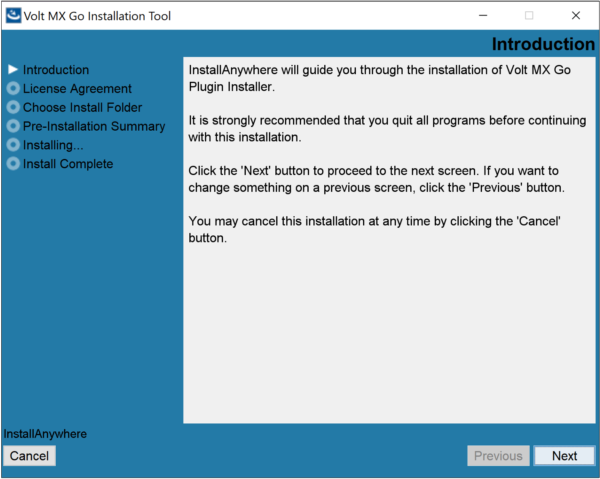
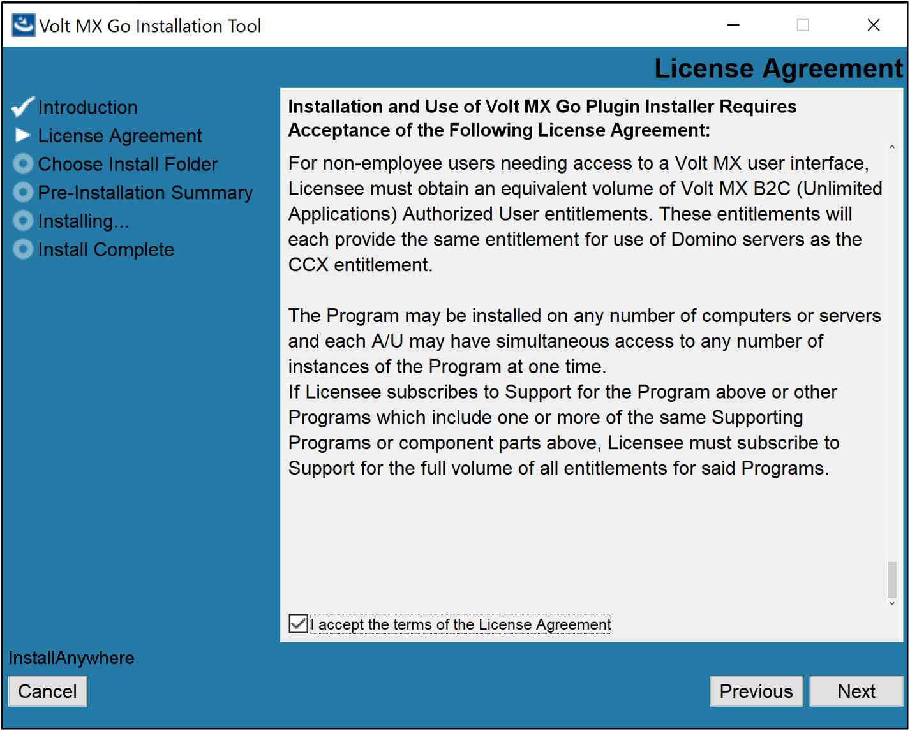
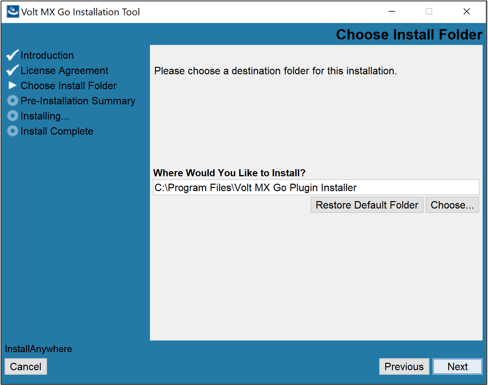
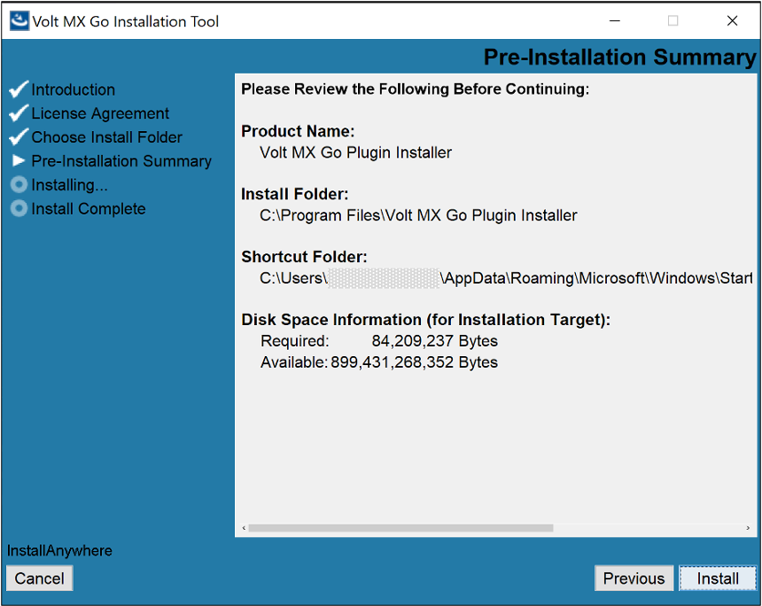
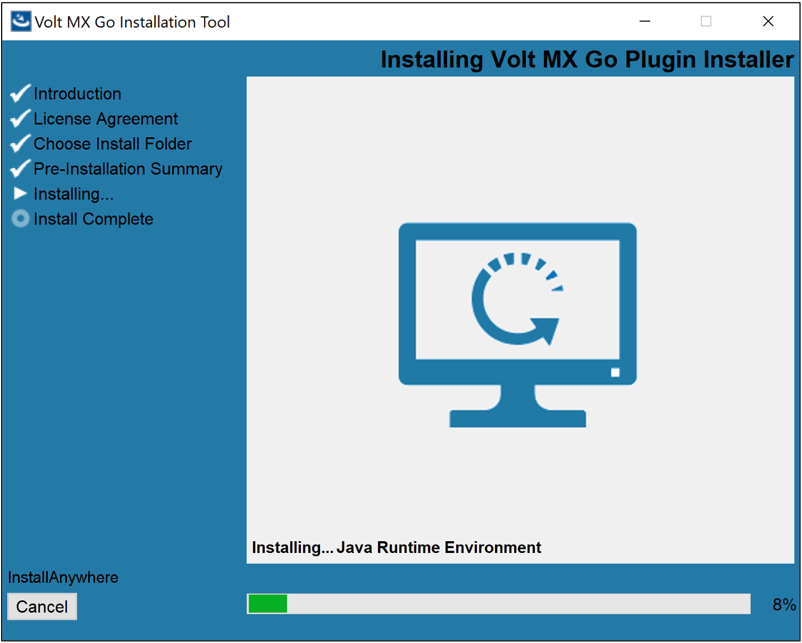
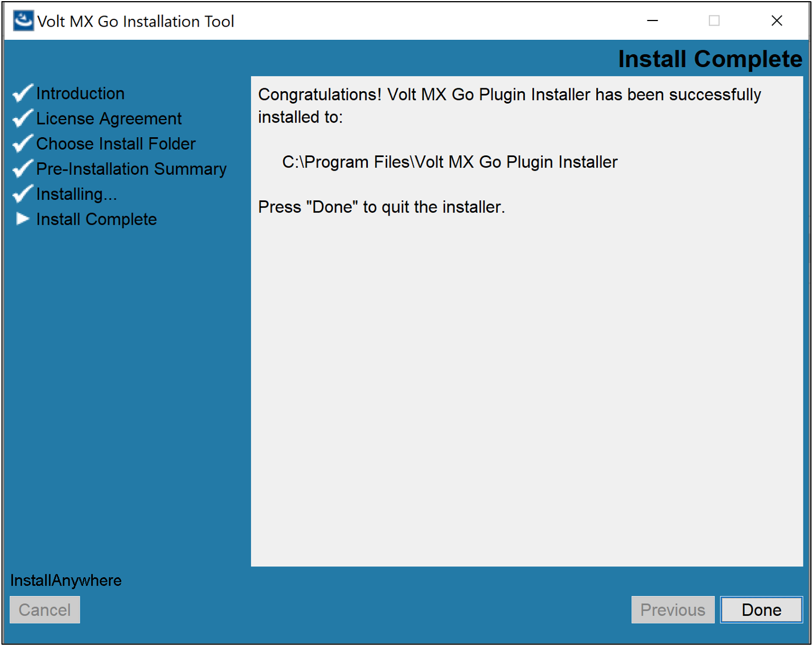
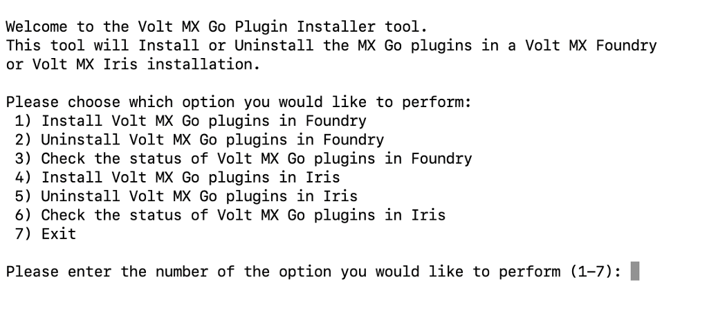

# For Volt MX Go v2.1 and later

## Install Domino REST API

Guides you in installing Domino REST API.

### Before you begin

--8<-- "drapiversion.md"

### Procedure

1. Download the Domino REST API installer. For more information, see [Download the Domino REST API](https://opensource.hcltechsw.com/Domino-rest-api/tutorial/installconfig/index.html#download-the-domino-rest-api "Link opens a new tab"){: target="_blank" rel="noopener noreferrer"}&nbsp;{: style="height:13px;width:13px"} in the HCL Domino REST API documentation.

2. Follow the links to the installation procedure based on your preferred installation platform:

    - [For Windows](https://opensource.hcltechsw.com/Domino-rest-api/tutorial/installconfig/win.html "Link opens a new tab"){: target="_blank" rel="noopener noreferrer"}&nbsp;{: style="height:13px;width:13px"}

    - [For Linux](https://opensource.hcltechsw.com/Domino-rest-api/tutorial/installconfig/linux.html "Link opens a new tab"){: target="_blank" rel="noopener noreferrer"}&nbsp;{: style="height:13px;width:13px"}

3. Complete all the [post-installation tasks](https://opensource.hcltechsw.com/Domino-rest-api/tutorial/installconfig/postinstallation.html "Link opens a new tab"){: target="_blank" rel="noopener noreferrer"}&nbsp;{: style="height:13px;width:13px"}.

For more information, see the [Installation and configuration](https://opensource.hcltechsw.com/Domino-rest-api/tutorial/installconfig/index.html "Link opens a new tab"){: target="_blank" rel="noopener noreferrer"}&nbsp;{: style="height:13px;width:13px"} page in the [HCL Domino REST API documentation](https://opensource.hcltechsw.com/Domino-rest-api/index.html "Link opens a new tab"){: target="_blank" rel="noopener noreferrer"}&nbsp;{: style="height:13px;width:13px"}.

## Install Volt MX Go Foundry

**Starting from Volt MX Go v2.1 release**, Volt MX Go Foundry is enabled by installing the supported version of Volt Foundry using available installation mechanisms and then installing Volt MX Go plugins to Volt Foundry using a Volt MX Go Plugin Installer. The use of Helm charts and a single container solution are also supported for installing Volt Foundry. It's important to note that for Volt MX Go v2.1, **only Volt Foundry using a Tomcat non-clustered application server is supported**.

**Volt Foundry must be licensed with a Volt MX Go entitlement for the plugins to be enabled and for the Volt MX Go features to work.**

### For using an installer

#### Before you begin

- You have downloaded the Volt Foundry installer. The minimum supported version is v9.5.18.0.
- You have downloaded the Volt MX Go Plugin Installer.

For more information, see [Download HCL Volt MX Go installers](portaldownload.md#for-volt-mx-go-v21-and-later).

#### Install Volt Foundry

For installing Volt MX Go Foundry, click the link to the installation guide corresponding to your installation platform and follow the installation steps. 

!!! warning "Important"

    - For Volt MX Go v2.1, **only Volt Foundry using a Tomcat non-clustered application server is supported**.
    - Make sure to check all the details and complete all the applicable procedures indicated in the sections in the installation guides.
    
    - After completing the installation, activate the **Volt MX Go license** on Volt Foundry and then shut it down before proceeding to the installation of the Volt MX Go plugins. For more information, see [license activation](https://help.hcl-software.com/voltmx/v9.5/Foundry/voltmx_licensing_guide/Content/License_Activation_through_VoltMX_Server_7.2.html "Link opens a new tab"){: target="_blank" rel="noopener noreferrer"}&nbsp;{: style="height:13px;width:13px"} on the *Volt MX documentation*. 

- [For Windows](https://opensource.hcltechsw.com/volt-mx-docs/95/docs/documentation/Foundry/voltmx_foundry_windows_install_guide/Content/Introduction.html "Link opens a new tab"){: target="_blank" rel="noopener noreferrer"}&nbsp;{: style="height:13px;width:13px"}

- [For Linux](https://opensource.hcltechsw.com/volt-mx-docs/95/docs/documentation/Foundry/voltmx_foundry_linux_install_guide/Content/Introduction.html "Link opens a new tab"){: target="_blank" rel="noopener noreferrer"}&nbsp;{: style="height:13px;width:13px"}

#### Install Volt MX Go Plugin Installer

The procedure enables the installation of the Volt MX Go Plugin Installer, which is used for installing the Volt MX Go plugins to Volt Foundry.

=== "on Linux"

    1. Open terminal and extract the installer from the tar file. 
    1. Navigate to the directory containing the `VoltMXGoInstallationTool.bin` to ensure that you are in the right location to execute the installation commands for the bin file. 
    1. Enter the following command to grant executable permissions to the `VoltMXGoInstallationTool.bin` file and press **Enter**. 

        `sudo chmod +x VoltMXGoInstallationTool.bin`

        Using the `chmod` command with `sudo` ensures administrative privileges.

    1. Run the `VoltMXGoInstallationTool.bin` file to start the installation using the following command and press **Enter**.

        `./VoltMXGoInstallationTool.bin`

    1. Follow the installation instructions. The binary file will initiate the installation process and may prompt you with on-screen instructions. Follow these instructions carefully to complete the installation.

        !!!note

            If you have a graphical terminal associated with your Linux deployment, the **Volt MX Go Installation Tool** window opens. Otherwise, installation is via the command line.  

    <!--1. Enter `ls -latrh` to list the installation directory contents to identify the shortcuts for running and uninstalling the installer.
    1. Take note of the shortcut for running the installer.-->

=== "on Windows"

    1. Navigate to the folder containing the downloaded installer file. 
    1. Double-click the installer file. The **Volt MX Go Installation Tool** window opens. 
    1. On the **Introduction**, read the details and instructions, and then click **Next**.

        {: style="height:80%;width:80%"}

    1. On the **License Agreement**, read the agreement details, select the **I accept the terms of the License agreement** checkbox, and then click **Next**.

        {: style="height:80%;width:80%"}

    1. On the **Choose Install Folder**, click **Next** if you agree with the indicated default location.

        {: style="height:80%;width:80%"} 

        !!!tip
            - If you want a different installation location, click **Choose** to select your preferred installation location or directly enter your preferred installation location in the text box, and then click **Next**.
            - If you selected a different installation location and decided to revert to the default location, click **Restore Default Folder** and then click **Next**.

    1. On the **Pre-Installation Summary**, review the details and then click **Install**.

        {: style="height:80%;width:80%"}

    1. On the **Installing**, see the installation status.

        {: style="height:80%;width:80%"}

    1. On the **Install Complete**, click **Done**.

        {: style="height:80%;width:80%"}

#### Install Volt MX Go plugins

The procedure enables the installation of Volt MX Go plugins to Volt Foundry to enable Volt MX Go features.

!!!warning "Important"
    - For Volt MX Go v2.1, you can only install Volt MX Go plugins to Volt Foundry that uses a Tomcat non-clustered application server.
    - Volt Foundry must be licensed with a Volt MX Go entitlement for the plugins to be enabled and for the Volt MX Go features to work.

=== "on Linux"

    1. Open Terminal.
    1. Go to the directory where you installed the Volt MX Go Plugin Installer. By default, the installer executable is located in the `~/VoltMXGoPluginInstaller` directory.
    2. Run the Volt MX Go Plugin Installer by entering the following command and press **Enter**.

        `./VoltMXGoPluginInstaller`

        The installation tool opens on the Terminal showing the available options.

        {: style="height:80%;width:80%"}

    3. Enter **1** to install Volt MX Go plugins in Volt Foundry and press **Enter**.
    4. Specify the Tomcat WebApps directory by entering the number corresponding to your installation or enter the full path to your Tomcat WebApps directory, and then press **Enter**.

        You get a confirmation statement that the plugins have been installed.

        !!! note

            Starting with Volt MX Go version 2.1.1, the installed Volt Foundry version is checked for compatibility. If incompatible, the plugin installation stops, and users are informed of their current and required minimum Volt Foundry versions.

    6. Enter **7** and press **Enter** to exit the installation tool. 

=== "on Windows"

    1. Select **Start**, scroll through the alphabetical list, and select **Volt MX Go Plugin Installer**. Depending on your OS, you might need to select **All apps**, scroll through the alphabetical list, and click **Volt MX Go Plugin Installer**.

        OR

        Double-click the **Volt MX Go Plugin Installer** shortcut on your desktop if available. 

        A Command Prompt window opens showing the available options.

        {: style="height:80%;width:80%"}

    2. Enter **1** to install Volt MX Go plugins and press **Enter**.
    3. Specify the Tomcat WebApps directory by entering the number corresponding to your installation, or enter the full path to your Tomcat WebApps directory, then press **Enter**. 

        You get a confirmation statement that the plugins have been installed.

        --8<--"foundryversioncheck.md"
        
        !!! note

            Starting with Volt MX Go version 2.1.1, the installed Volt Foundry version is checked for compatibility. If incompatible, the plugin installation stops, and users are informed of their current and required minimum Volt Foundry versions. 

    5. Press **Enter** to close the Command Prompt window.

!!! note

    - After installing the Volt MX Go plugins, open Volt Foundry to verify you see the Volt MX GO/First Touch banner. 
    - For further reference, see the {: style="height:15px;width:15px"}&nbsp;[Installing Volt MX Go v2.1 for Volt Foundry](https://www.youtube.com/watch?v=pVexsNw5st0 "Video opens and plays in a new tab"){: target="_blank" rel="noopener noreferrer"} video demonstration.

### For using Helm charts on a supported Kubernetes platform

#### Before you begin

- You have [obtained the authentication token from the HCL Container Repository](../howto/obtainauthenticationtoken.md).
- You have completed all the installation [prerequisites](https://opensource.hcltechsw.com/volt-mx-docs/95/docs/documentation/Foundry/voltmxfoundry_containers_helm/Content/Installing_Containers_With_Helm.html#prerequisites "Link opens a new tab"){: target="_blank" rel="noopener noreferrer"}&nbsp;{: style="height:13px;width:13px"}.
- You have reviewed the configuration parameters and identified their required values as you must provide them during the installation. For more information, see [Configuration](https://opensource.hcltechsw.com/volt-mx-docs/95/docs/documentation/Foundry/voltmxfoundry_containers_helm/Content/Installing_Containers_With_Helm.html#configuration "Link opens a new tab"){: target="_blank" rel="noopener noreferrer"}&nbsp;{: style="height:13px;width:13px"}.
- You have downloaded the Volt Foundry Helm charts. For more information, see [Download HCL Volt MX Go installers](./portaldownload.md#for-volt-mx-go-v21-and-later).

#### Procedure

1. Click the link to the installation guide and follow the installation steps.

    [Volt Foundry Container Helm installation guide](https://opensource.hcltechsw.com/volt-mx-docs/95/docs/documentation/Foundry/voltmxfoundry_containers_helm/Content/Installing_Containers_With_Helm.html#installation "Link opens a new tab"){: target="_blank" rel="noopener noreferrer"}&nbsp;{: style="height:13px;width:13px"}

    !!!warning "Important"
        Make sure to check all the details and complete all the applicable steps indicated in the installation guide.

2. After completing all applicable steps in the installation guide, update the `values.yaml` file.

    1. Locate the `values.yaml` file in the Volt Foundry directory.
    2. Open the `values.yaml` file with your preferred editor and locate the line containing the `imageRegistry:` key.
    3. Change the value of the `imageRegistry:` key to `"hclcr.io/voltmxgo`.
    4. Save your changes and close the file. 

3. Execute the `helm upgrade foundry` command to upgrade the running images to use Volt MX Go. 

### For single container solution

For more information, see [Volt Foundry Single Container Solution](https://opensource.hcltechsw.com/volt-mx-docs/95/docs/documentation/Foundry/voltmxfoundry_single_container/Content/VoltMX_Foundry_Single_Container_Solution_On-Prem_.html "Link opens a new tab"){: target="_blank" rel="noopener noreferrer"}&nbsp;{: style="height:13px;width:13px"} in the Volt MX Documentation. 

#### Before you begin

- You have [obtained the authentication token from the HCL Container Repository](../howto/obtainauthenticationtoken.md).
- You have completed all the [installation prerequisites](https://opensource.hcltechsw.com/volt-mx-docs/95/docs/documentation/Foundry/voltmxfoundry_single_container/Content/VoltMX_Foundry_Single_Container_Solution_On-Prem_.html#prerequisites "Link opens a new tab"){: target="_blank" rel="noopener noreferrer"}&nbsp;{: style="height:13px;width:13px"}.
- You have reviewed the configuration parameters and identified their required values as you must provide them during the installation. For more information, see [Configuration](https://opensource.hcltechsw.com/volt-mx-docs/95/docs/documentation/Foundry/voltmxfoundry_single_container/Content/VoltMX_Foundry_Single_Container_Solution_On-Prem_.html#configuration "Link opens a new tab"){: target="_blank" rel="noopener noreferrer"}&nbsp;{: style="height:13px;width:13px"}.
- You have downloaded the Volt Foundry Single Container install script. For more information, see [Download HCL Volt MX Go installers](../tutorials/portaldownload.md#for-volt-mx-go-v21-and-later).

#### Procedure

1. Click the link to the installation guide and follow the installation steps. 

    [Volt Foundry Single Container Solution installation guide](https://opensource.hcltechsw.com/volt-mx-docs/95/docs/documentation/Foundry/voltmxfoundry_single_container/Content/VoltMX_Foundry_Single_Container_Solution_On-Prem_.html#installation "Link opens a new tab"){: target="_blank" rel="noopener noreferrer"}&nbsp;{: style="height:13px;width:13px"}

    !!!warning "Important"
        - The installation guides indicate installation files and installation file download locations. **You must use the installer you downloaded as indicated in the *Before you begin* section.**
        - Make sure to check all the details and complete all the applicable steps indicated in the installation guide.

2. Update the `docker-compose.yml` file.

    1. Locate the `docker-compose.yml` file in the Volt Foundry directory.
    2. Open the `docker-compose.yml` file with your preferred editor and locate the line containing the `image:` key.
    3. Change the value of the `image:` key from `"hclcr.io/voltmx/voltmx-foundry-db:<version>_GA"` to `"hclcr.io/voltmxgo/voltmx-foundry-db:<version>_GA"`, wherein <version\> corresponds to the Volt Foundry release version. For example, `"hclcr.io/voltmxgo/voltmx-foundry-db:9.5.18.0_GA"`.
    4. Save your changes and close the file. 

3. Stop the existing images by running the command `docker compose down`.
4. Restart the images by running the command `docker compose up -d`.

## Next step

After completing the installation of **Domino REST API** and **Volt MX Go Foundry**, proceed to [Install Volt MX Go Iris](installiris.md).

