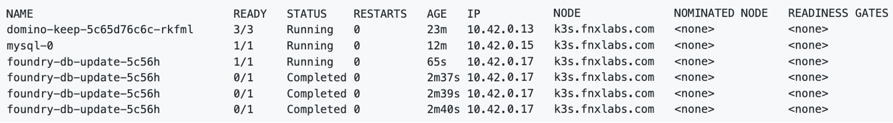

# Install Foundry

The procedures will guide you in the installation of Foundry. 

## 1. Download Foundry charts

1. Run the following commands to download the Foundry charts, unpack the files, and move the `values.yaml` file to the current directory:

    ```
    helm pull hclcr/voltmx-dbupdate
    helm pull hclcr/voltmx-foundry
    tar -xzf voltmx-foundry-1.2.0.tgz
    tar -xzf voltmx-dbupdate-1.1.0.tgz
    mv voltmx-foundry/values.yaml  ./
    ```

2. Edit the `values.yaml` file to update the `imageCredentials` by replacing `your-email` and   `your-authentication-token` with your [email and authentication token](k3sinstall.md#5-obtain-your-authentication-token-from-hcl-container-repository) used with the HCL Container Repository.

    ```
    imageCredentials:
      username: your-email
      password: your-authentication-token
    ```

3. Save the file and exit.

## 2. Deploy Foundry's dbupdate to create the databases in MySql

1. Run the following Helm install command to deploy Foundry's dbupdate:

    ```
    helm install dbupdate voltmx-dbupdate -f values.yaml
    ```

2. Run the following command to verify deployment completion of Foundry's dbupdate:

    ```
    kubectl get pods -o wide -w
    ```

    The output should be similar to the following and will update over time:



Once the dbupdate pod shows Completed in the STATUS column, press `Ctrl-c` to stop the command.

## 3. Install Foundry

1. Run the following Helm install command to deploy Foundry:

    ```
    helm install foundry voltmx-foundry -f values.yaml
    ```

2. Run the following command to verify when the Foundry install is ready:

    ```
    kubectl get pods -o wide -w
    ```

You should see an output similar to the following:


Once all the foundry pods have a 1/1 state in the READY column, press `Ctrl-c` to stop the kubectl command.  

Foundry is now available at [http://foundry.mymxgo.com/mfconsole/](http://foundry.mymxgo.com/mfconsole/).   

!!!note
    If you want to access this deployment from a remote machine, you will most likely need to update the `/etc/hosts` file on the remote machine as well.

## Next step

Proceed to [Connect to Domino server from your Notes client](connectdominofromnotes.md).