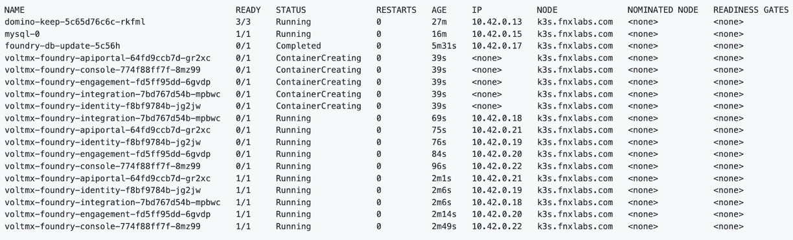

# Install Foundry

--8<-- "devtestenvironment.md"

The procedures will guide you in the installation of Foundry.

## 1. Download Foundry charts

1. Run the following command to make sure that the chart information for the repositories is up-to-date.

    ```
    helm repo update
    ```

2. Run the following commands to download the Foundry charts, unpack the files, and move the `values.yaml` file to the current directory:

    ```
    helm pull hclcr/voltmx-dbupdate
    helm pull hclcr/voltmx-foundry
    tar -xzf voltmx-foundry-1.2.5.tgz
    tar -xzf voltmx-dbupdate-1.2.5.tgz
    mv voltmx-foundry/values.yaml  ./
    mv voltmx-foundry/init-guids.sh  ./
    chmod +x init-guids.sh
    ```
    !!!note
        The foundry and dbupdate chart names have a version string in the filename. The `helm pull` command will pull down the latest version of the charts. Ensure your tar command uses the correct matching file names.


3. Foundry uses several Global Unique IDs to distinguish different installations of Foundry. Invoke the init-guids script to generate the IDs using the following command:
    ```
    ./init-guids.sh --new
    ```

4. Edit the `values.yaml` file to update the `imageCredentials` by replacing `your-email` and   `your-authentication-token` with your [email and authentication token](obtainauthenticationtoken.md) used with the HCL Container Repository.

    ```{ .yaml .no-copy }
    imageCredentials:
      username: your-email
      password: your-authentication-token
    ```

    !!!note
        Use the **CLI secret** value you saved from [obtaining authentication token from HCL Container Repository](obtainauthenticationtoken.md) as your authentication token or password.

5. Locate the following line in the file and add your Foundry server domain name setting:

    ```{ .yaml .no-copy }
    serverDomainName:
    ```
    Whatever server domain name you specify here, you need to ensure that it's resolvable. There is no additional work if you have already registered your server domain name in DNS. However, if you haven't registered it, you must add it to the server's /etc/hosts file as described in [Ensure Foundry Hostnames are resolvable](prereq.md#3-ensure-foundry-hostnames-are-resolvable), substituting your server domain name. Additionally, you must make the same updates in k3s's coredns config map as described in [For K3s only](prereq.md#for-k3s-only) again substituting your server domain name.

6. Locate the following lines in the file and add your Foundry database details:

    ```{ .yaml .no-copy }
    ### Database details ###

    # Database type which you want to use for Volt MX Foundry (String)
    # Possible values:
    #   "mysql" for MySQL DB server
    #   "sqlserver" for Azure MSSQL or SQLServer
    #   "oracle" for Oracle DB server
    dbType:

    # Database server hostname (String)
    dbHost:

    # Database server port number (Number). This can be empty for cloud managed service.
    dbPort:

    # Database User and password - you may set a single general userid/password here,
    # or you may set specific userid/password combinations below.  If set, the
    # specific values override the general dbUser/dbPass.

    # Database server user (String)
    dbUser:

    # Database server password (String) enclosed in quotes
    dbPass:
    ```
    See [Installing_Containers_With_Helm.html](https://opensource.hcltechsw.com/volt-mx-docs/95/docs/documentation/Foundry/voltmxfoundry_containers_helm/Content/Installing_Containers_With_Helm.html)
    for more details.

7. Save the file and exit.

## 2. Deploy Foundry's dbupdate to create the databases in MySql

1. Run the following Helm install command to deploy Foundry's dbupdate:

    ```
    helm install dbupdate voltmx-dbupdate -f values.yaml
    ```

2. Run the following command to verify deployment completion of Foundry's dbupdate:

    ```
    kubectl get pods -o wide -w
    ```

    The output should be similar to the following and will update over time:

    ```{ .yaml .no-copy }
    NAME                            READY   STATUS      RESTARTS   AGE
    domino-drapi-6d755b68df-2sfhb   3/3     Running     0          6m13s
    mysql-0                         1/1     Running     0          2m37s
    foundry-db-update-dzdrx         1/1     Running     0          24s
    foundry-db-update-dzdrx         0/1     Completed   0          65s
    foundry-db-update-dzdrx         0/1     Completed   0          67s
    foundry-db-update-dzdrx         0/1     Completed   0          68s
    ```

3. Once the foundry-db-update pod shows Completed in the STATUS column, the databases have been created in MySql. Press `Ctrl-c` to stop the kubectl command.

## 3. Install Foundry

1. Run the following Helm install command to deploy Foundry:

    ```
    helm install foundry voltmx-foundry -f values.yaml
    ```

2. Run the following command to verify when the Foundry install is ready:

    ```
    kubectl get pods -o wide -w
    ```

    The output should be similar to the following and will update over time:

    


3. Monitor all the foundry pods except for the foundry-db-update pod as it has already been completed. Once the other foundry pods have a 1/1 state in the READY column, press `Ctrl-c` to stop the kubectl command.

**Foundry is now available at [http://foundry.mymxgo.com/mfconsole/](http://foundry.mymxgo.com/mfconsole/)**.

!!!note
    - If you defined a different Foundry hostname, the Foundry URL would be the defined Foundry hostname concatenated with `/mfconsole/`.
    - If you want to access this deployment from a remote machine, you most likely need to update the `/etc/hosts` file on the remote machine as well.
    - To create an account, see [Create a Foundry administrator account](../howto/foundryadminaccount.md).
    - To connect to Domino server from your Notes client, see [Connect to Domino server from your Notes client](../howto/connectdominofromnotes.md).

## Next step

Proceed to [Install Volt MX Go Iris](installiris.md).