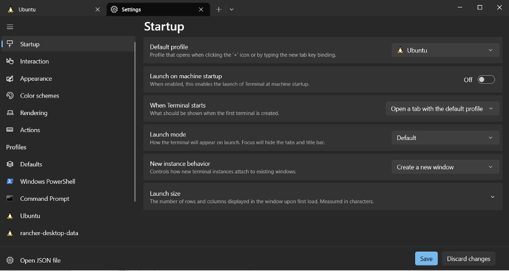

# Install Rancher Desktop

The procedure guides you in installing Rancher Desktop, which is delivered as a desktop app. 

## Before you start

!!!note
    If you will use K3s in deploying the Early Access version of Volt MX Go, you don't need to execute this procedure.

Rancher Desktop requires Windows Subsystem for Linux (WSL2) on Windows, which is automatically installed as part of the Rancher Desktop setup. Manually downloading a distribution isn't necessary.

Before starting with the procedure, make sure that you have checked and verified that all system requirements [for deploying Volt MX Go using Rancher Desktop running on Windows](../references/sysreq.md#for-deploying-volt-mx-go-using-rancher-desktop-running-on-windows) are met.

!!!note
    You can use Rancher Desktop as a Non-Admin user on a Windows machine. However, an Admin's intervention is required during the installation process for the following components:

    - WSL2 - You need Admin privileges to install WSL2, which is an essential component of Rancher Desktop.
    - Rancher Desktop Privileged Service - You need Admin privileges to install the Rancher Desktop privileged service, which is required to expose applications/services, running inside containers, on all interfaces on the host machine. However, you can skip the installation of the Rancher Desktop Privileged Service with the limitation that you will not be able to expose applications/services on any interface except 127.0.0.1.

## To install Rancher Desktop

1. Download the [Rancher.Desktop.Setup.1.8.1.msi](https://github.com/rancher-sandbox/rancher-desktop/releases/download/v1.8.1/Rancher.Desktop.Setup.1.8.1.msi) installer.
2. Navigate to the directory where you downloaded the installer to and run the installer. This is usually the **Downloads** folder.
5. Review the License Agreement, and then click **I Agree** to proceed with the installation.
6. If prompted, choose between installing for everyone on the machine or installing just for the current user. Installing for everyone is preferred to install the Rancher Desktop Privileged Service.
7. Follow the prompts to confirm installation.
8. When the installation completes, click **Finish** to close the installation wizard.

## Post installation 

You must add an Ubuntu Linux distribution to WSL2. You will use Ubuntu to interact with the Rancher Desktop support for Kubernetes, via running some previously listed utilities (commands) to configure and install Volt MX GO.

**To add Ubuntu Linux distribution to WSL2:** 

1. [Download Ubuntu](https://ubuntu.com/tutorials/install-ubuntu-on-wsl2-on-windows-10#3-download-ubuntu). 
	
    !!!note
        You must download the Ubuntu 20.04 LTS version. 

2. [Configure Ubuntu](https://ubuntu.com/tutorials/install-ubuntu-on-wsl2-on-windows-10#4-configure-ubuntu).
3. [Install the Windows Terminal App](https://apps.microsoft.com/store/detail/windows-terminal/9N0DX20HK701?hl=en-us&gl=us&activetab=pivot%3Aoverviewtab).

4. Configure the Windows Terminal App.

    1. Open Windows Terminal and go to the **Settings** UI window. 
    2. Select **Startup** and choose **Ubuntu** as the **Default profile** for your terminal.
    3. Click **Save**.

Use an Ubuntu terminal session to run all the commands presented in the [Complete prerequisite procedures](prereq.md) and the other sections. To access the Ubuntu terminal, enter "Terminal" in the Windows search box and select the Terminal App. An Ubuntu terminal session opens with your home directory set as your current directory. 

## Additional information

When run for the first time or when changing versions, Kubernetes container images are downloaded. It may take a little time to load on the first run for a new Kubernetes version.

After Rancher Desktop installation, users have access to these supporting utilities:

  - Helm
  - kubectl
  - nerdctl
  - Moby
  - Docker Compose

## Next step

Proceed to the [Complete prerequisite procedures](prereq.md).
