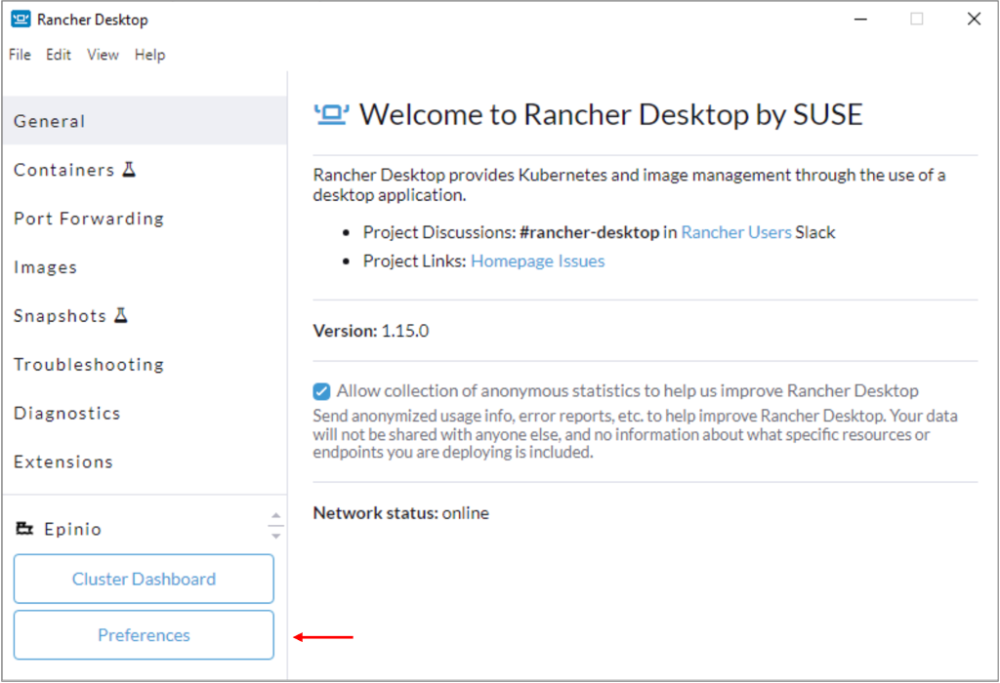
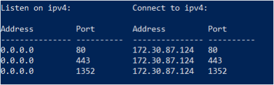

# Install Rancher Desktop

The procedure guides you in installing Rancher Desktop on Windows, which is delivered as a desktop app.

## Before you start

!!!note
    If you will use K3s in deploying the Early Access version of Volt MX Go, you don't need to execute this procedure. Rancher Desktop includes a customized configuration of K3s and is geared to enabling developers with a small, desktop style Kubernetes cluster. It includes other developer centric tooling not included in K3s.

Before starting with the procedure, make sure that you have checked and verified that all system requirements [for deploying Volt MX Go using Rancher Desktop running on Windows](sysreq.md#for-deploying-volt-mx-go-using-rancher-desktop-running-on-windows) are met.

!!!note
    You can use Rancher Desktop as a Non-Admin user on a Windows machine. However, an Admin's intervention is required during the installation process for the following components:

    - WSL2 - Rancher Desktop requires Windows Subsystem for Linux (WSL2) on Windows. You need Admin privileges to install WSL2, which is an essential component of Rancher Desktop.
    - Rancher Desktop Privileged Service - You need Admin privileges to install the Rancher Desktop privileged service, which is required to expose applications/services, running inside containers, on all interfaces on the host machine. However, you can skip the installation of the Rancher Desktop Privileged Service with the limitation that you will not be able to expose applications/services on any interface except 127.0.0.1.

## Install or Update WSL2

Before installing Rancher Desktop, make sure you have an up-to-date installation of WSL2. If you are already using WSL2, [update WSL2](#update-wsl2). Otherwise, [install WSL2](#install-wsl2).

### Update WSL2

If you are already using WSL2, open PowerShell or Windows Command Prompt in administrator mode by right-clicking and selecting **Run as administrator**. Run the following command to make sure WSL2 is up-to-date:

```
wsl --update
```

Follow any instructions given by the WSL update process. Afterward, from a Windows command prompt or PowerShell window, run the following command to make sure Ubuntu is the default distribution:

```
wsl --set-default Ubuntu-22.04
```

Proceed [to install Rancher Desktop](#to-install-rancher-desktop).

### Install WSL2

Open PowerShell or Windows Command Prompt in administrator mode by right-clicking and selecting **Run as administrator**. Run the following command to install WSL2 using Ubuntu-22.04 as the Linux distribution:

```
wsl --install -d Ubuntu-22.04
```

!!!warning "Important"
    Restart your machine after this initial installation to complete the setup. Once the restart has completed, return to this documentation and complete the steps that follow.

Enter `Ubuntu` on the Windows search box and open the **Ubuntu on Windows App**. You should be prompted to create a username and password.

!!!tip
    Use the first letter of your first name and your full last name as your username such as _jdoe_. Use a password that's easy for you to remember.

If you aren't prompted to create a username and password, run the following command to do so, adding your username such as _sudo adduser jdoe_:

```
sudo adduser
```

It's not required to enter more information, simply hit the **Enter** key and respond `Y` when prompted **Is the information correct?**.

!!!warning "Important"
    Make certain that **Ubuntu-22.04** is your default WSL distribution. From a Windows command prompt or PowerShell window, run the following command:
    ```
    wsl --set-default Ubuntu-22.04
    ```

You are now ready to install Rancher Desktop.


## To install Rancher Desktop

1. Download the [Rancher.Desktop.Setup.1.7.0.msi](https://github.com/rancher-sandbox/rancher-desktop/releases/download/v1.7.0/Rancher.Desktop.Setup.1.7.0.msi) installer.

    !!!note
        There is a serious defect in 1.8 that makes 1.8 difficult to use. It's strongly recommended to skip 1.8.

2. Navigate to the directory where you downloaded the installer to and run the installer. This is usually the **Downloads** folder.
3. Review the License Agreement, and then click **I Agree** to proceed with the installation.
4. If prompted, choose between installing for everyone on the machine or installing just for the current user. Installing for everyone is preferred to install the Rancher Desktop Privileged Service.
5. Follow the prompts to confirm installation.
6. In the **General** settings for Rancher Desktop, toggle off the **Check for updates automatically** as you don't want to be upgraded to version 1.8.n.
7. When the installation completes, click **Finish** to close the installation wizard.
8. Make sure that **Ubuntu-22.04** is selected under **WSL** in Rancher Desktop:

    1. Open Rancher Desktop, and then click the **Settings** icon.

        

    2. On the **Rancher Desktop - Preferences** dialog, click **WSL** and then select the **Ubuntu** checkbox.

        

    3. Click **Apply**.

!!!warning "Important"
    Use an Ubuntu terminal session to run all the commands presented in the [Complete preparatory procedures](prereq.md) and the other sections. To access the Ubuntu terminal, enter "Ubuntu" in the Windows search box and select the Ubuntu for Windows App. An Ubuntu terminal session opens with your home directory set as your current directory.


## Enable port forwarding for ports 80, 443 and 1352

Rancher Desktop needs the forwarding of specific ports to WSL2. The script you need to run forwards ports 80, 443, and 1352 on all network interfaces to WSL2.

!!!note
    Make sure Ubuntu is running before proceeding and also **stop** Rancher Desktop. If Rancher Desktop isn't stopped for this step, you may experience problems connecting to your Foundry and Domino deployments.

**Prerequisite**

You have already downloaded and saved the port forwarding script `mxgo-port-forwarding.ps1`. For more information, see [Download HCL Volt MX GO Early Access Release](portaldownload.md).

**To enable port forwarding**

1. Open a **Windows PowerShell** as the Administrator.
2. Run the following command and answer `A` when prompted.

    ```
    Set-ExecutionPolicy -ExecutionPolicy Unrestricted -Scope CurrentUser
    ```

3. Change to the directory where you downloaded the script and run it as follows:

    ```
    .\mxgo-port-forwarding.ps1
    ```

4. Run the following command to confirm that ports 80, 443, and 1352 are being forwarded:

    ```
    netsh interface portproxy show all
    ```

    The output should appear as follows:

    

5. Close the **Windows PowerShell**.
6. Restart Rancher Desktop.

!!!note
    Repeat the steps if either of the following occurs:

    - Rancher Desktop stops and restarts.
    - WSL instances stop and restart.

## Reset port forwarding for ports 80, 443 and 1352

If you need to reset (disable or stop) port forwarding for ports 80, 443, and 1352, perform the following steps:

1. Open a **Windows PowerShell** as the Administrator.
2. Run the following command:

    ```
    netsh interface portproxy reset
    ```

## Additional information

When run for the first time or when changing versions, Kubernetes container images are downloaded. It may take a little time to load on the first run for a new Kubernetes version.

After Rancher Desktop installation, users have access to these supporting utilities:

  - Helm
  - kubectl
  - nerdctl
  - Moby
  - Docker Compose

## Next step

Proceed to [Complete preparatory procedures](prereq.md).
