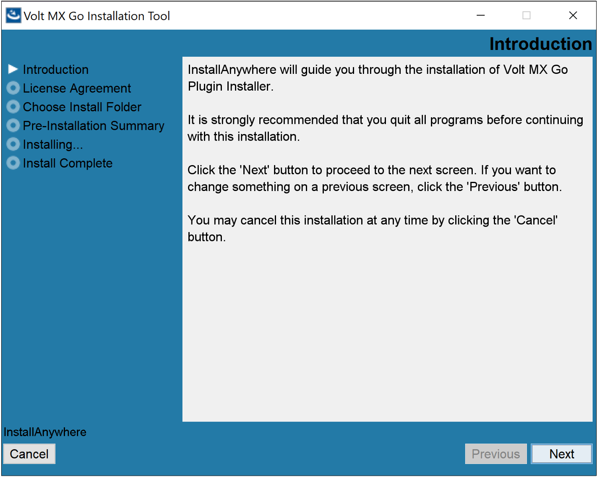
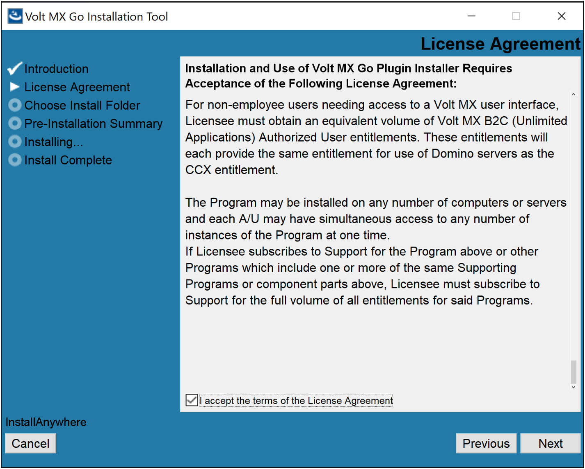
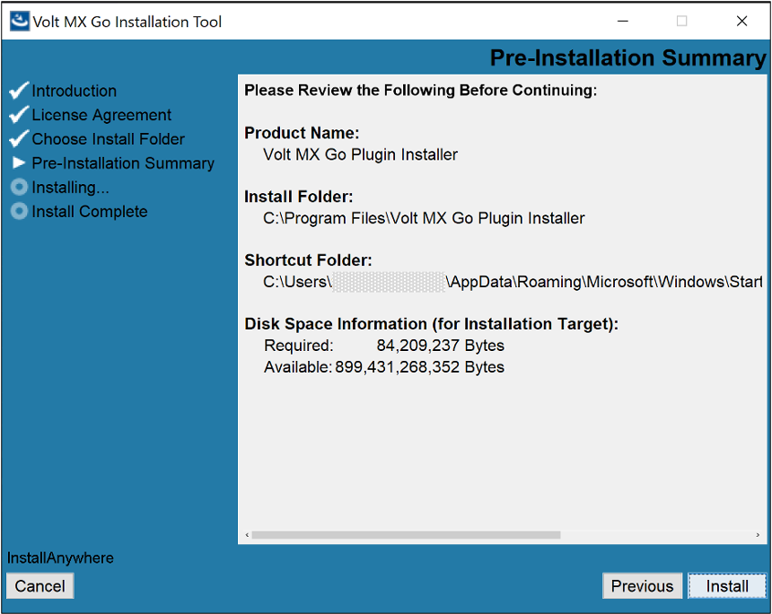
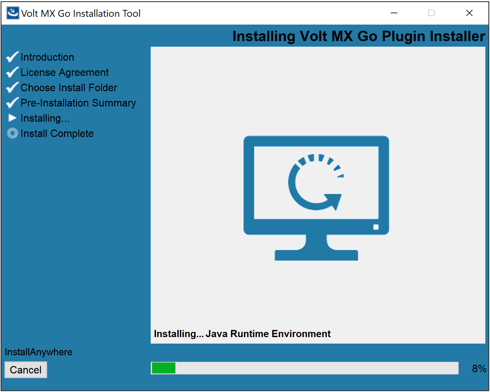

# For Volt MX Go v2.1 or later

Perform a new or an upgrade installation of Volt Iris.

## Install Volt Iris 

### Before you begin

- You have downloaded the Volt Iris installer. The minimum supported version is v9.5.50.

    !!! note

        The Volt Iris v10.0.0.0 is currently **not supported** for Volt MX Go.

- You have downloaded the Volt MX Go Plugin Installer.

For more information, see [Download HCL Volt MX Go installers](../portaldownload.md#for-volt-mx-go-v21-or-later).

### Install Volt Iris

For installing Volt Iris, click the link corresponding to your installation platform and follow the installation steps.

- [For installing Volt Iris on Mac](https://opensource.hcltechsw.com/volt-mx-docs/95/docs/documentation/Iris/iris_starter_install_mac/Content/Installing%20VoltMX%20Iris.html#installing "Link opens a new tab"){: target="_blank" rel="noopener noreferrer"}&nbsp;{: style="height:13px;width:13px"}

- [For installing Volt Iris on Windows](https://opensource.hcltechsw.com/volt-mx-docs/95/docs/documentation/Iris/iris_starter_install_win/Content/Installing%20VoltMX%20Iris.html#installing "Link opens a new tab"){: target="_blank" rel="noopener noreferrer"}&nbsp;{: style="height:13px;width:13px"}

### Install Volt MX Go Plugin Installer

The procedure enables the installation of the Volt MX Go Plugin Installer, which is used for installing the Volt MX Go plugins to Volt Iris.

=== "on Mac"

    1. Navigate to the directory of the downloaded installer zip file. 
    1. Extract the zip file to get the installer file. 
    1. Double-click the installer file. The **Volt MX Go Installation Tool** window opens. 
    1. On the **Introduction**, read the details and instructions, and then click **Next**.

        {: style="height:80%;width:80%"}

    1. On the **License Agreement**, read the agreement details, select the **I accept the terms of the License agreement** checkbox, and then click **Next**.

        {: style="height:80%;width:80%"}

    1. On the **Choose Install Folder**, click **Next** if you agree with the indicated default location. 

        {: style="height:80%;width:80%"}
        
        !!!tip
            - If you want a different installation location, click **Choose** to select your preferred installation location, and then click **Next**.
            - If you selected a different installation location and decided to revert to the default location, click **Restore Default Folder** and then click **Next**.

    1. On the **Pre-Installation Summary**, review the details and then click **Install**.

        {: style="height:80%;width:80%"}

    1. On the **Installing** tab, you can see the installation status.

        {: style="height:80%;width:80%"}

    1. On the **Install Complete**, click **Done**.

        {: style="height:80%;width:80%"}

=== "on Windows"

    1. Navigate to the folder containing the downloaded installer file. 
    1. Double-click the installer file. The **Volt MX Go Installation Tool** window opens. 
    1. On the **Introduction**, read the details and instructions, and then click **Next**.

        {: style="height:80%;width:80%"}

    1. On the **License Agreement**, read the agreement details, select the **I accept the terms of the License agreement** checkbox, and then click **Next**.

        {: style="height:80%;width:80%"}

    1. On the **Choose Install Folder**, click **Next** if you agree with the indicated default location.

        {: style="height:80%;width:80%"} 

        !!!tip
            - If you want a different installation location, click **Choose** to select your preferred installation location or directly enter your preferred installation location in the text box, and then click **Next**.
            - If you selected a different installation location and decided to revert to the default location, click **Restore Default Folder** and then click **Next**.

    1. On the **Pre-Installation Summary**, review the details and then click **Install**.

        {: style="height:80%;width:80%"}

    1. On the **Installing** tab, you can see the installation status.

        {: style="height:80%;width:80%"}

    1. On the **Install Complete**, click **Done**.

        {: style="height:80%;width:80%"}

### Install Volt MX Go Plugins

The procedure enables the installation of Volt MX Go plugins to Volt Iris to enable Volt MX Go features.

!!! warning "Important"

    Installing the MX Go plugins into your workspace requires that your workspace contains a `pluginsInfo.json` file in the `.plugins` directory. Otherwise, an installation error occurs. To create the `pluginsInfo.json` file in the `.plugins` directory, [create a Desktop Web App project](https://opensource.hcltechsw.com/volt-mx-docs/95/docs/documentation/Iris/iris_user_guide/Content/CreateKRAProject.html#create-a-volt-mx-iris-reference-architecture-project "Link opens a new tab"){: target="_blank" rel="noopener noreferrer"}&nbsp;{: style="height:13px;width:13px"} with Volt Iris in your workspace, and then [run Live Preview](https://opensource.hcltechsw.com/volt-mx-docs/95/docs/documentation/Iris/iris_user_guide/Content/LivePreview.html#preview-your-web-app-with-iris "Link opens a new tab"){: target="_blank" rel="noopener noreferrer"}&nbsp;{: style="height:13px;width:13px"}. Running the Live Preview creates the `pluginsInfo.json` file.

=== "on Mac"

    1. Click **Finder** in the **Dock**, click **Applications** in the sidebar of the **Finder** window, then double-click the **Volt MX Go Plugin Installer** app.
    
        Or

        Click **Launchpad** in the **Dock**, type *Volt MX Go Plugin Installer* in the search field at the top of **Launchpad**, and click the app to open it.

        A new terminal opens showing the available options.

        {: style="height:80%;width:80%"} 

    2. Enter **4** to install Volt MX Go plugins and press **return**.
    3. Specify a Volt Iris workspace by entering the number corresponding to a detected workspace or enter the full path to the workspace, then press **return**. 
    4. Specify the Volt Iris application installation directory by entering the number corresponding to your installation or enter the full path to your Volt Iris installation directory, then press **return**. 

        You get a confirmation statement about the completion of the installation of the plugins.

        !!! note

            Starting with Volt MX Go version 2.1.1, the installed Volt Iris version is checked for compatibility. If incompatible, the plugin installation stops, and users are informed of their current and required minimum Volt Iris versions. 
    
    5. Close the terminal.   

=== "on Windows"

    1. Select **Start**, scroll through the alphabetical list, and select **Volt MX Go Plugin Installer**. Depending on your OS, you might need to select **All apps**, scroll through the alphabetical list, and click **Volt MX Go Plugin Installer**.

        OR

        Double-click the **Volt MX Go Plugin Installer** shortcut on your desktop if available. 

        A Command Prompt window opens showing the available options.

        {: style="height:80%;width:80%"}

    2. Enter **4** to install Volt MX Go plugins and press **Enter**.
    3. Specify a Volt Iris workspace by entering the number corresponding to a detected workspace or enter the full path to the workspace, then press **Enter**. 
    4. Specify the Volt Iris application installation directory by entering the number corresponding to your installation or enter the full path to your Volt Iris installation directory, then press **Enter**. 

        You get a confirmation statement that the plugins have been installed.

        !!! note

            Starting with Volt MX Go version 2.1.1, the installed Volt Iris version is checked for compatibility. If incompatible, the plugin installation stops, and users are informed of their current and required minimum Volt Iris versions. 

    5. Press **Enter** to close the Command Prompt window.

!!! warning "Important"

    - After installing the plugins, connect Volt Iris to Volt Foundry licensed with a Volt MX Go entitlement to enable and use the Volt MX Go features in Volt Iris.
    
    - For further reference, see the {: style="height:15px;width:15px"}&nbsp;[Installing Volt MX Go v2.1 for Volt Iris](https://www.youtube.com/watch?v=fN4xW1xnd0s "Video opens and plays in a new tab"){: target="_blank" rel="noopener noreferrer"} video demonstration.   

## Upgrade Volt Iris 

Upgrades Volt Iris to the latest version<!--from Volt MX Go v2.0.4 to Volt MX Go v2.1-->.

### Before you begin

- You have downloaded the Volt Iris installer - v9.5.50 or later. For more information, see [Download HCL Volt MX Go installers](../portaldownload.md#for-volt-mx-go-v21-or-later).

    !!! note

        The Volt Iris v10.0.0.0 is currently **not supported** for Volt MX Go.

- You have installed the Volt MX Go Plugin Installer. For more information, see [Install Volt MX Go Plugin Installer](#install-volt-mx-go-plugin-installer).

### Upgrade Volt Iris

To upgrade, install the latest version of Volt Iris. Click the link corresponding to your installation platform and follow the installation steps.

- [For installing Volt Iris on Mac](https://opensource.hcltechsw.com/volt-mx-docs/95/docs/documentation/Iris/iris_starter_install_mac/Content/Installing%20VoltMX%20Iris.html#installing "Link opens a new tab"){: target="_blank" rel="noopener noreferrer"}&nbsp;{: style="height:13px;width:13px"}

- [For installing Volt Iris on Windows](https://opensource.hcltechsw.com/volt-mx-docs/95/docs/documentation/Iris/iris_starter_install_win/Content/Installing%20VoltMX%20Iris.html#installing "Link opens a new tab"){: target="_blank" rel="noopener noreferrer"}&nbsp;{: style="height:13px;width:13px"}

!!! note "Important"

    Make sure to use the same Workspace Folder you used for your previous <!--Volt Iris v2.0.4-->installation to access all the projects you worked on<!-- using Volt Iris v2.0.4-->.  

### Install Volt MX Go Plugins

Install the Volt MX Go plugins to Volt Iris to enable Volt MX Go features. For the installation steps, see [Install Volt MX Go Plugins](#install-volt-mx-go-plugins).

!!!warning "Important"
    After installing the plugins, connect Volt Iris to Volt Foundry licensed with a Volt MX Go entitlement to enable and use the Volt MX Go features in Volt Iris.

### Important consideration

Updates for Volt Iris are released regularly, and you will receive an update notification on your Volt Iris instance that prompts you to update to the latest version of Volt Iris. These updates are major release versions, service packs, and fix packs.

**You must reinstall the Volt MX Go plugins every time you update Volt Iris**.

For more information on updating Volt Iris, click the link corresponding to your installation platform:

- [For updating Volt Iris on Mac](https://opensource.hcltechsw.com/volt-mx-docs/95/docs/documentation/Iris/iris_starter_install_mac/Content/Upgrade.html "Link opens a new tab"){: target="_blank" rel="noopener noreferrer"}&nbsp;{: style="height:13px;width:13px"}

- [For updating Volt Iris on Windows](https://opensource.hcltechsw.com/volt-mx-docs/95/docs/documentation/Iris/iris_starter_install_win/Content/Upgrade.html "Link opens a new tab"){: target="_blank" rel="noopener noreferrer"}&nbsp;{: style="height:13px;width:13px"}
