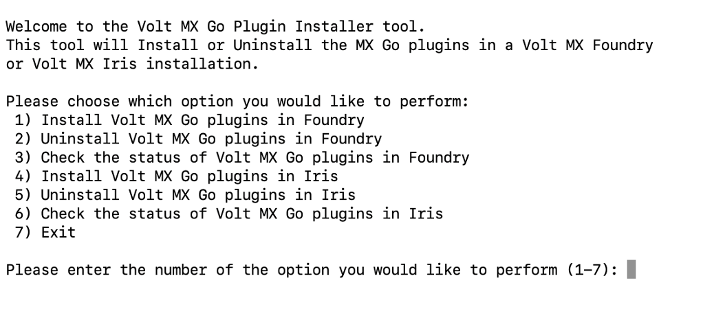

# For Volt MX Go v2.1 or later

Guides you in upgrading Volt MX Go server components.

## Upgrade Domino REST API

### Before you begin

--8<-- "drapiversion.md"

### Procedure

1. Download the required version of the Domino REST API installer. For more information, see [Download the Domino REST API](https://opensource.hcltechsw.com/Domino-rest-api/tutorial/installconfig/index.html#download-the-domino-rest-api "Link opens a new tab"){: target="_blank" rel="noopener noreferrer"}&nbsp;{: style="height:13px;width:13px"} in the HCL Domino REST API documentation.

2. Follow the relevant steps in the [upgrade procedure](https://opensource.hcltechsw.com/Domino-rest-api/howto/production/versionupdate.html "Link opens a new tab"){: target="_blank" rel="noopener noreferrer"}&nbsp;{: style="height:13px;width:13px"} in the [HCL Domino REST API documentation](https://opensource.hcltechsw.com/Domino-rest-api/index.html "Link opens a new tab"){: target="_blank" rel="noopener noreferrer"}&nbsp;{: style="height:13px;width:13px"} based on your installation platform.

## Upgrade Volt MX Go Foundry

The following procedures guide you in upgrading Volt MX Go Foundry to the latest version. As Volt MX Go Foundry supports various installation mechanisms, refer to the relevant upgrade procedure.

### For using an installer

The upgrade process works by upgrading the existing database to the latest version, and installing fresh application server artifacts, such as data sources and WARs. For installation details such as hostname, database port, prefix, suffix, you must refer to the installation logs of your previous setup.

The installer doesn't support automatic backups of database and other artifacts. You must clean up the existing application server artifacts and take a backup of the custom artifacts. The installer also doesn't support rollback in case of a failure during the upgrade. To roll back, restore the database and server artifacts you backed up before upgrading.

<!--Upgrades Volt MX Go Foundry from Volt MX Go v2.0.4 to Volt MX Go v2.1.-->

#### Before you begin

- Back up your databases and server artifacts.

- Download the latest Volt Foundry installer based on your installation platform. The minimum supported version is v9.5.18.0. For more information, see [Download HCL Volt MX Go installers](../portaldownload.md#for-volt-mx-go-v21-or-later).

- Download and install the latest Volt MX Go Plugin Installer. For more information, see [Install Volt MX Go Plugin Installer](../installserver/installdrapi.md#install-volt-mx-go-plugin-installer).

- Ensure that the Volt Foundry installer has execute permission.
- Ensure that you have the path of your previous installation directory.
- Ensure that you stop the application server of your existing Volt MX Go Foundry instance, which you want to upgrade.

#### Install Volt Foundry

- Follow the link to the upgrade procedure based on your used installation platform. <!--In this step, upgrade your Volt MX Go Foundry v2.0.4 with the minimum supported version of Volt Foundry.-->

    !!! warning "Important"

        - For Volt MX Go v2.1 up to the latest release, only Volt Foundry using a Tomcat non-clustered application server is supported.
        - Volt Foundry must be licensed with a Volt MX Go entitlement for the plugins to be enabled and for the Volt MX Go features to work.
        - The upgrade procedure indicates installation files and installation file download locations. **You must use the installer you downloaded in *Before you begin*.**
        - Check all the details and complete all the applicable steps indicated in the upgrade procedure.
        - Make sure to point to the same database you used for your previous Volt MX Go Foundry<!--v2.0.4--> installation to access all the projects you worked on.
        
        - After completing the installation, activate the **Volt MX Go license** on Volt Foundry and then shut it down before proceeding to the installation of the Volt MX Go plugins. For more information, see the following license activation guides on the Volt MX documentation:

            [For Volt Foundry version 9.5.20.0 and onwards](https://help.hcl-software.com/voltmx/v9.5/Foundry/voltmx_licensing_guide/Content/Volt_Foundry_Licensing_Guide.html "Link opens a new tab"){: target="_blank" rel="noopener noreferrer"}&nbsp;{: style="height:13px;width:13px"}

            [For Volt Foundry versions earlier than 9.5.20.0](https://help.hcl-software.com/voltmx/v9.5/Foundry/voltmx_licensing_guide/Content/License_Activation_through_VoltMX_Server_7.2.html "Link opens a new tab"){: target="_blank" rel="noopener noreferrer"}&nbsp;{: style="height:13px;width:13px"} 

    - [For Windows](https://opensource.hcltechsw.com/volt-mx-docs/95/docs/documentation/Foundry/voltmx_foundry_windows_install_guide/Content/Upgrading_VoltMX_Foundry_SP1.html "Link opens a new tab"){: target="_blank" rel="noopener noreferrer"}&nbsp;{: style="height:13px;width:13px"}

    - [For Linux](https://opensource.hcltechsw.com/volt-mx-docs/95/docs/documentation/Foundry/voltmx_foundry_linux_install_guide/Content/Upgrading_VoltMX_Foundry_SP1.html "Link opens a new tab"){: target="_blank" rel="noopener noreferrer"}&nbsp;{: style="height:13px;width:13px"}
    <!-- [For command line installer](https://opensource.hcltechsw.com/volt-mx-docs/95/docs/documentation/Foundry/VoltMX_Foundry_CLI/Content/installer_cli.html)-->

#### Install Volt MX Go plugins

The procedure enables the installation of Volt MX Go plugins to Volt Foundry to enable Volt MX Go features.

!!! warning "Important"

    - For Volt MX Go v2.1 up to the latest release, you can only install Volt MX Go plugins to Volt Foundry that uses a Tomcat non-clustered application server.
    - Volt Foundry must be licensed with a Volt MX Go entitlement for the plugins to be enabled and for the Volt MX Go features to work.

=== "on Linux"

    1. Open Terminal.
    1. Go to the directory where you installed the Volt MX Go Plugin Installer.
    2. Run the Volt MX Go Plugin Installer by entering the following command and press **Enter**

        `./VoltMXGoPluginInstaller`

        The installation tool opens on the Terminal showing the available options.

        {: style="height:80%;width:80%"}

    3. Enter **1** to install Volt MX Go plugins and press **Enter**.
    4. Specify the Tomcat WebApps directory by entering the number corresponding to your installation or enter the full path to your Tomcat WebApps directory, and then press **Enter**.

        You get a confirmation statement that the plugins have been installed.

    6. Enter **7** and press **Enter** to exit the installation tool. 

=== "on Windows"

    1. Select **Start**, scroll through the alphabetical list, and select **Volt MX Go Plugin Installer**. Depending on your OS, you might need to select **All apps**, scroll through the alphabetical list, and click **Volt MX Go Plugin Installer**.

        OR

        Double-click the **Volt MX Go Plugin Installer** shortcut on your desktop if available. 

        A Command Prompt window opens showing the available options.

        {: style="height:80%;width:80%"}

    2. Enter **1** to install Volt MX Go plugins and press **Enter**.
    3. Specify the Tomcat WebApps directory by entering the number corresponding to your installation, or enter the full path to your Tomcat WebApps directory, then press **Enter**. 

        You get a confirmation statement that the plugins have been installed. 

    5. Press **Enter** to close the Command Prompt window.

!!! note

    After installing the Volt MX Go plugins, open Volt Foundry to verify you see the Volt MX GO/First Touch banner.

#### Important consideration

There are regular updates for Volt Foundry. These updates are major release versions, service packs, and fix packs.

**You must reinstall the Volt MX Go plugins every time you update Volt Foundry**.

### For using Helm charts on a supported Kubernetes platform

#### Before you begin

You have downloaded the Volt Foundry Helm charts. For more information, see [Download HCL Volt MX Go installers](../portaldownload.md#for-volt-mx-go-v21-or-later).

#### Procedure

1. Click the link to the upgrade guide based on your requirement and follow the steps. 

    - [Upgrade Individual Foundry Components](https://opensource.hcltechsw.com/volt-mx-docs/95/docs/documentation/Foundry/voltmxfoundry_containers_helm/Content/Installing_Containers_With_Helm_PostInstallation.html#how-to-upgrade-individual-foundry-components "Link opens a new tab"){: target="_blank" rel="noopener noreferrer"}&nbsp;{: style="height:13px;width:13px"}

    - [Upgrade All Foundry Components](https://opensource.hcltechsw.com/volt-mx-docs/95/docs/documentation/Foundry/voltmxfoundry_containers_helm/Content/Installing_Containers_With_Helm_PostInstallation.html#how-to-upgrade-all-foundry-components "Link opens a new tab"){: target="_blank" rel="noopener noreferrer"}&nbsp;{: style="height:13px;width:13px"}

    !!!warning "Important"
        Make sure to check all the details and complete all the applicable steps indicated in the installation guide.

2. After completing all applicable steps in the installation guide, update the `values.yaml` file.

    1. Locate the `values.yaml` file in the Volt Foundry directory.
    2. Open the `values.yaml` file with your preferred editor and locate the line containing the `imageRegistry:` key.
    3. Change the value of the `imageRegistry:` key to `hclcr.io/voltmxgo`.
    4. Save your changes and close the file. 

3. Execute the `helm upgrade foundry` command to upgrade the running images to use Volt MX Go. 

## Next step

After completing the upgrade installation of **Domino REST API** and **Volt MX Go Foundry**, proceed to [Install and upgrade Volt MX Go Iris](../installiris/index.md).
