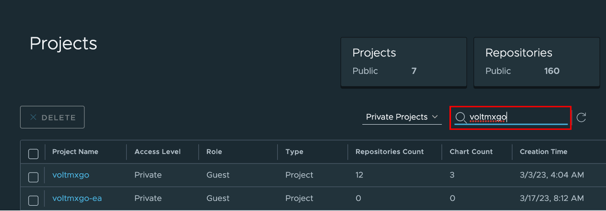

# Install and configure K3s

K3s is a fully compliant Kubernetes distribution. For more information, see [K3s - Lightweight Kubernetes](https://docs.k3s.io/)

!!!warning "Caution"
    In all the following instructions, it's assumed you are running commands as a **non-root user**. However, there are certain commands that must be run with sudo permissions. For these commands, you need to configure your non-root user with sudo. To do this, see [Using sudo to allow non-root users to perform root level functions](https://www.suse.com/support/kb/doc/?id=000016906).

## Before you start

!!!note
    If you will use Rancher Desktop in deploying the Early Access version of Volt MX Go, you don't need to install K3s. 

Before starting with the procedure, make sure that you have checked and verified that all system requirements [for deploying MX GO using K3s on an Ubuntu, RHEL, SLES machine, or VM](../references/sysreq.md#for-deploying-mx-go-using-k3s-on-an-ubuntu-rhel-sles-machine-or-vm) are met. 

## 1. Install K3s

Before installing K3s, make sure you have met any operating system configuration required by K3s, specifically for [RHEL and CENTOS](https://docs.k3s.io/advanced#red-hat-enterprise-linux--centos).

1. Run the following command:

    ```
    sudo sh -c 'curl -sfL https://get.k3s.io |  K3S_KUBECONFIG_MODE="644" sh -s -'
    ```

2. Review the output and verify that there is no error or warning.

## 2. Enable non-root user to use kube commands

1. Replace `<username>` in the following command with your Linux username, which you will use to install and work Volt MX Go. Run the command:

    ```
    export K3SUSER=<username>
    ```

2. Make sure the environment variable is set by running the command:

    ```
    echo $K3SUSER
    ```

3. Copy the K3s configuration file into your user's home directory and make it accessible by running the following commands:

    ```
    sudo mkdir /home/$K3SUSER/.kube
    sudo cp -f /etc/rancher/k3s/k3s.yaml  /home/$K3SUSER/.kube/config
    sudo chown -R $K3SUSER:$K3SUSER /home/$K3SUSER/.kube
    sudo chmod -R 700 /home/$K3SUSER/.kube
    ```

## 3. Update the KUBECONFIG environment variable

!!!note
    If you are using bash for your login shell, update your `.bashrc` to export the KUBECONFIG variable. Make the appropriate change if you use a different shell.

Run the commands to update the KUBECONFIG environment variable:

```
echo export KUBECONFIG=~/.kube/config >> /home/$K3SUSER/.bashrc
export KUBECONFIG=~/.kube/config
```

## 4. Install Helm

Helm is the package manager for Kubernetes and will be used to install Volt MX Go. For more information, see [Helm](https://helm.sh/).  

To install Helm, run the following commands:

```
sudo wget https://get.helm.sh/helm-v3.11.2-linux-386.tar.gz
sudo tar -xzf helm-v3.11.2-linux-386.tar.gz
sudo mv linux-386/helm  /usr/local/bin/helm
sudo rm -rf helm-v3.11.2-linux-386.tar.gz linux-386
```

For more information, see [Installing Helm](https://helm.sh/docs/intro/install/) and [Helm releases](https://github.com/helm/helm/releases).


## 5. Obtain your authentication token from HCL Container Repository

The binary images and Helm charts for Volt MX GO server components will be pulled from the HCL Container Repository. This will require you to get your authentication token from the HCL Container Repository. 

1. Go to the [HCL Container Repository](https://hclcr.io).
2. On the login page, click **LOGIN VIA OIDC Provider**, and then login using your corporate email address.
3. On the **Projects** page, enter `voltmxgo` in the search field, and then click `voltmxgo-ea` on the search result. 

    

4. On the **voltmxgo-ea** project page, click your username and select **User Profile**.

    

5. On the **User Profile** dialog, copy the value of the **CLI secret** by clicking the copy icon.

    

6. Save the CLI secret value as it's required in the next steps. 
7. Take note of exactly how your email address is written in the **User Profile** dialog as authentication is case sensitive on the user email.
8. Run the following commands to export the username and authentication token. 

    !!!note
        Replace `<your hclcr username>` with your email address as shown in the **User Profile** dialog. Replace `<your hclcr authentication token>` with the **CLI secret** value you copied from the **User Profile** dialog.

    ```
    export HCLCR_USERNAME=<your hclcr username>
    ```
    ```
    export HCLCR_TOKEN=<your hclcr authentication token>
    ```

## 6. Ensure K3s is active and ready

1. Run the following command to check if K3s has an active status:

    ```
    sudo systemctl status k3s
    ```

2. Review the output. The example image shows K3s as active:

    

3. Run the following command to check if K3s is ready:

    ```
    kubectl get nodes
    ```

    The result should be similar as below:

    ```
    NAME                   STATUS   ROLES                  AGE   VERSION
    vm1.example.com        Ready    control-plane,master   25h   v1.23.15+k3s1
    ```

## Next step

Proceed to the [Complete prerequisite procedures](prereq.md).