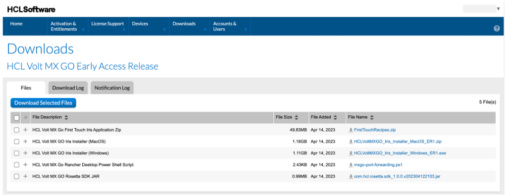

# Download HCL Volt MX Go Release package

## About this procedure

The procedure guides you on how to search and download the HCL Volt MX Go Release package from the **HCL License & Download Portal**.

<!--!!!note
    Make sure to download the latest version of the HCL Volt MX Go Early Access Release package.

The HCL Volt MX GO Release package includes:

|File description|File name|
|----|----|
|Domino REST API for MXGO EA3 Multiplatform Installer|Domino_REST_API_for_MXGO_EA3_Installer.tar.gz|
|Domino REST API for MXGO EA3 Readme|Domino_REST_API_for_MXGO_EA3_README.txt|
|HCL Volt MX Go First Touch Database Zip|FirstTouchRecipesNSF.zip|
|HCL Volt MX Go First Touch Iris Application Zip|FirstTouchRecipes.zip|
|HCL Volt MX GO Foundry Installer (Command Line)|HCLVoltMXGO_Foundry_Installer_CommandLine_EA3.zip|
|HCL Volt MX GO Foundry Installer (Linux)|HCLVoltMXGO_Foundry_Installer_Linux_EA3.tar.gz|
|HCL Volt MX GO Foundry Installer (Windows)|HCLVoltMXGO_Foundry_Installer_Windows_EA3.zip|
|HCL Volt MX GO Iris Installer (MacOS)|HCLVoltMXGO_Iris_Installer_MacOS_EA3.zip|
|HCL Volt MX GO Iris Installer (Windows)|HCLVoltMXGO_Iris_Installer_Windows_EA3.exe|
|HCL Volt MX Go Rancher Desktop Power Shell Script|mxgo-port-forwarding.ps1|-->

!!!tip
    To learn more about **HCL License & Download Portal**, see [What is the HCL Software License & Download Portal?](https://support.hcltechsw.com/csm?id=kb_article&sysparm_article=KB0073344){: target="_blank"}.

## To search and download the HCL Volt MX Go Release package

1. Go to [HCL License & Download Portal](https://hclsoftware.flexnetoperations.com/){: target="_blank"}.
2. On the sign in page, enter your username and click **Next**. The **License & Download Portal** home page opens. 
3. On the **License & Download Portal** home page, go to **Downloads** &rarr; **Search Downloads**.
4. On the **Download Search** page, enter `Volt MX GO` in the **Search for** field, and then click **Search**.
5. Click the **Volt MX Go** package from the search result.
6. On the **Files** tab in the **Downloads** page, select all the files and click **Download Selected Files**.

    **OR** 

    Click the download icon beside the filename of each file. 

<!---->

!!!tip
    For the Volt MX Go Foundry and Iris installers, you can just select and download the installer applicable to your machine. 

