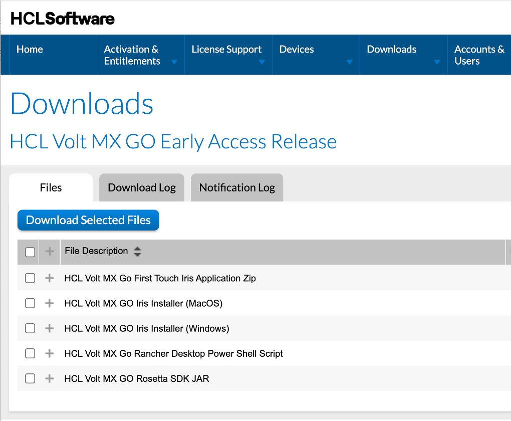

# Download HCL Volt MX Go Release package

## About this procedure

The procedure guides you on how to search and download the HCL Volt MX Go Release package from the **HCL License & Download Portal**.

!!!tip
    To learn more about **HCL License & Download Portal**, see [What is the HCL Software License & Download Portal?](https://support.hcltechsw.com/csm?id=kb_article&sysparm_article=KB0073344){: target="_blank"}.

## To search and download the HCL Volt MX Go Release package

1. Go to [HCL License & Download Portal](https://hclsoftware.flexnetoperations.com/){: target="_blank"}.
2. On the sign in page, enter your username and click **Next**. The **License & Download Portal** home page opens. 
3. On the **License & Download Portal** home page, go to **Downloads** &rarr; **List Downloads**.
4. On the **Downloads** page, search for and click `HCL Volt MX `.
5. On the **Download Packages** page, click the **HCL Volt MX Go Version x.x** package.
6. On the **Files** tab in the **Downloads** page, select all the files and click **Download Selected Files**.

    **OR** 

    Click the download icon beside the filename of each file. 

<!---->

!!!tip
    For the Volt MX Go Foundry and Iris installers, you can just select and download the installer applicable to your machine. 

## Next step

Proceed to [Install Volt MX Go server components](nativeinstallers.md).
