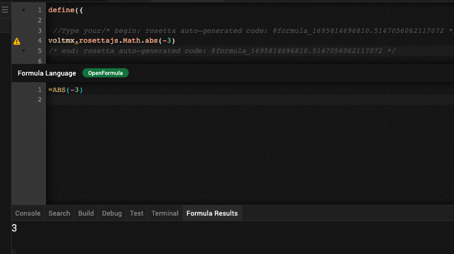
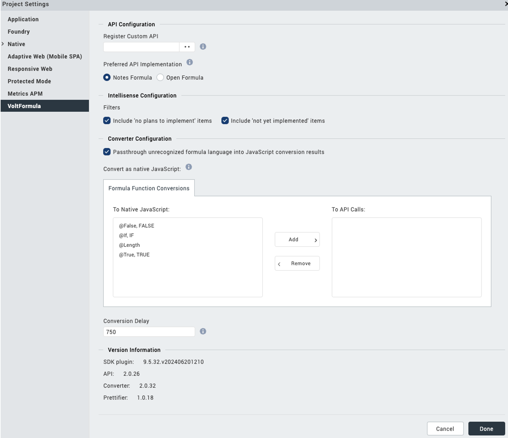

# VoltFormula Tutorial
The following tutorial shows you how to use voltFormula in Volt MX Iris to convert formulas from OpenFormula and NotesFormula into Volt MX Go Rosetta Javascript.
## Before you start

- You have completed the [Volt MX Go installation](installation.md#installing-volt-mx-go-iris).
- You have created your [Foundry admin account](../howto/foundryadminaccount.md).
- You have noted the following Domino REST API details:
    - Server URL: `http://drapi.mymxgo.com` 
    - username: `mxgo admin`
    - password: `password`
- You have to used the [actions](https://opensource.hcltechsw.com/volt-mx-docs/95/docs/documentation/Iris/iris_user_guide/Content/working_with_Action_Editor.html#search-for-an-action-in-action-editor) in Volt MX Iris.

## Launch Volt MX Go Iris

1. Open the **Volt MX Go Iris**. This opens the log-in screen of Iris.

    !!!note
        You can also start Iris by going to the folder where it's stored and double-clicking it.
		
   	On launching Iris, the Volt MX Go cloud login screen appears for license validation.

2.  Enter your **credentials** in Volt MX Go Iris and click **Sign-In**.
    The Volt MX Go Iris app canvas opens.

## Validating Volt MX Go Foundry
	
1. Open the **Volt MX Iris** menu bar for **Mac** or **Edit** menu bar for **Windows** and click **Preferences**.
2. This opens the **Volt MX Iris Preferences**. Click to **Volt MX Foundry**.
3. Fill-in the Foundry URL with `http://foundry.mymxgo.com` and click **Validate**. 
4. Click **Done**. 

## Introduction to the VoltFormula

This feature in Volt MX Go Iris is an added action in Volt MX Iris where you can insert the [OpenFormula](https://docs.oasis-open.org/office/OpenDocument/v1.3/OpenDocument-v1.3-part4-formula.html) and [Notes Formula Language](https://help.hcltechsw.com/dom_designer/10.0.1/basic/H_NOTES_FORMULA_LANGUAGE.html) translated into a JavaScript code.

## Open voltFormula through `Actions`

1. Open your **Project**.
2. From the **Project** tab of the **Project Explorer**, go on `Forms` navigation and select the widget or object you want to apply action to. 
3. Once in the Iris forms, right-click it, and then select one of the action sequences, such as `onTouchStart`, `onClick` and others. 

    

    The **Action Editor** opens and creates an action sequence for you to configure.

4. On the left side of the **Action Editor**, go to **Formula** and click the **Add Formula**.
    

## Translating the OpenFormula and NotesFormula into javascript

1. On the **action editor**, click the **Add Formula** on the diagram. On the right side of the **action editor** window, you can see the properties of the voltFormula.
    - **window for the translated OpenFormula and NotesFormula in JavaScript.**
    - **window for the formula language** - OpenFormula and NotesFormula are the accepted formulas to add in this window.
    - **window for the formula results**.
    

2. Click on **Formula Language** window and enter a valid formula.

    !!!note
        In Formula language  window, it has the abilty to detect the **Notes** and **Open** formula. You must enter the **@** character before the formula in NotesFormula and enter the **=** character before the formula in OpenFormula.
    
    You can see the JavaScript code and the result.

4. Click **Save**.
      

## Using the voltFormula in Controller 
### Add formula in a controller
1. Open a controller on **Project Explorer.**
2. Select and open your controller. This opens the code window.
3. Right-click on the code window and select **Add Code from Formula**. The Formula Language window appear.
     
4. Add the code in the **Formula Language** window.

	!!!note
        - **@** chraracter for *NotesFormula*
	    - **=** character  for *OpenFormula*
	    - You can the see the syntax code or the IntelliSense for the formula that you choose.
	    - If you don't know how to convert the Javascript in Volt MX Go `rosettajs` from **OpenFormula** and **NotesFormula**, you may use the Formula Language window to do so.
        

    The code you enter in **Formula Language** is translated to autogenerated rosettajs code in the code window.   
    
  

### Edit formula in a controller
1. Open a controller on Project Explorer.
2. Select and open your controller. This opens the code window.

    !!!note
        You can easily see the conversion formula that comes from the openFormula and notesFormula inbetween the comment  of rosetta autogenerated code.
        

3. Right-click on the existing code and select **Edit Formula Code**. The Formula Language window appear and you can see the existing formula in the Formula Language window.
    

4. You can edit the code you want in the Formula Language window.

    !!!note
        - **@** chraracter for *NotesFormula*
        - **=** character  for *OpenFormula*
        - You can the see the syntax code or the IntelliSense for the formula that you choose.
        - If you don't know how to convert the Javascript in Volt MX Go `rosettajs` from **OpenFormula** and **NotesFormula**, you may use the Formula Language window to do so.
        - You can add or edit code in the formula language window as long as you folow the syntax.
        - You can add more than one line of code. 
        

    The code you enter in **Formula Language** is translated to autogenerated `rosettajs` code in the code window.   
    
  

### Edit Rosetta Javascript

1. Open a controller on **Project Explorer.**
2. Select and open your controller. This opens the code window.

    !!!note
        You can easily see the conversion formula that comes from the openFormula and notesFormula inbetween the comment  of rosetta autogenerated code.
        

3. Add your formula in `rosettajs` in the code window, or edit the existing formula in the code window without opening the **Formula Language** window.

    !!!note
        - When you add `rosetta` javascript,  you'll be able see the syntax code or the intellisense for the formula that you choose in code window.
        - Make sure you know the syntax for coding the `rosetta` javascript
        
    
     
<!--ALSO NEEDS EDIT EXISTING FORMULA  (right click on the javascript code to pop menu that shows EDIT formula)
ALSO NEEDS REVERTING FORMULA (when you change the javascript converted formula and then try to edit formula) 
MISSING ROSETTA CONFIGURATION PANEL OF IRIS  (eg.  Iris -> Project Settings -> Rosetta "Tab"
-->

## Using Rosetta setting panel of Iris
1. Open the **Project Settings** icon.
    
2. The **Project Setting** window appears. Click the **Rosetta** tab.
    

    |Rosetta Settings| Description|
    |----------------|------------|
    |API configuration||
    |Converter Configuration|You can select or clear the option|
    |Use Native vs. API Conversion|You can select or clear the control flow statement that you want for your formula code|
    |Version| This is where you get the version of the `SDK`,`API`,`Converter`, and `prettifier`|

