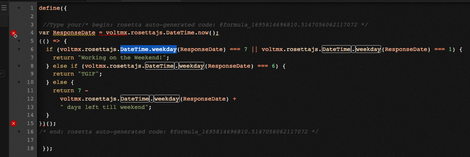

# VoltFormula tutorial

This tutorial shows you how to use VoltFormula in Volt MX Iris to convert formulas from OpenFormula and NotesFormula into Volt MX Go Rosetta Javascript. This feature in Volt MX Go Iris allows you to enter into source [OpenFormula](https://docs.oasis-open.org/office/OpenDocument/v1.3/OpenDocument-v1.3-part4-formula.html){: target="_blank"} and [Notes Formula Language](https://help.hcltechsw.com/dom_designer/10.0.1/basic/H_NOTES_FORMULA_LANGUAGE.html){: target="_blank"} and have it translated automatically into JavaScript code.
## Before you start
<!--!!!note
    Make sure you have downloaded the latest version of Volt MX Go Iris before performing the installation.-->

- You have completed the [Volt MX Go installation](installation.md).
- You have created your [Foundry admin account](../howto/foundryadminaccount.md).

- You know how to use [actions](https://opensource.hcltechsw.com/volt-mx-docs/95/docs/documentation/Iris/iris_user_guide/Content/working_with_Action_Editor.html#search-for-an-action-in-action-editor){: target="_blank"} in Volt MX Iris.

## Launch Volt MX Go Iris

1. Open the **Volt MX Go Iris**. This opens the Iris log-in screen. Click the close button.

    !!!note
        If the Iris newly installed, the close button is accessible. However, once the preference is modified, the close button is no longer appear during login.

    Wait until the MX Go Foundry preference has been verified before logging in.

    **Validation of MX Go preference:**
        
    1. Click  the home {: style="height:3%;width:3%"} icon.
    2. Open the **Volt MX Iris** menu bar for Mac and **Edit** menu bar for Windows and click **Preferences**.
    3. This opens the **Volt MX Iris Preferences**. Click on **Volt MX Foundry**.
    4. Fill in the **Foundry URL** with your Foundry hostname, and click **Validate**.
        

    5. Click **Done**. 

4. Enter your **Foundry app credentials** in Volt MX Go Iris and click **Sign-in**.

    

## Open VoltFormula using the Action Editor

!!!Tip
    To see your Project, click in **Design** tab beside the **Storyboard** tab.

1. Open your **Project**.
2. On the Project window, find the `Forms`. Once you click the `form`, the form appears on the canvass.  
3. On the `form` canvass, select the widget or object you want to apply action to. **Right-click** it, and then select one of the action sequences, such as `onTouchStart`, `onClick` and others. 

    {: style="height:80%;width:80%"}

    The **Action Editor** opens and creates an action sequence for you to configure.

4. On the left side of the **Action Editor**, go to **Formula** and click the **Add Formula**
    
    {: style="height:80%;width:80%"}

## Translate OpenFormula and NotesFormula into Javascript

1. On the **action editor**, click the **Add Formula** on the diagram. On the right side of the **action editor** window, you can see the properties of the voltFormula.
    - **window for the translated OpenFormula and NotesFormula in JavaScript.**
    - **window for the formula language** - OpenFormula and NotesFormula are the accepted formulas to add in this window.
    - **window for the formula results**.
    
    {: style="height:90%;width:90%"}

2. Click on **Formula Language** window and enter a valid formula.

    !!!note
        In Formula language  window, it can detect the **Notes** and **Open** formula. You must enter the **@** character before the formula in NotesFormula and enter the **=** character before the formula in OpenFormula.
    
    You can see the JavaScript code and the result.

    {: style="height:90%;width:90%"}

4. Click **Save**.
 
## Use VoltFormula in a Controller module
### Add formula in a controller
1. Open a controller on **Project Explorer.**
2. Select and open your controller. This opens the code window.
3. Right-click the code window and select **Add Code from Formula**. The Formula Language window appear.

    {: style="height:90%;width:90%"}
 
4. Add the code in the **Formula Language** window.

	!!!note
        - **@** character for *NotesFormula*
	    - **=** character  for *OpenFormula*
	    - You can see the code hinting or the IntelliSense for the formula that you choose.
        - Each formula is accompanied by its category.
	    - If you don't know how to convert the Javascript in Volt MX Go `rosettajs` from **OpenFormula** and **NotesFormula**, you may use the Formula Language window to do so.
      
    {: style="height:90%;width:90%"}
  
    The code you enter in **Formula Language** is translated to autogenerated rosettajs code in the code window.   
    
    {: style="height:90%;width:90%"}  

### Edit formula in a controller
1. Open a controller on **Project Explorer**.
2. Select and open your controller. This opens the code window.

    !!!note
        You can see the conversion formula that comes from the OpenFormula and NotesFormula inbetween the comment  of rosetta autogenerated code.
        
    

3. Right-click the existing code and select **Edit Formula Code**. The Formula Language window appear and you can see the existing formula in the Formula Language window.

    

4. You can edit the code you want in the Formula Language window.

    !!!note
        - **@** character for *NotesFormula*
        - **=** character  for *OpenFormula*
        - You can see the code hinting or the IntelliSense for the formula that you choose.
        - Each formula is accompanied by its category.
        - If you don't know how to convert the Javascript in Volt MX Go `rosettajs` from **OpenFormula** and **NotesFormula**, you may use the Formula Language window to do so.
        - You can add or edit code in the formula language window as long as you follow the syntax.
        - You can add more than one line of code. 
    
    {: style="height:90%;width:90%"}
    
    The code you enter in **Formula Language** is translated to autogenerated `rosettajs` code in the code window.   
    
    {: style="height:90%;width:90%"}
      

### Edit Rosetta Javascript

1. Open a controller on **Project Explorer**.
2. Select and open your controller. This opens the code window.

    !!!note
        You can see the conversion formula that comes from the OpenFormula and NotesFormula inbetween the comment  of rosetta autogenerated code.
        
    

3. Add your formula in `rosettajs` in the code window, or edit the existing formula in the code window without opening the **Formula Language** window.

    !!!note
        - When you add `rosetta` javascript,  you'll be able see the code hinting or the IntelliSense for the formula that you choose in code window.
        - Make sure you know the syntax for coding the `rosetta` javascript.
        
    
     
!!!Info
    - The default Rosetta voltFormula setting can be modified according to your need for your app. To change the configuration, go to this link [Configure VoltFormula's Rosetta API Options](../howto/configrosetta.md)

    - To know more about the proper way of handling codes, go to this link [Recommended Volt Formula Coding Practices in MX Go Iris](../references/vfcodingguides.md)

