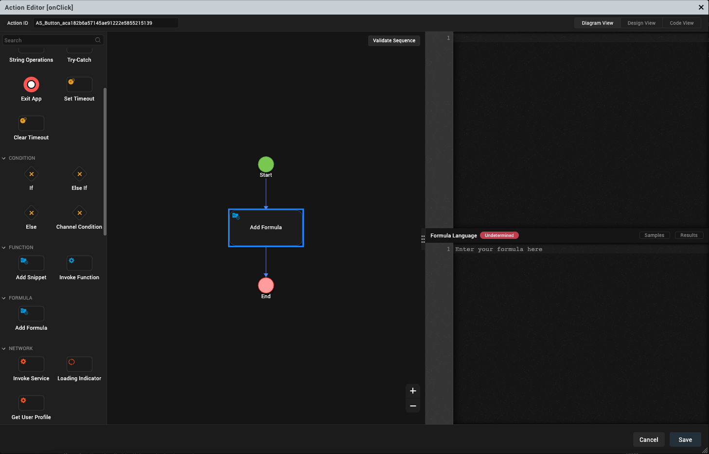
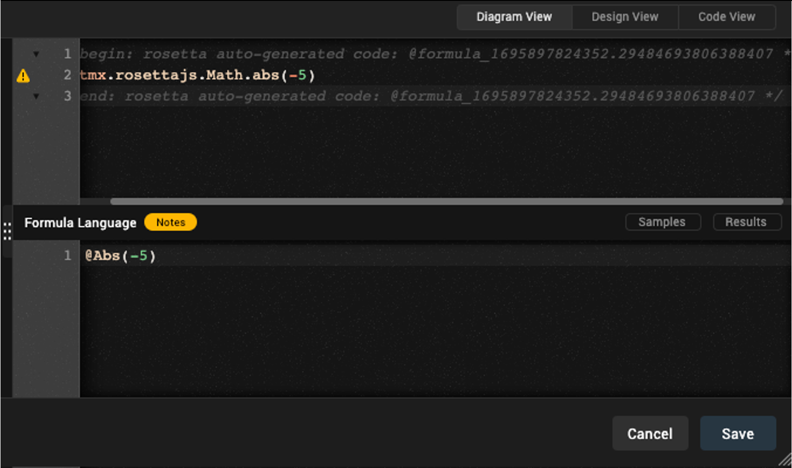
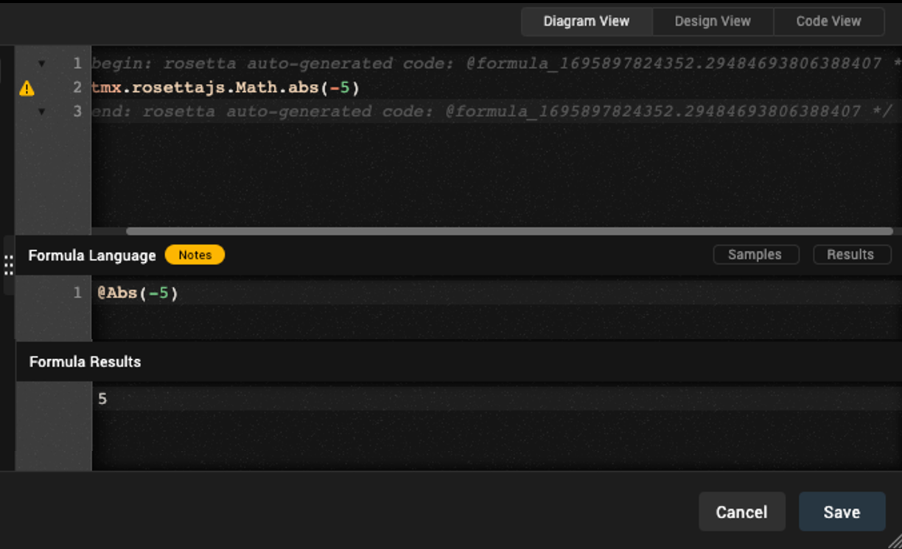
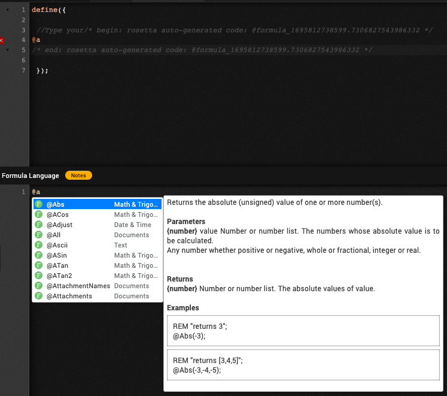
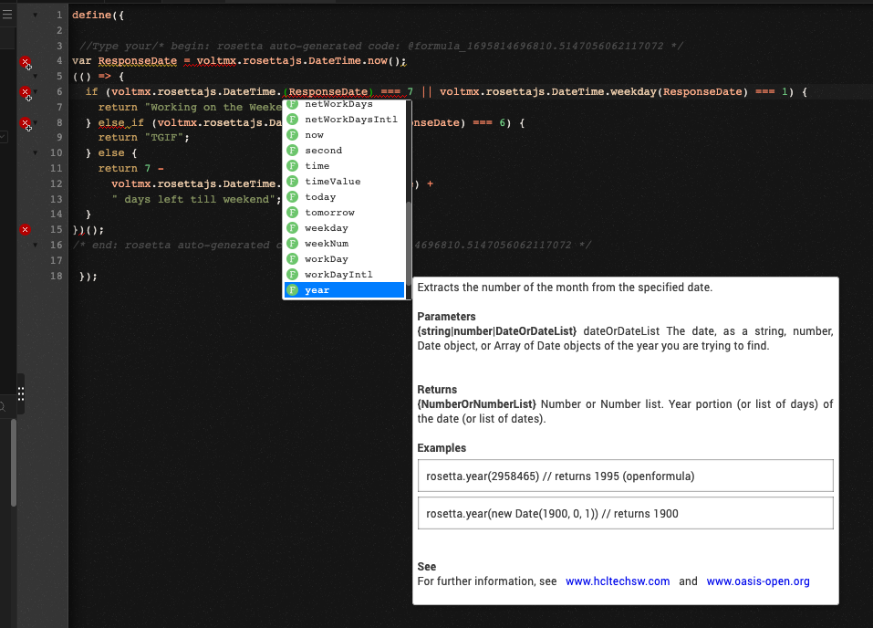

# VoltFormula tutorial

This tutorial shows you how to use VoltFormula in Volt MX Go Iris to convert formulas from OpenFormula and NotesFormula into Volt MX Go Rosetta JavaScript. This feature in Volt MX Go Iris allows you to enter into source [OpenFormula](https://docs.oasis-open.org/office/OpenDocument/v1.3/OpenDocument-v1.3-part4-formula.html "Link opens a new tab"){: target="_blank" rel="noopener noreferrer"}&nbsp;{: style="height:13px;width:13px"} and [Notes Formula Language](https://help.hcltechsw.com/dom_designer/10.0.1/basic/H_NOTES_FORMULA_LANGUAGE.html "Link opens a new tab"){: target="_blank" rel="noopener noreferrer"}&nbsp;{: style="height:13px;width:13px"} and have it translated automatically into JavaScript code.

## Before you begin

- You have completed the [Volt MX Go installation](installation.md).

- You have created your [Volt MX Go Foundry admin account](../howto/install/foundryadminaccount.md).

- You know how to use [Actions](https://opensource.hcltechsw.com/volt-mx-docs/95/docs/documentation/Iris/iris_user_guide/Content/working_with_Action_Editor.html#search-for-an-action-in-action-editor "Link opens a new tab"){: target="_blank" rel="noopener noreferrer"}&nbsp;{: style="height:13px;width:13px"}.

## Launch Volt MX Go Iris

1. Open Volt MX Go Iris. When the **Sign-in** dialog opens, close it.

    !!!note
        If you have already configured the login settings while performing the other tutorials, enter your email and password for Volt MX Go Foundry on the **Sign in to your account** page and click **Sign In**. You don't need to execute the steps below for configuring the login settings and logging in. 

2. Configure the login settings.

    1. Go to **Preferences**.

        For Windows, select **Edit** &rarr; **Preferences**.

        For Mac, depending on your macOS, select **Volt Iris** &rarr; **Preferences** or **Settings**.

    2. On the **Volt MX Go Iris Preferences** dialog, click **Volt MX Go Foundry**.

        

    3. On the **Volt MX Go Foundry** tab, enter your Foundry URL in the **Foundry URL** text box, and then click **Validate**.

        You should see the “Validation Successful” message at the top of the dialog.

    4. Click **Done**.

3. Log in to Volt MX Go Iris.
    1. Click **Login** on the upper right corner of the Volt MX Go Iris screen.
    2. Enter your email and password for Volt MX Go Foundry on the **Sign in to your account** page.
    3. Click **Sign In**. Your username appears next to the profile icon.

## Open VoltFormula using the Action Editor

!!!Tip
    To see your Project, click in **Design** tab beside the **Storyboard** tab.

1. Open your **Project**.
2. On the Project window, find the `Forms`. Once you click the `form`, the form appears on the canvass.  
3. On the `form` canvass, select the widget or object you want to apply action to. **Right-click** it, and then select one of the action sequences, such as `onTouchStart`, `onClick` and others. 

    {: style="height:80%;width:80%"}

    The **Action Editor** opens and creates an action sequence for you to configure.

4. On the left side of the **Action Editor**, go to **Formula** and click the **Add Formula**.

    {: style="height:80%;width:80%"}

## Translate OpenFormula and NotesFormula into JavaScript

1. On the **Action Editor**, click the **Add Formula** on the diagram. On the right side of the **Action Editor** window, you can see the properties of the VoltFormula.
    - **window for the translated OpenFormula and NotesFormula in JavaScript.**
    - **window for the formula language** - OpenFormula and NotesFormula are the accepted formulas to add in this window.
    - **window for the formula results**.

    {: style="height:90%;width:90%"}

2. Click on **Formula Language** window and enter a valid formula.

    !!!note
        In Formula language  window, it can detect the **Notes** and **Open** formula. You must enter the **@** character before the formula in NotesFormula and enter the **=** character before the formula in OpenFormula.

       Upon typing your formula, the intellisence will appear and return the syntax, descriptions, and examples of your chosen formula.

    You can see automatically the JavaScript code with the formula you type in the **Formula Language** window.

    {: style="height:90%;width:90%"}

    You can also see the result upon clicking the **Results** button.

    {: style="height:90%;width:90%"}

3. Click **Save**.

## Use VoltFormula in a Controller module

### Add formula in a controller

1. Open a controller on **Project Explorer.**
2. Select and open your controller. This opens the code window.
3. Right-click the code window and select **Add Code from Formula**. The Formula Language window appear.

    {: style="height:90%;width:90%"}

4. Add the code in the **Formula Language** window.

	!!! note

        - **@** character for *NotesFormula*
	    - **=** character  for *OpenFormula*
	    - You can see the code hinting or the IntelliSense for the formula that you choose.
        - Each formula is accompanied by its category.
	    - If you don't know how to convert the JavaScript in Volt MX Go `rosettajs` from **OpenFormula** and **NotesFormula**, you may use the Formula Language window to do so.

    {: style="height:90%;width:90%"}
  
    The code you enter in **Formula Language** is translated to autogenerated RosettaJS code in the code window.

    {: style="height:90%;width:90%"}  

### Edit formula in a controller

1. Open a controller on **Project Explorer**.
2. Select and open your controller. This opens the code window.

    !!! note

        You can see the conversion formula that comes from the OpenFormula and NotesFormula inbetween the comment  of rosetta autogenerated code.
        
    

3. Right-click the existing code and select **Edit Formula Code**. The Formula Language window appear and you can see the existing formula in the Formula Language window.

    

4. You can edit the code you want in the Formula Language window.

    !!!note
        - **@** character for *NotesFormula*
        - **=** character  for *OpenFormula*
        - You can see the code hinting or the IntelliSense for the formula that you choose.
        - Each formula is accompanied by its category.
        - If you don't know how to convert the JavaScript in Volt MX Go `RosettaJS` from **OpenFormula** and **NotesFormula**, you may use the Formula Language window to do so.
        - You can add or edit code in the formula language window as long as you follow the syntax.
        - You can add more than one line of code. 

    {: style="height:90%;width:90%"}

    !!! note

        - The code you enter in **Formula Language** is translated to autogenerated `RosettaJS` code in the code window.  
        - You can also see the result in **Formula Results** tab.

    {: style="height:90%;width:90%"}

### Edit Rosetta JavaScript

1. Open a controller on **Project Explorer**.
2. Select and open your controller. This opens the code window.

    !!! note

        You can see the conversion formula that comes from the OpenFormula and Notes Formula inbetween the comment of rosetta autogenerated code.
        
    

3. Add your formula in `rosettajs` in the code window, or edit the existing formula in the code window without opening the **Formula Language** window.

    !!! note

        - When you add `rosetta` JavaScript,  you'll be able see the code hinting or the IntelliSense for the formula that you choose in code window.
        - Make sure you know the syntax for coding the `rosetta` JavaScript.
        
    

!!! info

    - The default Rosetta VoltFormula setting can be modified according to your need for your app. To change the configuration, see [Configure VoltFormula's Rosetta API Options](../howto/voltformula/configrosetta.md).
    
    - To know more about the proper way of handling codes, see [VoltFormula coding exercise examples in Volt MX Go Iris](../topicguides/voltformula/vfcodingguides.md).

